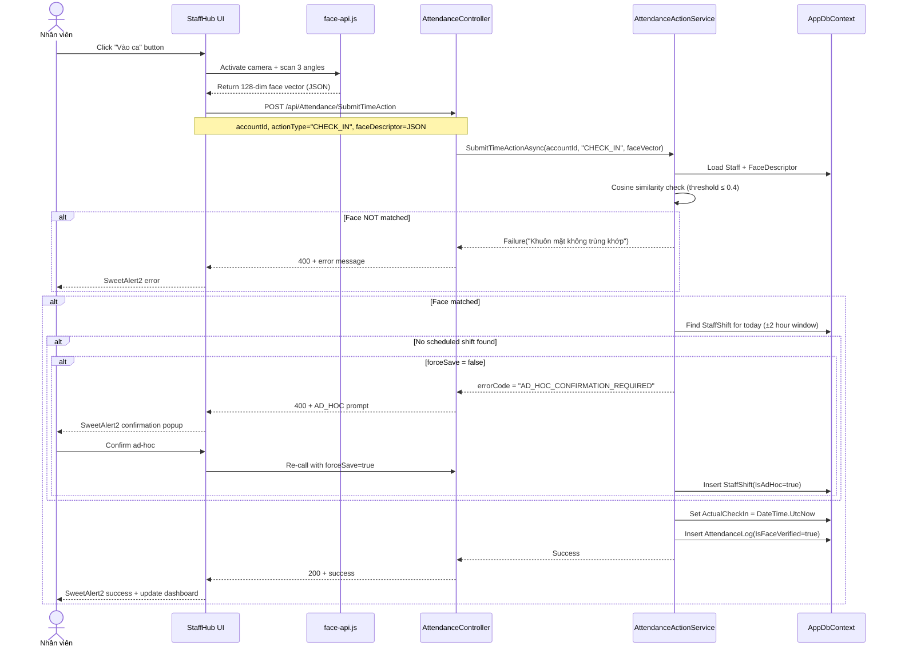

# Module 2 Guide: StaffHub Portal & Attendance Engine

---
version: 2.0
last_verified: 2026-05-26
depends_on:
  - docs/module-1-auth-rbac.md
  - learnings/project-context.md
scope: STAFFHUB UI + ATTENDANCE (IP Geofencing DEFERRED — will be handled separately)
---

This guide documents the **StaffHub portal** layout, **attendance (chấm công) logic**, and **edge case handling** for the biometric timekeeping engine. IP geofencing logic is **deferred** and will not affect the core StaffHub/attendance flows described here.

> **NOTE**: All references to "Kiosk" in code refer to the StaffHub controller (`Controllers/KioskController.cs`). The naming migration Kiosk→StaffHub is tracked here for consistency.

---

## 1. Objectives & Business Logic

1. **StaffHub Dashboard**: A premium, dark-themed portal for store-level employees with:
   - Live digital clock (server-synced)
   - Today's shift schedule calendar
   - Check-in / Check-out buttons (gated by FaceID)
   - POS terminal launcher (gated by active shift)
2. **Biometric Attendance**: 3D FaceID verification to prevent buddy-punching.
3. **Smart Shift Mapping**: Auto-associate check-in timestamps with scheduled `StaffShift` records.
4. **Ad-Hoc Shift Management**: Allow flexible check-ins for `IsFreeShift` schedules with SweetAlert2 confirmation.

---

## 2. StaffHub Controller Architecture

**Current File**: `Controllers/KioskController.cs` (to be renamed to `StaffHubController.cs`)

```csharp
[Authorize]
public class StaffHubController : Controller
{
    private readonly IAttendanceSecurityService _securityService;
    private readonly IAttendanceActionService _actionService;

    public StaffHubController(
        IAttendanceSecurityService securityService,
        IAttendanceActionService actionService)
    {
        _securityService = securityService;
        _actionService = actionService;
    }

    // GET: /StaffHub/Index
    public async Task<IActionResult> Index()
    {
        // 1. Extract AccountId from Claims (Anti-IDOR)
        var accountIdStr = User.FindFirst(ClaimTypes.NameIdentifier)?.Value;
        if (string.IsNullOrEmpty(accountIdStr) || !int.TryParse(accountIdStr, out int accountId))
        {
            return RedirectToAction("Login", "Account");
        }

        // 2. Load StaffHub data via Service (Thin Controller rule)
        var result = await _actionService.GetKioskDataAsync(accountId);
        if (!result.IsSuccess)
        {
            TempData["ErrorMessage"] = result.Message;
            return RedirectToAction("Login", "Account");
        }

        ViewBag.KioskData = result.Data;
        return View();
    }
}
```

> **IMPORTANT**: The controller does NOT call `_context` (DbContext) directly. All DB access goes through Service layer per `rules/dotnet-architecture.md`.

---

## 3. Attendance API Endpoints

**File**: `Controllers/AttendanceController.cs`

| Endpoint | Method | Purpose |
|---|---|---|
| `POST /api/Attendance/SubmitTimeAction` | `SubmitTimeAction` | FaceID check-in/check-out with biometric verification |
| `POST /api/Attendance/RegisterFace` | `RegisterFace` | 3D face registration (3-angle capture) |
| `GET /api/Attendance/GetKioskData` | `GetKioskData` | Load dashboard data: staff info, shifts, face status |
| `POST /api/Attendance/FirstLoginChangePassword` | `FirstLoginChangePassword` | Force password change for new staff |

### A. SubmitTimeAction Flow (CHECK_IN)



### B. Cosine Similarity Verification

```csharp
private double CalculateFaceDistance(float[] vec1, float[] vec2)
{
    if (vec1.Length != 128 || vec2.Length != 128)
        throw new ArgumentException("Face vectors must be 128 dimensions.");

    double sum = 0.0;
    for (int i = 0; i < 128; i++)
    {
        double diff = vec1[i] - vec2[i];
        sum += diff * diff;
    }
    return Math.Sqrt(sum); // Euclidean distance
}
// Threshold: distance ≤ 0.4 = MATCH
```

---

## 4. Edge Cases & Error Recovery Matrix

### A. Duplicate Check-In (Same Day, Same Staff)

| Trigger | Expected Behavior | Status |
|---|---|---|
| Staff checks in on PC, then tries again on phone | Block: "Bạn đã chấm công vào ca hôm nay rồi!" | 🔴 **MUST IMPLEMENT** |

**Solution** — Add to `SubmitTimeActionAsync` before processing:
```csharp
// Guard: Already checked in today?
var alreadyActive = await _context.StaffShifts
    .AnyAsync(s => s.StaffId == staff.StaffId
        && s.WorkDate == DateTime.Today
        && s.ActualCheckIn != null
        && s.ActualCheckOut == null);

if (alreadyActive && actionType == "CHECK_IN")
{
    return ServiceResult.Failure("Bạn đã chấm công vào ca hôm nay rồi! "
        + "Vui lòng tan ca trước khi vào lại.");
}
```

### B. Check-Out Without Check-In

| Trigger | Expected Behavior | Status |
|---|---|---|
| Staff navigates to StaffHub and clicks "Tan ca" without prior check-in | Block: "Không tìm thấy ca đang hoạt động" | ✅ Handled in logic |

### C. Overnight Shift (Cross-Day Boundary)

| Trigger | Expected Behavior | Status |
|---|---|---|
| Check-in 23:50 Dec 31, Check-out 06:10 Jan 1 | Shift must be found across calendar day boundary | ⚠️ **Needs IsOvernight flag check** |

**Solution** — Modify shift lookup window:
```csharp
// When finding scheduled shift for check-in:
var now = DateTime.Now;
var today = DateTime.Today;
var yesterday = today.AddDays(-1);

var scheduledShift = await _context.StaffShifts
    .Include(s => s.Shift)
    .Where(s => s.StaffId == staff.StaffId
        && s.ActualCheckIn == null  // Not yet checked in
        && (
            // Normal: shift scheduled for today
            s.WorkDate == today
            ||
            // Overnight: shift started yesterday, still open
            (s.WorkDate == yesterday && s.Shift != null && s.Shift.IsOvernight)
        ))
    .OrderBy(s => s.WorkDate)
    .ThenBy(s => s.CustomStartTime ?? s.Shift.StartTime)
    .FirstOrDefaultAsync();
```

### D. Camera Permission Denied

| Trigger | Expected Behavior | Status |
|---|---|---|
| Browser blocks camera access | Show instruction overlay with "Cách bật camera" | ⚠️ **Frontend handling needed** |

**Solution** — Frontend detection:
```javascript
async function checkCameraPermission() {
    try {
        const result = await navigator.permissions.query({ name: "camera" });
        if (result.state === "denied") {
            Swal.fire({
                icon: 'info',
                title: 'Cần quyền Camera',
                html: `
                    <p>Tính năng chấm công Face ID yêu cầu truy cập Camera.</p>
                    <p><b>Chrome:</b> Settings → Privacy → Camera → Cho phép trang này</p>
                    <p><b>Safari:</b> Settings → Safari → Camera → Cho phép</p>
                `,
                confirmButtonText: 'Đã hiểu, thử lại'
            });
            return false;
        }
        return true;
    } catch (e) {
        // Fallback: just try to open camera, browser will prompt
        return true;
    }
}
```

### E. Face-API Model Loading Timeout

| Trigger | Expected Behavior | Status |
|---|---|---|
| Slow network → face-api.js models (~5MB) fail to load | Show progress + retry button | ⚠️ **Frontend handling needed** |

**Solution**:
```javascript
async function loadFaceModels() {
    const MODEL_URL = '/lib/face-api/models';
    const timeout = 30000; // 30 seconds

    try {
        const loadPromise = Promise.all([
            faceapi.nets.tinyFaceDetector.loadFromUri(MODEL_URL),
            faceapi.nets.faceLandmark68Net.loadFromUri(MODEL_URL),
            faceapi.nets.faceRecognitionNet.loadFromUri(MODEL_URL)
        ]);

        await Promise.race([
            loadPromise,
            new Promise((_, reject) =>
                setTimeout(() => reject(new Error('timeout')), timeout))
        ]);

        return true;
    } catch (err) {
        Swal.fire({
            icon: 'error',
            title: 'Lỗi tải dữ liệu AI',
            text: 'Không thể tải mô hình nhận diện. Kiểm tra kết nối mạng.',
            confirmButtonText: 'Thử lại',
            showCancelButton: true,
            cancelButtonText: 'Bỏ qua'
        }).then(result => {
            if (result.isConfirmed) loadFaceModels();
        });
        return false;
    }
}
```

### F. Staff Account Has No FaceDescriptor (Not Registered)

| Trigger | Expected Behavior | Status |
|---|---|---|
| New staff tries to check in without registering face | Error: "Tài khoản chưa đăng ký Face ID" + redirect to registration | ✅ Handled in service |

### G. Anti-IDOR on Attendance Endpoints

| Trigger | Expected Behavior | Status |
|---|---|---|
| Malicious user sends `accountId=999` in POST body | Server must ignore client-supplied accountId | 🔴 **VULNERABILITY** |

**Current Problem**: `AttendanceController.SubmitTimeAction` accepts `accountId` from form data:
```csharp
// ❌ CURRENT — trusts client-supplied accountId
public async Task<IActionResult> SubmitTimeAction(int accountId, ...)
```

**Solution**: Extract from Claims instead:
```csharp
// ✅ FIXED — Anti-IDOR
[HttpPost("SubmitTimeAction")]
[Authorize]
public async Task<IActionResult> SubmitTimeAction(
    [FromForm] string actionType,
    [FromForm] string faceDescriptor,
    [FromForm] bool forceSave = false)
{
    var accountIdStr = User.FindFirst(ClaimTypes.NameIdentifier)?.Value;
    if (string.IsNullOrEmpty(accountIdStr) || !int.TryParse(accountIdStr, out int accountId))
    {
        return Unauthorized(new { success = false, message = "Chưa đăng nhập." });
    }

    var result = await _actionService.SubmitTimeActionAsync(
        accountId, actionType, faceDescriptor, forceSave);
    // ...
}
```

> Same fix applies to: `RegisterFace`, `GetKioskData`, `FirstLoginChangePassword`

### H. Payroll Rounding & Background Worker

| Trigger | Expected Behavior | Status |
|---|---|---|
| Staff checks out → PayrollHours needs calculation | Background worker rounds to 15-minute boundary | ✅ Logic documented in Module 3 |

---

## 5. Files Affected By This Module

| File | Change Type | Description |
|---|---|---|
| `Controllers/KioskController.cs` | RENAME → `StaffHubController.cs` | Portal entry point |
| `Controllers/AttendanceController.cs` | MODIFY | Anti-IDOR fix (extract AccountId from Claims) |
| `Application/Services/Attendance/AttendanceActionService.cs` | MODIFY | Duplicate check-in guard, overnight shift fix |
| `Views/Kiosk/Index.cshtml` | RENAME → `Views/StaffHub/Index.cshtml` | Dashboard view |
| `wwwroot/js/staffhub.js` | ADD/MODIFY | Camera permission, model timeout, 401 handler |
