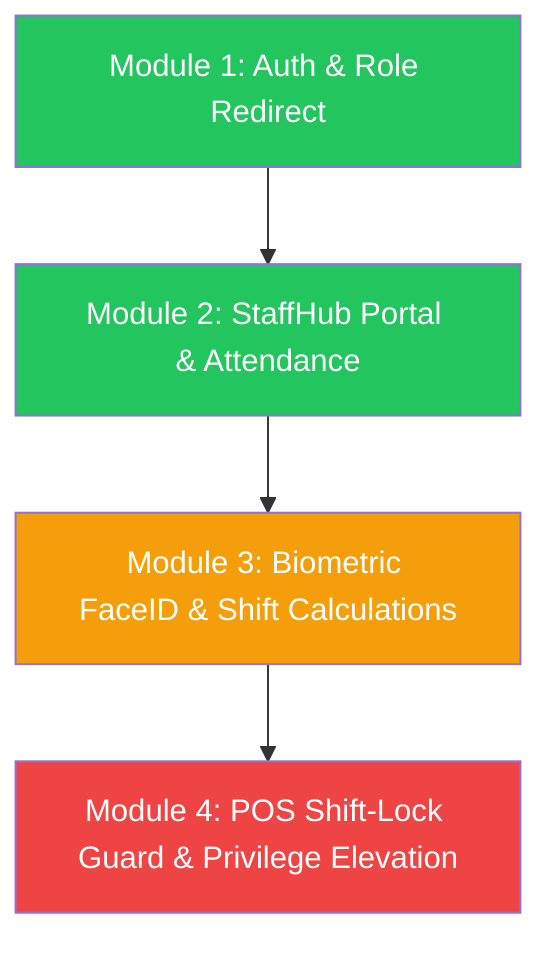

# CafeChain StaffHub & POS Upgrade: Master Module Overview

---
version: 2.0
last_verified: 2026-05-26
---

This master documentation provides an architectural blueprint and modular roadmap to implement the secure **StaffHub**, **Biometric Timekeeping**, and **Active Shift-Locked POS Access** system for CafeChain.

---

## 1. Modular Roadmap & Dependency Chain

The project is broken down into **4 core sub-modules** with clear dependency ordering:

> **IP Geofencing** is a cross-cutting concern that will be addressed as a **separate enhancement** after the core modules are stable. It does NOT block Module 1-4 development.

---

### 📋 Module 1: Authentication & Role-Based Redirect
- **Goal**: Route users to the correct portal after login using exact role matching.
- **Key Tasks**:
  - Use `RoleConstants.*` constants (NOT hardcoded Vietnamese strings) for role classification.
  - Redirect admin roles → `/Admin/AdminStaff/Index`, staff roles → `/StaffHub/Index`, customers → `/Home/Index`.
  - Inject `StoreId` claim during sign-in for store-bound staff.
  - Guard storefront profile links for staff accounts.
- **Edge Cases**: Unknown roles fallback, cookie expiration mid-session, concurrent sessions.
- **Status**: ✅ Core logic implemented. Edge case hardening in progress.

### 📋 Module 2: StaffHub Portal & Attendance Engine
- **Goal**: Premium dark-themed portal with biometric check-in/check-out and smart shift mapping.
- **Key Tasks**:
  - Build StaffHub dashboard (`Views/StaffHub/Index.cshtml`) with live clock, schedule calendar, FaceID triggers.
  - Implement `SubmitTimeAction` for biometric check-in with cosine similarity matching.
  - Smart shift association: find scheduled `StaffShift` within ±2 hour window.
  - Ad-hoc shift (`IsAdHoc`) with SweetAlert2 confirmation flow.
- **Edge Cases**: Duplicate check-in guard, overnight shifts, camera permission denied, IDOR vulnerability on attendance API, face model loading timeout.
- **Status**: ✅ Core APIs built. Anti-IDOR fix + duplicate guard needed.

### 📋 Module 3: Biometric FaceID Registration & Payroll Calculations
- **Goal**: 3D face registration (3-angle scan) and background payroll hour calculations.
- **Key Tasks**:
  - Client-side 3D face scan: Look Straight → Turn Left → Turn Right.
  - Average 128-dim vector → save to `Staff.FaceDescriptor`.
  - Background worker: calculate `PayrollHours` rounded to 15-minute segments.
  - Handle `IsFreeShift` with `forceSave` confirmation pattern.
- **Edge Cases**: Poor lighting conditions, face descriptor drift over time, overnight PayrollHours calculation.
- **Status**: ⏳ Pending implementation.

### 📋 Module 4: POS Shift-Lock Guard & Privilege Elevation
- **Goal**: Block POS access unless staff has active checked-in shift; require shift leader override for sensitive operations.
- **Key Tasks**:
  - POS entrance guard: verify `ActualCheckIn != null && ActualCheckOut == null`.
  - Bind `StaffShiftId` to every sales invoice for audit trail.
  - Shift Leader Elevation popup: FaceID scan or 4-digit PIN for void/discount overrides.
- **Edge Cases**: Store mismatch, shift expired during POS session, leader PIN brute-force protection.
- **Status**: ⏳ Pending implementation.

---

## 2. Documentation Index

| # | File | Scope |
|---|---|---|
| 1 | [Module 1 Guide](file:///d:/FPL_KY2/DATN/BE/CafeChain/.agent/docs/module-1-auth-rbac.md) | Authentication, Claims, Role Redirect, Edge Cases |
| 2 | [Module 2 Guide](file:///d:/FPL_KY2/DATN/BE/CafeChain/.agent/docs/module-2-staff-hub.md) | StaffHub Portal, Attendance Engine, Anti-IDOR Fix |
| 3 | [Module 3 Guide](file:///d:/FPL_KY2/DATN/BE/CafeChain/.agent/docs/module-3-biometric-attendance.md) | FaceID Registration, Payroll Calculations |
| 4 | [Module 4 Guide](file:///d:/FPL_KY2/DATN/BE/CafeChain/.agent/docs/module-4-pos-locked-guard.md) | POS Lock Guard, Leader Elevation |

---

## 3. Naming Convention: Kiosk → StaffHub Migration

The codebase currently uses "Kiosk" in several places. The canonical name going forward is **StaffHub**.

| Current Name | Target Name | File |
|---|---|---|
| `KioskController` | `StaffHubController` | `Controllers/KioskController.cs` |
| `/Kiosk/Index` | `/StaffHub/Index` | Routes |
| `Views/Kiosk/` | `Views/StaffHub/` | View folder |
| `kioskRoles` | `staffHubRoles` | `AccountController.RedirectByRole()` |
| `GetKioskData` | `GetStaffHubData` | `IAttendanceActionService` |

> **Migration Strategy**: Rename incrementally. Update routes first, then views, then service methods. Do NOT break existing functionality during migration.
