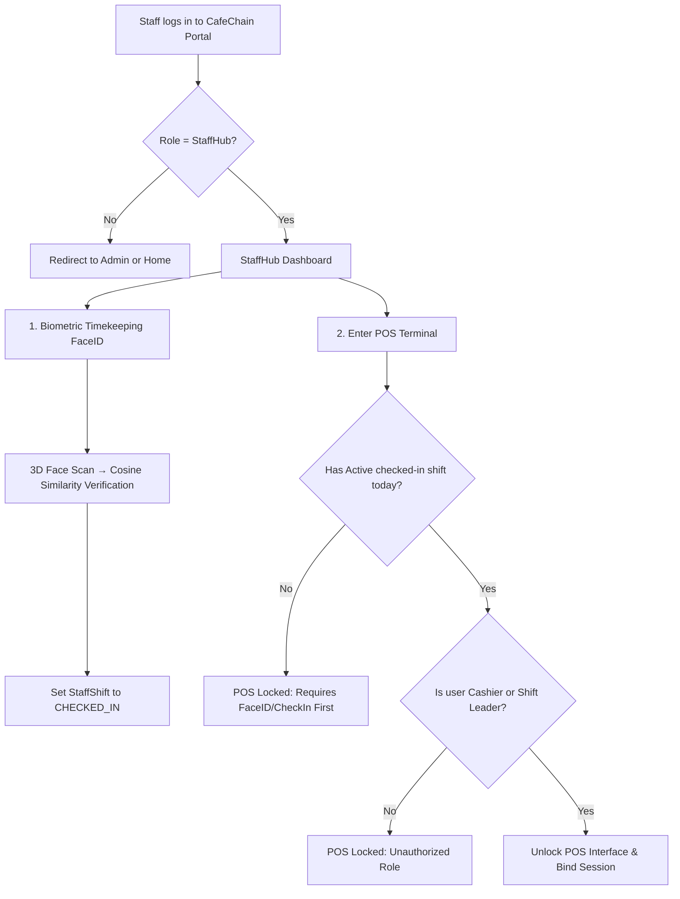

# CafeChain Project Context & Domain Architecture

Welcome to **CafeChain**, an enterprise-grade multi-tenant F&B (Food & Beverage) ERP and POS ecosystem designed for high-performance and zero-trust security operations. This document outlines the core business domain, role hierarchies, data models, and the core Unique Selling Proposition (USP) for staff login, biometric timekeeping, and POS systems.

---

## 1. Domain Overview
CafeChain manages decentralized coffee shop networks nationwide. It consists of three core business boundaries:
1. **Enterprise Backoffice (HQ/Admin Area)**: Used for managing multi-store configuration, staff profiles, regional structures, shift setups, inventory, and BOM formulas.
2. **StaffHub (Employee Portal)**: A unified dashboard where store-level employees (General Staff, Cashiers, Shift Leaders) perform timekeeping via biometric FaceID, view shifts, request ca tự do (ad-hoc shifts), and launch POS terminals.
3. **POS Station (Point of Sale)**: A security-hardened transaction engine where cashiers register sales. Access is protected by network bounds and active shift biometric locks.

---

## 2. Strict Role & Scope Matrix (Decentralized RBAC)
CafeChain follows a strict **"Quyền cao trùm quyền thấp, không được nhìn vượt cấp"** (Hierarchical RBAC) rule. Store levels are isolated via logical scoping in the database.

| Role Name | Scope Type | Quyền Hiển thị (View) | Quyền Tạo/Sửa (Create/Edit) |
| :--- | :---: | :--- | :--- |
| **Super Admin / CEO** | HQ (1) | Thấy toàn bộ nhân sự toàn quốc. | Tạo/sửa được TẤT CẢ các vai trò dưới cấp. |
| **Area Manager** | Province/Ward (2-3) | Chỉ thấy nhân sự thuộc các cửa hàng thuộc tỉnh/phường mình quản lý. | Tạo/sửa Cửa hàng trưởng, Ca trưởng, Thu ngân thuộc vùng. |
| **Store Manager** | Store (4) | Chỉ thấy nhân sự thuộc ĐÚNG cửa hàng mình làm việc. | CHỈ được Tạo/Sửa Ca trưởng, Thu ngân của cửa hàng mình. |
| **Shift Leader (Ca trưởng)** | Store (4) | Thấy lịch ca của toàn bộ nhân viên trong ca mình phụ trách. | Xác nhận ca tự do (Ad-hoc) và phê duyệt giao dịch nhạy cảm ở POS. |
| **Cashier (Thu ngân)** | Store (4) | Xem lịch ca cá nhân và tổng giờ công của bản thân. | Chỉ được phép truy cập POS khi đã checked-in thành công. |
| **General Staff (Nhân viên chung)** | Store (4) | Xem lịch ca cá nhân và tổng giờ công của bản thân. | Chỉ thực hiện chấm công và báo cáo công việc. |

---

## 3. Core Database Models (Attendance & Security)
The database structure leverages Entity Framework Core (Code-First) and maps directly to the following key entities:

- **Staff (`Staffs`)**: The core profile model containing general details, CCCD, personal info. Relates to:
  - `StaffAddresses` & `StaffPhones` (1-to-N relationships).
  - `StaffDependents` (tax deductions) & `StaffBanks` (payroll routing).
- **Shift (`Shifts`)**: Template configurations for work schedules.
  - Fields: `IsOvernight` (night shift shift-date boundary adjustments), `IsFreeShift` (ad-hoc, flexible check-ins).
- **StaffShift (`StaffShifts`)**: Assigns a specific `Staff` to a `Shift` on a specific calendar day.
  - Fields: `CustomStartTime`, `CustomEndTime`, `ActualCheckIn`, `ActualCheckOut`, `PayrollHours`, `StatusId` (Completed, In-progress, Upcoming).
- **AttendanceLog (`AttendanceLogs`)**: Stores raw timekeeping records.
  - Fields: `IpAddress` (client network stamp), `IsFaceVerified` (true if biometric matches), `Status` (Valid/Invalid based on IP/geofence checks).
- **StoreIP (`StoreIPs`)**: Stores whitelist IP configurations per store.
  - Fields: `IPAddress` (supports wildcard subnet e.g. `192.168.1.*`), `IsPublicNetwork` (determines remote access policy), `IsActive`.

---

## 4. The CafeChain USP: "Zero-Trust Active Shift-Locked POS"
In standard F&B businesses, cashier fraud, buddy timekeeping, and untethered POS access are high-risk cost leakages. CafeChain builds its unique market-leading strength around a unified **StaffHub** using a **Zero-Trust POS Access Workflow**:

### Key Strengths of this USP:
1. **No Buddy Punching**: Attendance is bound to a 3-step 3D Face Scan (Look Straight, Turn Left, Turn Right) processed in the browser using `face-api.min.js` and compared on the server via cosine-similarity vector matching.
2. **Geofenced Access (BYOD & Terminal)**: Employees cannot check in from home. The `StoreIPs` table whitelist forces their device to be on the local store Wi-Fi (checked via secure HttpContext RemoteIpAddress filters supporting wildcard subnet boundaries).
3. **No Shift-Dangling Transactions**: Cashiers cannot log in to POS unless they have clocked in. All POS invoices are bound to the cashier's active `StaffShiftId` and `AttendanceLogId`, establishing full audit transparency.
4. **Shift Leader Privileged Elevation**: When cashiers require restricted operations (voiding bills, manual discounts, zero-out cash drawers), the system triggers a quick local face scan or 4-digit PIN bypass from the Shift Leader.

---

## 5. Strict Localization Constraint (The Iron Law)
To maintain dual coherence between database standards and localized F&B operations:
- **Codebase Language**: All C# models, controllers, properties, tables, variables, and code comments **MUST be in English**.
- **User-Facing Language**: ALL HTML elements, placeholders, Razor views, validation messages, SweetAlert alerts, and returned JSON error messages **MUST be strictly in Vietnamese**.

---

## 6. Critical Security Boundaries
- **Anti-IDOR Guard**: Never bind user inputs directly to user modifications. Extract `AccountId` from claims (`User.FindFirst(ClaimTypes.NameIdentifier)`) on the controller/service side.
- **Anti-Overposting (Mass Assignment)**: Never pass database models directly. Always build explicit DTOs and ViewModels.
- **Soft-Delete Only**: Core records (`Staffs`, `Stores`, `Accounts`) must never be physically deleted to maintain historical audit chains for financial and tax auditing. Use `IsActive = false`.
