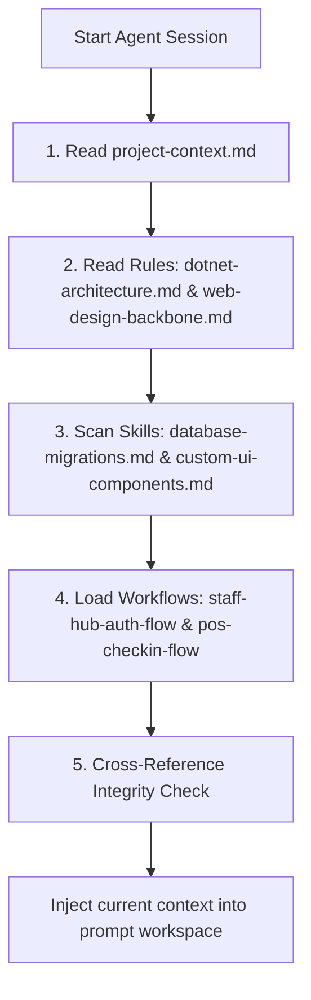

# Agent Learnings Loader Rules

---
version: 2.0
last_verified: 2026-05-26
---

To maintain absolute alignment across all agent tasks and code generations in CafeChain, the agent must initialize its workspace context using this structured loading protocol.

---

## 1. Dynamic Startup Initialization

Every time the agent starts a new session or initiates work, it must read the `.agent/` folder first.
- **Goal**: Prevent drift in design tokens, database rules, role constants, and naming practices.
- **Rule**: Do not start writing C# code or modifying Razor views without performing a verification pass on current rules.

---

## 2. Directory Traversal Hierarchy

The agent must verify configuration files in this specific sequence:



1. **`.agent/learnings/project-context.md`**: Domain models, role boundaries, scope types, localization rules.
2. **`.agent/rules/dotnet-architecture.md`**: Clean N-Tier patterns, anti-IDOR, transaction rules.
3. **`.agent/rules/web-design-backbone.md`**: HSL colors, glassmorphism CSS, SweetAlert2 standards.
4. **`.agent/skills/`**: Custom shell tooling and migration commands.
5. **`.agent/workflows/`**: Step-by-step transaction chains for login, StaffHub, and POS.

---

## 3. Version Header Protocol

Every `.agent/` file must contain a YAML frontmatter header:

```yaml
---
version: 2.0
last_verified: 2026-05-26
depends_on:
  - path/to/dependency.md
scope: Brief description of what this file covers
---
```

- **version**: Increment when content changes significantly.
- **last_verified**: Date when content was last verified against actual codebase.
- **depends_on**: Files that this document references. If a dependency is updated, this file should be re-verified.
- **scope**: Clarifies boundaries — prevents agent from applying rules out of context.

---

## 4. Cross-Reference Integrity Check (NEW)

After loading all files, the agent must validate:

1. **Code Pattern Consistency**: No `docs/` file should contain patterns that violate `rules/`.
   - If `rules/dotnet-architecture.md` says "No DbContext in Controllers"
   - Then no `docs/module-*.md` should contain `_context.` inside Controller code samples.

2. **Naming Consistency**: All references should use **StaffHub** (not "Kiosk" or "AppHub").
   - Code still uses `KioskController` → acceptable (migration in progress)
   - Documentation must say "StaffHub" → enforced

3. **Staleness Detection**: If a file's `last_verified` is older than 60 days, flag it for review before using its patterns.

---

## 5. Dynamic Conflict Resolution Protocol

In the event that new code logic clashes with these guidelines:
- **Action**: Do not modify core rule structures without first analyzing impact on other features.
- **Precedence**: Rules in `.agent/rules/` take precedence over framework defaults.
- **Update Cycle**: If a refactoring changes data relationships, the agent must immediately update `learnings/project-context.md` and relevant `docs/module-*.md` files.

---

## 6. Current Naming Convention

| Old Name | New Name | Status |
|---|---|---|
| Kiosk | StaffHub | Docs updated, code migration pending |
| AppHub | StaffHub | Docs updated |
| kioskRoles | staffHubRoles | Migration pending in AccountController |
| GetKioskData | GetStaffHubData | Migration pending in IAttendanceActionService |

> **Rule**: When writing new code, always use "StaffHub" naming. When modifying existing code, rename "Kiosk" references incrementally.
