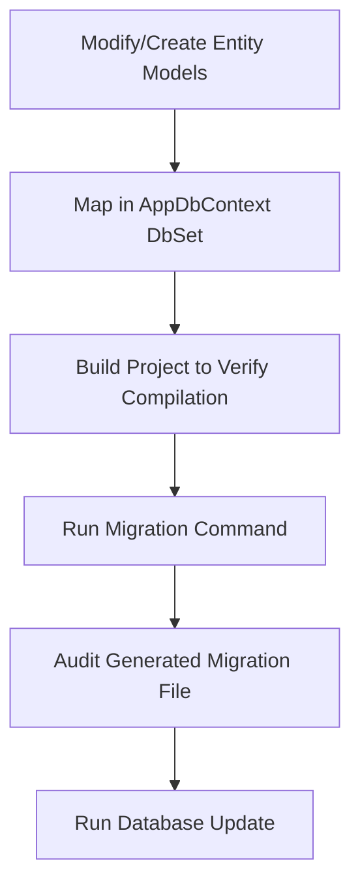

# EF Core Database Migration Skill

This skill outlines the strict workflow for altering the database schema using Entity Framework Core (Code-First) within the CafeChain project.

---

## 1. Prerequisites
Before executing any migration commands:
- **Language Lock**: All table names, columns, relationships, and index names must be in **English**.
- **No Direct DB Edits**: Never modify tables or columns directly via SQL Server Management Studio (SSMS) or SQL queries. All changes must originate from the C# Entity Models inside the `Data/` or `Models/` directories.

---

## 2. Standard Schema Modification Workflow



### Step 1: Model Definition & AppDbContext Mapping
1. Modify or create entity classes (e.g., `StoreIP.cs` or `AttendanceLog.cs`).
2. Register the model inside `Data/AppDbContext.cs` as a `DbSet<TEntity>` property.
3. Configure entity constraints (Primary keys, Indexing, Foreign keys, Cascade settings) in `OnModelCreating` using Fluent API:
```csharp
modelBuilder.Entity<StoreIP>(entity =>
{
    entity.HasKey(e => e.Id);
    entity.Property(e => e.IPAddress).IsRequired().HasMaxLength(50);
    entity.HasOne(e => e.Store)
          .WithMany(s => s.StoreIPs)
          .HasForeignKey(e => e.StoreId)
          .OnDelete(DeleteBehavior.Cascade);
});
```

### Step 2: Compile Validation
Ensure the project compiles with no warnings or syntax errors before generating migration code. Run:
```powershell
dotnet build
```

### Step 3: Generating Code Migrations
Run the `dotnet ef migrations add` command inside the project root folder.
- **Naming Rule**: Always use a clean camelCase description prefixed with a logical verb (`Add`, `Modify`, `Remove`, `Rename`).
- **Example Command**:
```powershell
dotnet ef migrations add AddStoreIPAndAttendanceLogTables
```

### Step 4: Code Auditing (Critical Safeguard)
Open the generated file under `/Migrations/{Timestamp}_AddStoreIPAndAttendanceLogTables.cs`.
Verify:
1. **Cascade Triggers**: Ensure `onDelete: ReferentialAction.Cascade` is only used when logically required. Switch to `Restrict` or `NoAction` to avoid circular delete paths.
2. **Nullable Reference Types**: Verify that columns intended to allow null values map to nullable C# properties (e.g., `int? StoreId`).

### Step 5: Applying to Database
Apply the migration to your local SQL Server instance:
```powershell
dotnet ef database update
```

---

## 3. Disaster Recovery (Rollback Protocol)
If a migration fails or is applied with incorrect mappings:
1. **To rollback changes before database update**:
   ```powershell
   dotnet ef migrations remove
   ```
2. **To rollback after database update**:
   - Revert database to a specific safe migration stamp:
     ```powershell
     dotnet ef database update NameOfPreviousSafeMigration
     ```
   - Once database is rolled back, remove the incorrect migration:
     ```powershell
     dotnet ef migrations remove
     ```
