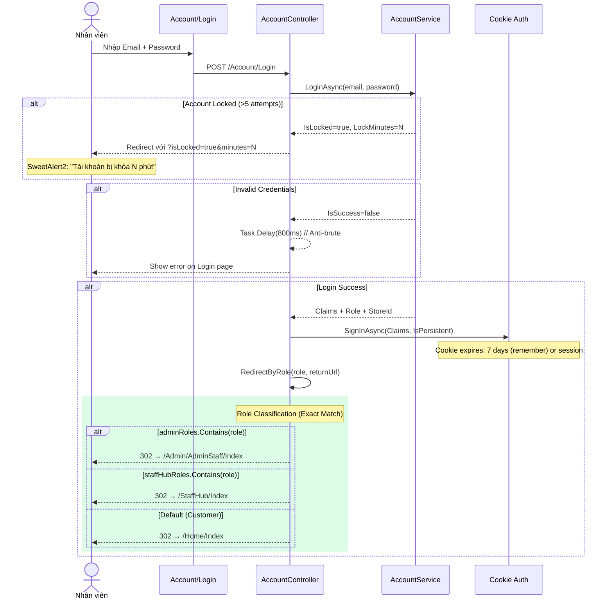
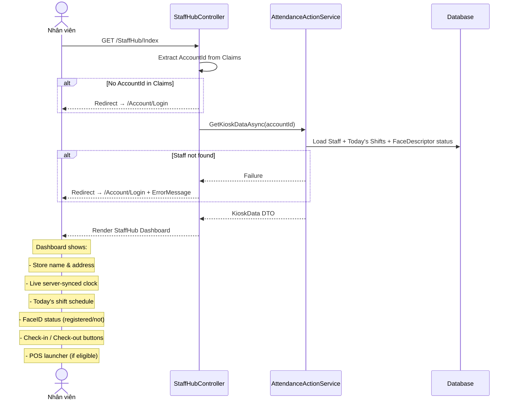
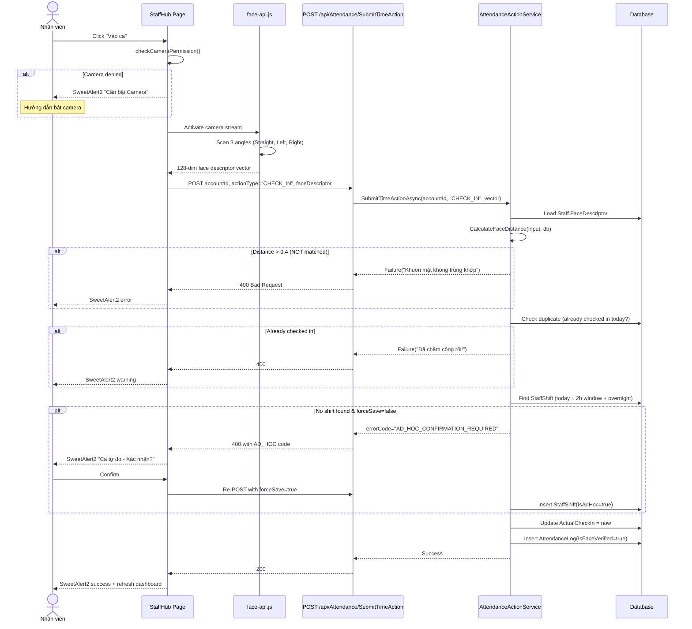

# StaffHub Auth & Role Redirect Workflow

---
version: 2.0
last_verified: 2026-05-26
depends_on:
  - docs/module-1-auth-rbac.md
scope: LOGIN → REDIRECT → STAFFHUB ACCESS (IP Geofencing DEFERRED)
---

This document specifies the end-to-end authentication routing for CafeChain employees, from login submission to StaffHub dashboard access. IP geofencing checks are **deferred** and not included in this flow.

---

## 1. Core Login → Redirect Flow

---

## 2. StaffHub Dashboard Load Flow

---

## 3. Check-In Attendance Flow (FaceID)

---

## 4. Error Recovery Matrix

| # | Edge Case | Trigger | Auto Recovery | Manual Fallback |
|---|---|---|---|---|
| 1 | Cookie expired during StaffHub use | 7-day expiry or idle timeout | 302 → Login page (for page requests) | Global AJAX 401 handler → SweetAlert2 |
| 2 | Duplicate check-in (same day) | 2 devices, same account | Server blocks with error message | Staff sees "Đã chấm công rồi" |
| 3 | Overnight shift cross-day | Check-in 23:50, shift starts 23:00 | Query includes yesterday's overnight shifts | Manual ad-hoc if auto-match fails |
| 4 | Camera permission denied | Browser setting | Detect via `navigator.permissions` | Show instruction overlay |
| 5 | Face model load timeout | Slow network (>30s) | Promise.race timeout + retry button | Skip FaceID (admin override) |
| 6 | Unknown role after login | New role not in constants | Falls through to Home | Log warning + notify admin |
| 7 | Staff has no FaceDescriptor | New hire, not registered | Service returns clear error | Redirect to face registration |
| 8 | IDOR attack on API | Malicious accountId in POST | Extract from Claims, ignore POST body | Return 401 Unauthorized |
| 9 | First-login password | Default password detected | Modal blocks all StaffHub access | Must change before proceeding |
| 10 | Concurrent POS + Check-out | Staff checks out while POS is open | POS should detect shift end | SweetAlert2 "Ca đã kết thúc" on next POS action |
