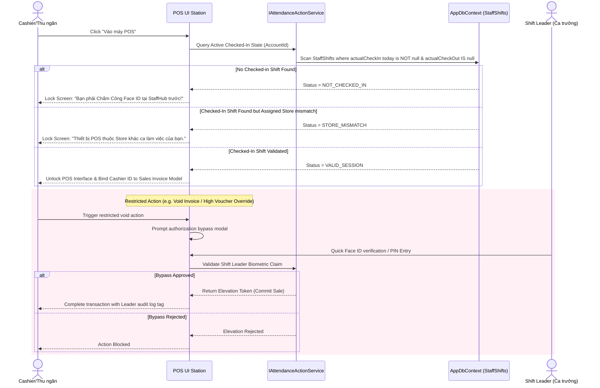

# Active Shift-Locked POS Check-in & Unlock Workflow

---
version: 2.0
last_verified: 2026-05-26
depends_on:
  - docs/module-4-pos-locked-guard.md
  - docs/module-2-staff-hub.md
scope: POS ENTRY GUARD + LEADER ELEVATION (depends on StaffHub attendance)
---

This document defines the zero-trust workflow ensuring only physically present, biometrically checked-in cashiers and authorized shift leaders can unlock and process sales at CafeChain POS terminals.

---

## 1. Flow Design: Zero-Trust Guard on POS
No F&B staff member can access POS transactions without an actively verified work state.



---

## 2. Technical Validation Logic (Zero-Trust Guard Clause)

To prevent cashiers from manipulating POST payloads to bypass the check-in requirement, the POS controller actions must contain the following verification check:

```csharp
[HttpPost("CommitSale")]
public async Task<IActionResult> CommitSale([FromBody] SaleTransactionDto saleDto)
{
    var accountIdClaim = User.FindFirst(ClaimTypes.NameIdentifier)?.Value;
    if (string.IsNullOrEmpty(accountIdClaim) || !int.TryParse(accountIdClaim, out int loggedInAccountId))
    {
        return Unauthorized(new { success = false, message = "Chưa đăng nhập." });
    }

    // 1. Core Guard: Is the staff member actively checked-in right now?
    var activeShift = await _context.StaffShifts
        .Include(s => s.Shift)
        .FirstOrDefaultAsync(s => s.Staff.AccountId == loggedInAccountId 
                             && s.ActualCheckIn != null 
                             && s.ActualCheckOut == null);

    if (activeShift == null)
    {
        return BadRequest(new { 
            success = false, 
            message = "Giao dịch bị chặn! Bạn không nằm trong ca làm việc tích cực nào. Hãy chấm công trước." 
        });
    }

    // 2. Geofence Guard: Is the sale being processed in the correct store location?
    if (activeShift.Staff.StoreId != saleDto.StoreId)
    {
        return BadRequest(new { 
            success = false, 
            message = "Sai phạm bảo mật! Cửa hàng giao dịch không khớp với địa điểm chấm công của bạn." 
        });
    }

    // Process sale transaction ...
    return Ok(new { success = true, message = "Giao dịch đã được ghi nhận." });
}
```

---

## 3. Shift Leader privileged Elevation Override
If the transaction requires overriding (for example: voiding an item or applying a massive discount), the Cashier can summon a Shift Leader to authenticate on the spot.

1. **Elevation Modal**: Pops up requesting a Face Scan or 4-digit PIN matching the Shift Leader assigned to the same store.
2. **AJAX Elevation Payload**:
   ```json
   {
     "action": "PrivilegedElevation",
     "targetInvoiceId": 10594,
     "leaderPin": "9988",
     "storeId": 4
   }
   ```
3. **Audit Logging**: The server verifies that the entered credentials belong to a checked-in Shift Leader at the same store location. The transaction is then logged in `InvoiceAuditLogs` with both `CashierStaffId` and `ApproverStaffId` references, satisfying rigorous anti-fraud auditing guidelines.
