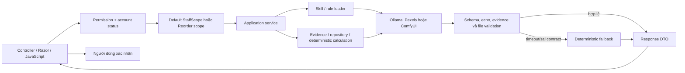

# Hướng dẫn tổng hợp nghiệp vụ và kỹ thuật AI CafeChain

> **Nguồn chuẩn:** tài liệu này được đối chiếu trực tiếp với source ngày
> 30/07/2026. Khi tài liệu cũ mâu thuẫn với tài liệu này, ưu tiên source và
> tài liệu này. Không có secret, API key hay connection string nào được ghi lại.

## 1. Giới thiệu

CafeChain dùng AI ở những điểm cần hiểu ngôn ngữ tự nhiên hoặc diễn giải dữ
liệu. Các phép tính tồn kho, dự báo thống kê, chấm điểm, phát hiện bất thường và
chuyển trạng thái chứng từ vẫn do backend xác định. AI hỗ trợ người dùng đọc kết
quả; AI không thay người dùng duyệt nghiệp vụ, không tự chạy SQL và không tự tạo
chứng từ.

Phạm vi runtime đã tìm thấy gồm:

- AI Dashboard: hiểu câu hỏi, lập kế hoạch dữ liệu có whitelist, lấy evidence và
  trình bày phân tích/biểu đồ.
- Giải thích gợi ý nhập hàng: LLM chỉ viết lời giải thích cho kết quả rule đã
  tính; hệ thống luôn có deterministic fallback.
- Gợi ý dữ liệu danh mục, đồ uống, size và topping; pipeline ảnh Pexels/ComfyUI.
- Forecast, supplier scoring, anomaly detection và POS recommendation có code,
  worker và contract, nhưng phần lớn đang tắt bằng cấu hình hoặc chưa có luồng
  UI vận hành đầy đủ.
- Màn hình “tối ưu lịch” hiện chỉ quản lý availability, constraint, staffing
  requirement và time-off; chưa có solver/LLM tự xếp ca.

Giới hạn quan trọng: chất lượng phụ thuộc dữ liệu nghiệp vụ; output AI có thể
fallback; pipeline ảnh chưa dùng vision model; một số entry point AI master-data
đang bị ẩn; và người dùng luôn phải xác nhận kết quả trước khi lưu.

## 2. Danh sách chức năng AI

| STT | Chức năng | Form/Module | Người dùng/quyền | Input | Output | Provider/cơ chế | Trạng thái thực tế |
| ---: | --- | --- | --- | --- | --- | --- | --- |
| 1 | Hỏi đáp AI Dashboard | Dashboard, tab AI | `App.AdminDashboard` và policy Dashboard hiện hành | Câu hỏi, kỳ, Store trong scope | `AnalysisContext`, evidence, kết luận, bảng và chart plan | Rule parser + Ollama tùy flag | **Dùng được để demo**; intent parser bật, phần LLM explanation đang tắt trong cấu hình hiện tại nên có deterministic fallback |
| 2 | Phân tích doanh thu/đơn hàng/top sản phẩm/tồn kho/NCC | Cùng AI Dashboard | Như trên | `AnswerFocus`, filter backend | Fact, statistic, comparison, chart | Stored procedure/repository + rule; Ollama chỉ diễn giải | **Đã nối UI**, evidence-first |
| 3 | Tính gợi ý nhập hàng | Kho & Cung ứng → Gợi ý nhập hàng | `ReorderSuggestion.View` | Tồn khả dụng, tiêu thụ, ngưỡng, lead time, PO/restock đang xử lý, package | Điểm đặt hàng, nhu cầu còn lại, số package, số lượng cuối | Công thức deterministic | **Đã triển khai**, **không phải mô hình AI** |
| 4 | Giải thích gợi ý nhập hàng | Nút giải thích trên danh sách gợi ý | `ReorderSuggestion.View` + StaffScope chuyên biệt | Snapshot kết quả rule | Summary, risk, action text | Ollama hoặc deterministic fallback | **Dùng được để demo** |
| 5 | Chuyển gợi ý thành yêu cầu nhập | Nút tạo/bổ sung yêu cầu | `Restock.Create` | Suggestion token, Store, ingredient, RequestKey | RestockRequest/adjustment | Transactional business service | **Đã triển khai**, không phải AI; có deduplication |
| 6 | Gợi ý danh mục | Category | `Category.Create` | Ý tưởng, danh mục hiện có | Tên, code, icon, mô tả | Ollama + fallback + duplicate filter | Backend/JS có; nút ở Index bị `d-none`, view Create riêng không có GET entry bình thường: **prototype chưa khả dụng theo luồng chuẩn** |
| 7 | Gợi ý đồ uống | Drink Create | `Drink.Create` | Ý tưởng, mode, master data | Tên, code/type/category, mô tả, visual specification | Ollama + fallback | Backend/JS/UI có nhưng nút entry bị `d-none`: **prototype** |
| 8 | Gợi ý size | Size Index | `Size.Create` | Ý tưởng, mode, size hiện có | Tên, mô tả, loại | Ollama + fallback | Section cha bị `d-none`: **prototype** |
| 9 | Gợi ý topping | Topping Index | `Topping.Create` | Ý tưởng, mode, topping hiện có | Tên, image prompt, visual specification | Ollama + fallback | Section cha bị `d-none`: **prototype** |
| 10 | Tìm ảnh tham chiếu | Drink/Topping prototype | Quyền Create tương ứng | Visual specification, query, excluded IDs | Ứng viên Pexels đã chấm metadata | Pexels + metadata scorer | Code hoàn chỉnh mức prototype; entry UI bị ẩn |
| 11 | Tạo/dùng ảnh | Drink/Topping prototype | Quyền Create tương ứng | Prompt hoặc ảnh Pexels | File ảnh kỹ thuật hợp lệ để gắn vào form | ComfyUI img2img/txt2img hoặc dùng Pexels trực tiếp | Prototype; chưa vision validation, attribution Pexels chưa persist |
| 12 | Forecast doanh thu/sản phẩm | `AdminIntelligence` + worker | Policy Dashboard + StaffScope | Chuỗi thời gian theo Store | 7/30 ngày, khoảng dự báo, quality | Seasonal naive/moving average | Code/worker có nhưng `RevenueEnabled` và `ProductEnabled` đang **OFF** |
| 13 | Đánh giá nhà cung cấp | `CompareSuppliers` | Policy Dashboard + StaffScope | Store, ingredient, lượng cần | Score, confidence, component scores | Công thức trọng số; Ollama chỉ giải thích | Code có, `ScoringEnabled` đang **OFF**, chưa có UI chính |
| 14 | Phát hiện bất thường | AdminOperationalAnomalies + worker | `App.AdminDashboard` + StaffScope | Revenue series | Anomaly, robust score, feedback | Median/MAD; Ollama chỉ giải thích | Code/UI có nhưng worker flag đang **OFF** |
| 15 | POS recommendation | Worker/catalog | Chưa có UI người dùng hoàn chỉnh | Basket lịch sử | Support/confidence/lift | Association statistics | Code/worker có, flag đang **OFF** |
| 16 | “Tối ưu” lịch làm việc | AdminShiftOptimization | `Shift.View`/`Shift.Create` + StaffScope | Availability, constraint, requirement, time-off | Cấu hình ràng buộc | CRUD/rule validation | Đã có form cấu hình; **chưa có thuật toán sinh lịch tự động** |
| 17 | Face ID, Gemini, embedding, vision | Chỉ xuất hiện trong blueprint/tài liệu hoặc cảnh báo | Không có contract runtime AI hoàn chỉnh | — | — | — | **Ngoài phạm vi runtime hiện tại** |

## 3. Kiến trúc AI tổng thể



Nguyên tắc dữ liệu:

1. Controller xác thực account và permission.
2. Backend resolve EffectiveStoreIds trước khi query.
3. Service chỉ lấy dữ liệu đã giới hạn; LLM không nhận DbContext và không nhận
   câu lệnh SQL.
4. Prompt chứa rule/skill và evidence đã chuẩn hóa.
5. Output phải qua validation; lỗi chuyển sang fallback.
6. Chỉ service nghiệp vụ được phép ghi dữ liệu sau khi người dùng xác nhận.

Scope đặc biệt của SystemAdmin chỉ áp dụng cho `ReorderSuggestion`: toàn bộ
Store **Active**. Dashboard, forecast, anomaly, supplier scoring và các module
kinh doanh khác dùng default StaffScope; không suy rộng quyền global từ role.

## 4. Provider và tích hợp

### 4.1 Ollama

- Vai trò: parse intent có cấu trúc và viết lời giải thích/gợi ý.
- Cấu hình: `AI:*` và `Ollama:*`; Base URL, model, timeout, temperature,
  keep-alive. Không ghi giá trị môi trường thật vào tài liệu.
- Request: `POST api/chat` với system prompt, payload JSON và format có cấu
  trúc. Không gửi SQL.
- Response: text/JSON; client trả `Success`, `UsedFallback` và thông báo an toàn.
- Timeout: HttpClient dùng `Ollama:TimeoutSeconds`, clamp 1–600 giây.
- Retry: structured master-data có giới hạn retry từ
  `AI:StructuredResponseRetries`; không retry vô hạn.
- Health: `GET /Admin/AI/Health` gọi endpoint model/provider.
- Fallback: rule/candidate tĩnh hoặc narrative deterministic tùy feature.
- Bảo mật: log feature, độ dài payload, elapsed và loại lỗi; không log prompt
  đầy đủ hay secret.

### 4.2 Pexels

- Vai trò: tìm và tải ảnh tham chiếu theo Visual Specification.
- Cấu hình: `Pexels:Enabled`, `BaseUrl`, `ApiKey`, timeout, page size và max
  bytes. API key phải ở secret store.
- Request: query đã giới hạn độ dài, orientation và excluded photo IDs.
- Response: metadata ảnh; scorer xét query/alt/dimension/orientation. Đây không
  phải vision scoring.
- Timeout: clamp 3–120 giây; lỗi transient được đánh dấu retryable.
- Cache/retry: memory cache theo hash specification; số round/query/candidate
  bị giới hạn bởi `AIImagePipeline`.
- Fallback: cho phép chuyển sang txt2img khi cấu hình và người dùng xác nhận;
  không âm thầm dùng ảnh kém điểm.
- Bản quyền: phải hiển thị nguồn/photographer; source hiện cảnh báo attribution
  chỉ tồn tại trong phiên form, chưa persist cùng entity.

### 4.3 ComfyUI

- Vai trò: img2img từ ảnh Pexels hoặc txt2img từ prompt.
- Cấu hình: `ComfyUI:*`, workflow path, checkpoint, node IDs, output size,
  steps/CFG/sampler, timeout. Không ghi checkpoint/đường dẫn máy thật.
- Request: workflow JSON được clone, sau đó map prompt, latent/reference,
  sampler, batch và output node theo node ID cấu hình.
- Response: poll history, tải output; kiểm file ảnh, dimension, orientation và
  size kỹ thuật.
- Timeout: clamp 10–600 giây; poll theo interval cấu hình.
- Fallback: trả lỗi retryable; người dùng có thể dùng Pexels trực tiếp hoặc
  upload thủ công. Cấu hình hiện không tự fallback sang ComfyUI.
- Giới hạn: chưa có vision model kiểm đúng chủ thể/ngữ nghĩa.

### 4.4 Provider không tồn tại

Không tìm thấy Gemini, OpenAI API, embedding store hoặc vision inference trong
runtime hiện tại. Các tên đó trong prompt/blueprint không chứng minh tính năng
đã triển khai.

## 5. Skill và rule

- Skill root mặc định: `Resources/AI/skills`.
- Schema root mặc định: `Resources/AI/schemas`.
- `AISkillCatalog` route theo entity/feature, đọc toàn bộ `SKILL.md` cần thiết,
  kiểm frontmatter/name, chống path escape khỏi ContentRoot và giới hạn context
  2.000–50.000 ký tự (mặc định cấu hình 12.000).
- Named skills gồm dashboard intent/insight, inventory reorder explanation,
  forecast explanation, supplier score explanation và anomaly explanation.
- Master-data dùng `skill-router`, `cafe-business-rules`,
  `suggestion-generation`, `duplicate-detection`; Drink/Topping thêm
  image-prompt, Pexels và ComfyUI skills.
- JSON schema quy định field/type/range. Thiếu skill/schema không làm app tự
  sáng tạo contract: loader ghi warning và dùng prompt/fallback tích hợp.
- Version hiện nằm trong skill metadata, calculation/model version và schema
  file; khi đổi contract cần đổi version, test parser và giữ compatibility DTO.
- Chống prompt injection hiện có: system prompt xác định contract, input được
  serialize thành JSON, output whitelist/schema, echo/evidence validation,
  context size/path guard. Tuy nhiên chưa có bộ phân loại injection chung cho
  mọi master-data prompt; đây là hạn chế cần test và harden.

## 6. Luồng xử lý từng chức năng AI

### 6.1 AI Dashboard

1. Mục đích: trả lời câu hỏi kinh doanh có bằng chứng.
2. Quyền: policy Dashboard yêu cầu account hợp lệ và `App.AdminDashboard`.
3. Input: prompt tối đa 500 ký tự, locale, kỳ, Store/context.
4. Validation: period tối đa 366 ngày, enum/widget whitelist, rate limit,
   context/fingerprint.
5. Dữ liệu: Dashboard Service/Repository và stored procedure read-only.
6. Scope: default StaffScope; requested Store phải thuộc EffectiveStoreIds.
7. Prompt/rule: QuestionCatalog xác định focus, DataPlan và answer style.
8. Provider: Ollama khi từng flag bật.
9. Output: schema, widget coverage, evidence ID và số grounded được kiểm.
10. Fallback: parser/narrative deterministic.
11. UI: analysis context, source, warning, chart/table và status AI.
12. Lỗi: 400/403/404/422/429 hoặc fallback có cảnh báo.
13. Log: trace/analysis ID, StaffId, StoreIds, intent, status, elapsed; không log
    secret.
14. Giới hạn: giải thích LLM đang tắt trong cấu hình hiện tại; câu hỏi ngoài
    catalog đi vào DynamicFocus với confidence thấp hơn.

### 6.2 Gợi ý nhập hàng và giải thích

1. Mục đích: phát hiện nguyên liệu cần bổ sung và giải thích nguyên nhân.
2. Quyền: `ReorderSuggestion.View`; tạo yêu cầu cần `Restock.Create`.
3. Input: Store, analysis window, ingredient và suggestion token.
4. Validation: Store scope, token/fingerprint/version, ingredient, offer,
   threshold, unit/package và trạng thái.
5. Dữ liệu: inventory, consumption, incoming PO, pipeline procurement,
   supplier offer và price history.
6. Scope: Owner/Manager dùng StaffScope; SystemAdmin chỉ trong module này được
   dùng mọi Store Active.
7. Rule: công thức ở mục 8; AI không thay đổi số.
8. Provider: Ollama chỉ cho action Explain.
9. Output: đúng bốn text field, số/evidence/status phải khớp snapshot.
10. Fallback: giải thích deterministic.
11. UI: badge mức độ, số lượng, lý do, lời giải thích và CTA được permission
    guard.
12. Lỗi: data incomplete, expired/changed suggestion, out-of-scope, timeout.
13. Log/audit: AI warning; confirmation ghi transition snapshot và RequestKey.
14. Giới hạn: lịch sử tiêu thụ là average trong window, chưa dùng forecast model.

### 6.3 Master-data suggestion

1. Mục đích: gợi ý bản nháp category/drink/size/topping.
2. Quyền: permission Create của entity.
3. Input: idea, mode, field đang nhập và dữ liệu hiện có.
4. Validation: DataAnnotations, độ dài, enum/code whitelist, relevance và
   duplicate similarity.
5. Dữ liệu: master data cần thiết; không gửi dữ liệu Store.
6. Scope: không phải dữ liệu kinh doanh theo Store, nhưng vẫn cần account và
   permission.
7. Prompt: skill catalog + JSON payload.
8. Provider: Ollama.
9. Output: DTO đã clean/validate; visual spec do backend tạo cho Drink/Topping.
10. Fallback: candidate tĩnh, vẫn lọc trùng.
11. UI: code/JS tồn tại nhưng entry point chính đang bị ẩn.
12. Lỗi: invalid request/response, timeout, unavailable.
13. Log: request ID, provider status, không log secret.
14. Giới hạn: chưa production-ready; output chỉ điền form, không tự lưu.

### 6.4 Forecast, supplier, anomaly và POS recommendation

- Forecast chọn SeasonalNaive hoặc MovingAverage 7/14/28 theo backtest
  MAE/WAPE; LLM chỉ giải thích một forecast point.
- Supplier score là tổng trọng số price/on-time/fill/quality/lead-time và gắn
  confidence theo số receipt; LLM chỉ diễn giải component đã chốt.
- Anomaly dùng median/MAD, ngưỡng chênh lệch tuyệt đối/phần trăm và robust
  score; người dùng có feedback với rowversion.
- POS recommendation tính support, confidence, lift từ basket; không phải
  generative AI.
- Tất cả phải resolve Store trước query. Các worker tôn trọng feature flag;
  trạng thái hiện tại là OFF nên không được trình diễn như tính năng đang chạy.

### 6.5 Cấu hình lịch

Màn hình lưu availability, giờ tối đa/tối thiểu nghỉ, staffing requirement và
time-off sau khi kiểm Store scope. Không có phương thức generate/optimize
schedule trong `ShiftOptimizationService`; không gọi LLM. Vì vậy chỉ gọi đây là
“workspace cấu hình ràng buộc”, không gọi “AI tự xếp ca”.

## 7. AI Dashboard

`BusinessIntent` phân nhóm RevenueAnalysis, OrderAnalysis, ProductPerformance,
InventoryAnalysis, ReorderAnalysis, SupplierAnalysis, AnomalyDetection,
StoreComparison và tổng quan. `AnswerFocus` cụ thể hóa câu hỏi, ví dụ
RevenueComparison, TopSellingProducts, ReorderPriority. Khi không match catalog,
`DynamicFocus` lưu mô tả trọng tâm và confidence mặc định thấp hơn.

`DataPlan` do server tạo, chứa nguồn/widget whitelist, field, metric, filter,
EffectiveStoreIds, period, grouping, sort, limit và data-quality rule.
`EvidencePack` chứa primary/supporting/chart/table evidence, applied filters,
missing fields và limitations. `ChartPlan` chỉ tham chiếu field/evidence có thật.
`AnalysisContext` bind period, Store scope và fingerprint. `DataStatus` phân biệt
OK/NO_DATA/ERROR/partial states; AI không được biến dữ liệu thiếu thành kết luận
chắc chắn.

Luồng:

```text
Câu hỏi
→ QuestionUnderstanding (BusinessIntent, AnswerFocus, DynamicFocus)
→ EffectiveStoreIds + DataPlan
→ widget data + EvidencePack
→ deterministic insight/chart
→ Ollama explanation nếu bật và hợp lệ
→ fallback nếu provider/output lỗi
```

Câu hỏi mẫu đúng catalog:

- “So sánh doanh thu kỳ này với kỳ trước.”
- “Top 10 sản phẩm bán chạy nhất trong kỳ là gì?”
- “Phân tích số đơn và tỷ lệ hủy theo chi nhánh.”
- “Nguyên liệu nào đang có nguy cơ thiếu?”
- “Nguyên liệu nào nên được đặt lại trước?”
- “Nhà cung cấp nào có rủi ro chất lượng hoặc đơn mua quá hạn?”

Biểu đồ là bằng chứng trực quan, không trang trí: line cho xu hướng thời gian,
bar/horizontal bar cho ranking/comparison, donut/stacked cho composition, table
cho dữ liệu chi tiết. LLM phải bao phủ đúng widget, dùng số đã grounded và kết
thúc theo AnswerFocus; output lạc đề, thêm số lạ hoặc thiếu evidence bị reject.

## 8. AI gợi ý nhập hàng

Phần tính toán hoàn toàn rule-based:

```text
AverageDailyConsumption = UsageQuantity / AnalysisWindowDays
ReorderPoint = AverageDailyConsumption × LeadTimeDays + MinimumStock
ProjectedStock = AvailableStock + IncomingQuantity
RawDemand = max(0, ReorderPoint - ProjectedStock)
RemainingDemand = max(0, RawDemand - ProcurementCoveredQuantity)
SuggestedPackageCount =
    max(ceil(RemainingDemand / PackageBaseQuantity), MinimumOrderPackageCount)
FinalSuggestedQuantity = SuggestedPackageCount × PackageBaseQuantity
```

Offer được quy đổi về base unit; lựa chọn ưu tiên giá/base quantity rồi lead
time. Incoming chỉ lấy trạng thái PO hợp lệ; coverage tránh đếm lặp restock/PA/PO
đang xử lý. Thiếu threshold, history, lead time, unit/package hoặc supplier offer
thì trả `DATA_INCOMPLETE`, không tự đoán.

Action Explain gửi snapshot rule sang Ollama; output sai status, sai schema hoặc
chứa số không có trong evidence bị fallback. Action Confirm khóa/recalculate
server-side, không tin quantity/storeId client, dùng RequestKey,
`RequestDeduplicationService`, Serializable transaction, token/fingerprint và
transition audit. Replay cùng RequestKey không tạo dòng yêu cầu thứ hai.

Forecast worker hiện tắt và không nằm trong công thức trên. Vì vậy không gọi số
gợi ý hiện tại là “AI forecast”.

## 9. AI tạo nội dung và hình ảnh

Luồng prototype:

```text
Ý tưởng
→ Ollama/fallback tạo suggestion + VisualSpecification
→ Pexels queries (3–6) và metadata scoring
→ người dùng chọn ảnh
→ dùng Pexels trực tiếp hoặc ComfyUI img2img
→ nếu được phép: ComfyUI txt2img
→ validate format/dimension/orientation/size
→ chuyển Base64 thành File trên browser
→ người dùng áp dụng vào form và lưu qua luồng upload thường
```

Workflow ComfyUI nằm dưới `Resources/AI/ComfyUI` và `Resources/AI/workflows`.
Node mapping lấy từ `ComfyUIOptions`: checkpoint, sampler, reference/scale,
latent, positive/negative prompt, batch và output. Client poll history đến timeout.

Pexels download bị giới hạn bytes, chuẩn hóa JPEG, resize và kiểm orientation.
Comfy output phải là ảnh hợp lệ, tối thiểu 256×256 và đúng orientation. Pipeline
không lưu trực tiếp entity hoặc Cloudinary; file chỉ được đưa vào form, sau đó
luồng create/upload thông thường mới lưu.

Fallback:

- Không có ảnh đạt điểm: báo lỗi và có thể cho txt2img khi cấu hình cho phép.
- Pexels lỗi: retryable; người dùng upload thủ công.
- ComfyUI lỗi/timeout: giữ suggestion text hoặc dùng Pexels trực tiếp.
- Không có vision validation: bắt buộc người dùng xem và chọn.

Bản quyền: hiển thị photographer/Pexels link và tuân thủ điều khoản Pexels.
Hiện attribution chưa persist cùng Drink/Topping; đây là việc phải hoàn thiện
trước production.

## 10. Validation và bảo mật

- Permission kiểm ở controller/API và application service; ẩn nút không thay
  backend authorization.
- Resolve account → permission → EffectiveStoreIds trước khi query. Requested
  Store ngoài scope trả 403/validation và audit; không query trước rồi mới che.
- SystemAdmin global Active Store chỉ cho ReorderSuggestion. Các AI khác dùng
  default StaffScope.
- Prompt không được chứa SQL executor/tool. Data plan chỉ chọn widget đã
  whitelist.
- Serialize input thành JSON, giới hạn prompt/context; skill path không được
  thoát ContentRoot.
- Validate schema, enum, field count, length, echo, evidence ID, grounded number
  và data status. Không dùng output invalid.
- Master-data prompt injection defense chưa đồng đều; cần thêm adversarial tests.
- Image URL phải từ provider đã cấu hình; download giới hạn timeout/bytes;
  ImageSharp kiểm format/dimension. Chưa có semantic/vision validation.
- Không log secret, raw API key hay connection string. Credential đang tồn tại
  trong local config phải rotate và chuyển sang environment/user-secrets/secret
  manager.
- Áp dụng rate limit cho Dashboard; các endpoint prototype cần rate-limit rõ
  trước khi mở UI.
- Restock Confirm dùng antiforgery, loading state, RequestKey, deduplication,
  transaction và replay-safe backend.
- LLM không tự lưu entity, không tự duyệt/confirm và không thay separation of
  duties.

## 11. Hướng dẫn sử dụng

### AI Dashboard

1. Đăng nhập tài khoản có `App.AdminDashboard`.
2. Mở Dashboard, chọn kỳ và Store thuộc StaffScope.
3. Mở tab AI, chọn câu hỏi mẫu hoặc nhập câu hỏi tối đa 500 ký tự.
4. Đọc `AnalysisContext`, `DataStatus`, applied filters và cảnh báo.
5. Đối chiếu kết luận với chart/table và mục “Xem nguồn dữ liệu”.
6. Nếu hiển thị `Fallback`, facts vẫn từ backend; chỉ phần diễn đạt dùng rule.

### Gợi ý nhập hàng

1. Có `ReorderSuggestion.View`, mở Kho & Cung ứng → Gợi ý nhập hàng.
2. Chọn Store trong phạm vi và analysis window.
3. Đọc tồn khả dụng, incoming, reorder point, coverage, package và lý do.
4. Bấm giải thích để xem narrative; kiểm `UsedOllama/UsedFallback` nếu UI hiển
   thị trạng thái.
5. Chỉ khi có `Restock.Create`, chọn tạo/bổ sung yêu cầu. Không double-click;
   màn hình khóa nút trong request.
6. Nếu suggestion changed/expired, tải lại để backend tính lại.

### Master-data và ảnh

Entry point hiện bị ẩn nên không xem là chức năng người dùng bình thường. Khi
pilot được bật có kiểm soát: nhập ý tưởng → chọn suggestion → chọn/tìm ảnh →
kiểm nội dung/bản quyền → áp dụng vào form → người dùng tự bấm lưu. Không dùng
endpoint trực tiếp nếu chưa có quyền Create tương ứng.

### Forecast/anomaly/supplier/POS

Không bật trực tiếp trên production nếu chưa hoàn tất seed dữ liệu, StaffScope,
permission, worker monitoring và UI acceptance test. Các endpoint hiện phục vụ
pilot/kỹ thuật.

## 12. Xử lý lỗi

| Lỗi | Nguyên nhân | Hệ thống xử lý | Người dùng xử lý |
| --- | --- | --- | --- |
| Ollama không chạy/model thiếu | Provider offline/config sai | Health false; feature trả fallback hoặc warning | Khởi động provider/model; vẫn dùng facts/fallback |
| Timeout | Model/provider chậm | Hủy theo timeout, log loại lỗi, fallback/retryable | Thử lại một lần; không double-click |
| JSON sai schema | Model trả markdown/field lạ/type sai | Reject, không dùng một phần output | Dùng fallback; báo kỹ thuật nếu lặp |
| Không đủ dữ liệu | Thiếu history/threshold/COGS/offer | `NO_DATA`, partial hoặc `DATA_INCOMPLETE` | Bổ sung dữ liệu nguồn rồi chạy lại |
| Không có quyền | Thiếu permission/override Deny/account inactive | 403, không query nghiệp vụ | Liên hệ quản trị RBAC |
| Store ngoài scope | Sửa URL/body hoặc chọn Store không thuộc scope | 403/validation và audit | Chọn Store được cấp; không sửa request |
| Suggestion changed/expired | Snapshot không còn khớp | 409, không tạo Restock | Tải lại danh sách |
| Request trùng | Double-click/replay | Trả kết quả trước hoặc conflict phù hợp; không insert lặp | Dùng kết quả hiện có |
| Pexels không có ảnh | Không có metadata candidate đủ điểm | Báo no suitable image; có thể mở text fallback | Đổi ý tưởng/query hoặc upload thủ công |
| Pexels lỗi | Key/network/rate limit | Retryable, không dùng URL tùy ý | Kiểm cấu hình/giới hạn provider |
| ComfyUI lỗi | Service/workflow/node/checkpoint sai | Timeout/retryable; không trả file lỗi | Kiểm service/workflow hoặc dùng Pexels/upload |
| File quá lớn/sai định dạng | Download/output không đạt policy | Từ chối hoặc normalize theo giới hạn | Chọn ảnh khác |
| Ảnh sai ngữ nghĩa | Chưa có vision model | Cảnh báo bắt buộc human review | Không áp dụng ảnh sai |
| Provider không phản hồi | Network/provider crash | Fallback hoặc failure có trace | Kiểm log theo trace ID |

## 13. Kiểm thử

- Unit: question catalog, DataPlan, evidence builder, reorder formula, package
  rounding, forecast selector, supplier weights, MAD anomaly, basket metrics.
- Integration: controller → service → repository/provider stub; feature flags;
  antiforgery; status codes.
- Authorization: grant/deny override, account inactive, direct URL 403, UI
  visibility theo permission.
- StaffScope: Owner/Manager Store A không thấy B; SystemAdmin chỉ global Active
  Store trong Reorder; Dashboard/module khác không kế thừa global.
- Prompt injection: yêu cầu bỏ system rule/chạy SQL/đổi schema; payload chứa
  markup; skill path escape.
- Fallback: Ollama disabled/unavailable/timeout/invalid JSON.
- Output schema: field lạ, numeric string, missing echo/evidence, ungrounded
  number và status contradiction.
- Image: Pexels timeout/status/content type/size, metadata score, Comfy workflow
  node thiếu, invalid image, orientation, max bytes và attribution.
- Reorder: token expired/changed, body Store tampering, replay và concurrent
  RequestKey chỉ tạo một request/transition.
- Test source hiện có đáng chú ý:
  `DashboardAiFallbackContractTests`, `DashboardIntelligenceP0P1ContractTests`,
  `InventoryReorderAiExplanationTests`, `AIImagePipelineTests`,
  `AIImageHttpClientTests`, `AISkillCatalogTests`,
  `AiPhase2To4ContractTests`, `ReorderSuggestionConfirmationContractTests`.

## 14. Hạn chế và hướng phát triển

### Hạn chế source hiện tại

- Dashboard LLM explanation đang OFF trong cấu hình; demo narrative chủ yếu là
  fallback.
- Master-data/image có code end-to-end nhưng entry point UI bị ẩn.
- Visual Specification được client gửi lại nhưng chưa có chữ ký/binding với
  suggestion snapshot; cần chống sửa prompt/spec.
- Pexels attribution chưa persist; chưa có vision semantic validation.
- Forecast/supplier/anomaly/POS recommendation phần lớn đang flag OFF; UI/ops
  chưa hoàn chỉnh.
- Shift optimization chưa sinh lịch; chỉ lưu cấu hình.
- Prompt-injection defense chưa đồng nhất cho mọi feature.
- Generic typed explanation cần tiếp tục reject đầy đủ unknown field và số không
  grounded ở mọi schema, không chỉ Dashboard/Reorder.

### Hướng phát triển đề xuất

1. Hoàn thiện HTTP/StaffScope/security tests rồi mới bật từng flag theo pilot.
2. Ký Visual Specification và bind RequestId/SuggestionId/payload hash.
3. Persist attribution/source/license metadata; thêm moderation/vision validator.
4. Thêm provider telemetry, rate-limit và circuit breaker theo feature.
5. Đánh giá forecast bằng backtest theo Store trước khi dùng vào quyết định.
6. Nếu xây solver lịch, tách rõ constraint optimizer khỏi LLM explanation.

Các mục trên là đề xuất, không phải chức năng đã hoàn thiện.

## 15. Danh sách file nguồn

Các nguồn chính đã đối chiếu:

- `Areas/Admin/Controllers/AdminDashboardIntelligenceController.cs`
- `Areas/Admin/Controllers/AdminReorderSuggestionsController.cs`
- `Areas/Admin/Controllers/AdminIntelligenceController.cs`
- `Areas/Admin/Controllers/AdminOperationalAnomaliesController.cs`
- `Areas/Admin/Controllers/AdminCategoryController.cs`
- `Areas/Admin/Controllers/AdminDrinkController.cs`
- `Areas/Admin/Controllers/AdminSizeController.cs`
- `Areas/Admin/Controllers/AdminToppingController.cs`
- `Application/Services/Admin/Dashboard/DashboardIntelligenceService*.cs`
- `Application/Services/Admin/Dashboard/DashboardQuestionCatalog.cs`
- `Application/Services/Inventories/ReorderSuggestionService.cs`
- `Application/Services/Inventories/ReorderSuggestionConfirmationService.cs`
- `Application/Services/AI/AIService*.cs`
- `Application/Services/AI/AIImagePipelineService.cs`
- `Application/Services/AI/OllamaClient.cs`
- `Application/Services/AI/PexelsClient.cs`
- `Application/Services/AI/ComfyUIClient.cs`
- `Application/Services/AI/AISkillCatalog.cs`
- `Application/Services/AI/Forecast*.cs`
- `Application/Services/AI/SupplierIntelligenceService.cs`
- `Application/Services/AI/AnomalyDetectionService.cs`
- `Application/Services/AI/PosRecommendationService.cs`
- `Application/Services/Admin/Staffs/ShiftOptimizationService.cs`
- `Application/Options/*IntelligenceOptions.cs`, `ForecastingOptions.cs`
- `Infrastructure/Configurations/AIOptions.cs`, `OllamaOptions.cs`,
  `PexelsOptions.cs`, `ComfyUIOptions.cs`, `AIImageOptions.cs`
- `Resources/AI/skills`, `Resources/AI/schemas`, `Resources/AI/workflows`,
  `Resources/AI/ComfyUI`
- `wwwroot/js/Admin/Dashboard`, `wwwroot/js/Admin/AI`
- Các test AI/Reorder/Scope trong `CafeChain.Tests`.

