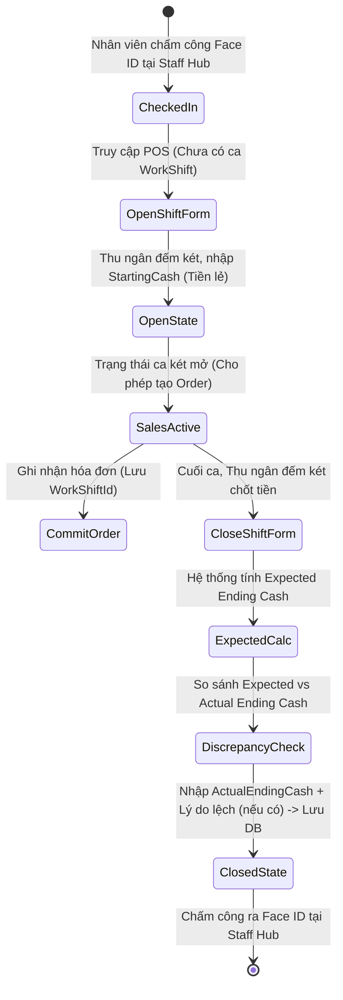

# 📑 BÁO CÁO PHÂN TÍCH NGHIỆP VỤ HỆ THỐNG POS (POS BUSINESS REQUIREMENTS DOCUMENT - BRD)
## 💼 Dự án: CafeChain - Phân Tích bởi Business Analyst (BA)
**Tác giả:** Business Analyst (BA)  
**Phiên bản:** 1.0  
**Ngày lập:** 2026-05-28  
**Đối tượng:** Đội ngũ Phát triển Phần mềm, Quản lý Cửa hàng, và Kế toán Tài chính.

---

## 1. 🎯 TỔNG QUAN DỰ ÁN & MỤC TIÊU KINH DOANH (BUSINESS CONTEXT)

Hệ thống POS (Point of Sale) tại quầy của CafeChain không đơn thuần chỉ là một phần mềm ghi nhận đơn hàng (order) và in hóa đơn, mà là **trung tâm quản trị dòng tiền mặt** và **điểm kiểm soát an ninh vận hành** trực tiếp tại cửa hàng.

### 🔴 Các Điểm Nghẽn Vận Hành Hiện Tại (Pain Points)
1. **Thất thoát tiền mặt (Cash Leakage):** Thu ngân thực hiện hủy hóa đơn đã thanh toán sau khi khách đi để đút túi riêng tiền mặt mà hệ thống không có ghi vết kiểm toán hoặc sự giám sát của quản lý.
2. **Lệch két bàn giao ca (Shift Handover Discrepancies):** Tiền lẻ thối đầu ca và tiền chốt ca cuối ngày thường xuyên bị lệch mà không rõ nguyên nhân từ nhân viên nào.
3. **Bán hàng không kiểm soát (Unauthorized Selling):** Nhân viên chưa chấm công vào ca vẫn có thể vào POS để bán hàng, dẫn đến sai lệch giờ công và lỗ hổng bảo mật.
4. **Gián đoạn khi mất mạng (Network Instability):** Mạng chập chờn khiến quầy POS bị đơ, nhân viên không thể phục vụ khách hàng, gây giảm trải nghiệm nghiêm trọng.

### 🟢 Mục Tiêu Hệ Thống POS Mới
* **Bảo mật tuyệt đối ca làm việc (Shift-Locked Security):** Chỉ nhân viên đã chấm công Face ID hợp lệ mới được mở két POS.
* **Minh bạch tài chính 100%:** Quản lý vòng đời hộc kéo tiền mặt (Standard Float), đối soát lệch két tự động.
* **Cơ chế elevation bảo mật:** Mọi thao tác rủi ro cao (hủy món, giảm giá lớn) bắt buộc phải có PIN Trưởng ca chấp thuận trực tiếp.
* **Hoạt động liên tục (High Availability):** Hỗ trợ offline mượt mà, tự động đồng bộ khi có kết nối lại.

---

## 2. 👥 PHÂN TÍCH CÁC BÊN LIÊN QUAN (STAKEHOLDER ANALYSIS)

Hệ thống POS được vận hành và tương tác bởi nhiều đối tượng với các mối quan tâm khác nhau. BA định nghĩa các User Persona như sau:

| Đối tượng | Vai trò trong POS | Mối quan tâm lớn nhất (Core Concerns) |
| :--- | :--- | :--- |
| **Thu ngân (`Cashier`)** | Người trực tiếp sử dụng POS để chọn món, thu tiền, in hóa đơn. | - Tốc độ phản hồi cực nhanh (dưới 100ms/click). - Giao diện cảm ứng nút lớn dễ bấm. - Quy trình thối tiền lẻ đơn giản, rõ ràng. |
| **Ca trưởng (`ShiftSupervisor`)** | Người giám sát ca, duyệt các thao tác nhạy cảm, mở/đóng két. | - Duyệt bằng OTP one-time 6 ký tự (email), không còn PIN cố định (#143). - Báo cáo chênh lệch tiền mặt cuối ca nhanh để bàn giao ca. |
| **Kế toán (`CFO / Accountant`)** | Người đối soát doanh thu tài chính cuối ngày từ xa. | - Báo cáo lệch két chính xác (Lệch bao nhiêu, ai làm lệch, lý do là gì). - Vết kiểm toán (`InvoiceAuditLog`) rõ ràng cho từng hóa đơn bị hủy/giảm giá. |
| **Nhân viên Pha chế / Bếp** | Người nhận thông tin order để chuẩn bị đồ uống. | - Món ăn in ra bếp/hiển thị màn hình bếp phải chính xác về Size, Sugar/Ice, Toppings. - Tránh trùng lặp đơn. |
| **Khách hàng (`Customer`)** | Người chi trả tiền và nhận đồ uống. | - Hóa đơn in ra rõ ràng, chi tiết tiền gốc và tiền giảm. - Tích điểm thành viên chính xác. - Áp voucher khuyến mãi không bị lỗi. |

---

## 3. 🔄 QUY TRÌNH NGHIỆP VỤ CHI TIẾT (CORE BUSINESS PROCESSES)

### Quy trình 1: Vòng Đời Két Tiền POS (WorkShift Lifecycle)
Đây là quy trình xương sống quản lý dòng tiền mặt vật lý tại quầy bán hàng.

#### ✍️ Đặc tả nghiệp vụ từ BA:
1. **Điều kiện đầu vào (Entry Criteria):** User đăng nhập có Role `Cashier` hoặc `ShiftSupervisor`, đã check-in `StaffShift` thành công tại cửa hàng đó.
2. **Két lẻ tiêu chuẩn (Change Fund Policy):** Cửa hàng bàn giao một két tiền lẻ mặc định (ví dụ 1.000.000đ).
   - Nếu két lẻ khớp định mức: Thu ngân nhập `StartingCash = 1.000.000đ`.
   - Nếu két lẻ bị thừa/thiếu do ca trước bàn giao sai: Thu ngân bắt buộc nhập con số thực tế đếm được (ví dụ: 950.000đ). Hệ thống ghi nhận điểm khởi đầu mới cho ca này và tự động gắn cờ lệch ca trước.
3. **Chốt két cuối ca (Safe Drop & Discrepancy Policy):**
   - Công thức tính tiền mặt lý thuyết:
     $$\text{Expected Ending Cash} = \text{StartingCash} + \sum \text{Tiền mặt thu đơn} - \sum \text{Tiền thối}$$
   - Thu ngân đếm tổng tiền mặt thực tế trong hộc (`ActualEndingCash`).
   - Nếu có chênh lệch $\neq 0$: Hệ thống bắt buộc nhập **Lý do chênh lệch** (`DiscrepancyReason`) (Ví dụ: *"Khách không lấy 2.000đ tiền thối"*, *"Thối nhầm tiền cho khách đơn #123"*).
   - **Rút tiền doanh thu (Safe Drop):** Toàn bộ số tiền vượt định mức két lẻ (Expected Ending Cash - Starting Cash) phải được rút ra, niêm phong nộp cho Quản lý. Trong hộc kéo POS chỉ để lại đúng định mức tiền lẻ tiêu chuẩn (ví dụ 1.000.000đ) để bàn giao.

---

### Quy trình 2: Giao Dịch Order & Thanh Toán Tại Quầy (POS Checkout)
Quy trình thực hiện order đồ uống và thanh toán trực tiếp với khách hàng.

#### ✍️ Đặc tả nghiệp vụ từ BA:
1. **Ghi nhận đồ uống và Customization:**
   - Đồ uống được chọn phải cho phép thiết lập thuộc tính phụ:
     - **Size:** M, L, XL (mỗi size có mức giá chênh lệch cộng dồn vào giá gốc).
     - **Sugar / Ice:** 100%, 70%, 50%, 0% (Không ảnh hưởng đến giá nhưng bắt buộc in ra hóa đơn bếp).
     - **Topping:** Thạch, Trân châu, Pudding... (Mỗi topping chọn thêm sẽ cộng dồn một số tiền cố định vào đơn giá dòng món ăn).
2. **Nhận diện thành viên & Tích điểm (Loyalty Integration):**
   - Thu ngân tìm kiếm khách hàng bằng **Số điện thoại**.
   - Nếu khách hàng tồn tại: Hiển thị hạng thành viên, số điểm hiện tại.
   - **Tích điểm:** Mỗi hóa đơn thanh toán thành công sẽ tự động tích lũy điểm dựa trên tỷ lệ cấu hình (ví dụ: Tích điểm = 5% tổng hóa đơn thanh toán thực tế).
   - **Tiêu điểm:** Khách hàng có thể quy đổi điểm thành tiền giảm giá trực tiếp (ví dụ: 1 điểm = 1.000đ). Số điểm muốn tiêu (`PointsUsed`) phải nhỏ hơn hoặc bằng số dư khả dụng và không vượt quá 50% tổng trị giá hóa đơn.
3. **Khuyến mãi & Voucher (Promo Engine):**
   - Thu ngân nhập mã voucher $\rightarrow$ POS gọi API kiểm tra tính hợp lệ.
   - Các điều kiện ràng buộc voucher bao gồm:
     - Hạn sử dụng.
     - Giá trị đơn hàng tối thiểu (`MinOrderValue`).
     - Chỉ áp dụng cho một số chi nhánh nhất định (`StoreBound`).
     - Giảm theo số tiền cố định hoặc giảm theo phần trăm (có chặn giá trị tối đa `MaxDiscount`).
4. **Phương thức thanh toán hỗn hợp (Split Payments):** Hệ thống cho phép khách hàng thanh toán bằng nhiều hình thức kết hợp (Ví dụ: Khách thanh toán đơn hàng 100.000đ bằng cách dùng 20.000đ tiền mặt lẻ + 80.000đ quét mã QR chuyển khoản).

---

### Quy trình 3: Kiểm Soát Thao Tác Nhạy Cảm (Shift Leader Elevation)
Cơ chế bảo mật ngăn ngừa gian lận dòng tiền của thu ngân.

#### ✍️ Đặc tả nghiệp vụ từ BA:
1. **Các sự kiện kích hoạt kiểm soát:**
   - **Hủy hóa đơn (Void Invoice):** Đơn hàng đã hoàn thành, khách muốn hủy trả đồ hoặc thu ngân nhập sai cần hủy để tạo lại.
   - **Giảm giá thủ công (Manual Discount) > 15%:** Tự giảm giá cho người quen mà không có mã voucher khuyến mãi của hệ thống.
   - **Đổi giá món (Override Unit Price):** Thay đổi đơn giá của ly cafe trực tiếp tại quầy khác với giá niêm yết trên hệ thống.
2. **Cơ chế bypass:**
   - Màn hình POS ngay lập tức kích hoạt một lớp phủ mờ (Backdrop overlay) khóa toàn bộ tương tác bán hàng.
   - Hiển thị bảng số (Numpad) yêu cầu nhập **Mã PIN Trưởng ca** (PIN gồm 4 chữ số).
   - POS gửi API xác thực lên Server. Trưởng ca nhập đúng PIN $\rightarrow$ Hệ thống cho phép thực hiện thao tác nhạy cảm, đồng thời ghi log kiểm toán chi tiết vào bảng `InvoiceAuditLogs`.

---

### Quy trình 4: Vận Hành Ngoại Tuyến & Đồng Bộ (Offline Resiliency)
Đảm bảo POS hoạt động trơn tru ngay cả khi mất mạng đột ngột.

#### ✍️ Đặc tả nghiệp vụ từ BA:
1. **Lưu trữ cục bộ:** Khi mất mạng (hệ thống phát hiện qua trạng thái ping hoặc bắt lỗi mạng ajax), POS tự động chuyển sang chế độ **Offline Mode**. Các hóa đơn bán ra được mã hóa và lưu trữ trực tiếp vào `LocalStorage` hoặc `IndexedDB` của trình duyệt.
2. **In hóa đơn offline:** Sử dụng template in ấn tối giản được tích hợp sẵn ở Client để in hóa đơn cho khách.
3. **Đồng bộ khi có mạng (Sync Trigger):** Khi hệ thống phát hiện có mạng trở lại (Online), POS hiển thị chỉ báo màu xanh và kích hoạt nút *"Đồng bộ dữ liệu ngoại tuyến"*.
4. **Xử lý trừ kho an toàn (Safe Inventory Sync):** 
   - Đơn hàng sau khi đồng bộ lên Server sẽ được lưu vết gắn cờ `[OFFLINE-SYNC]`.
   - Hệ thống tự động kích hoạt tiến trình trừ kho nguyên liệu tương ứng với danh sách đồ uống trong đơn hàng ngoại tuyến để đảm bảo số liệu tồn kho thực tế và trên phần mềm luôn khớp nhau.

---

## 4. 📋 YÊU CẦU CHỨC NĂNG HỆ THỐNG (FUNCTIONAL REQUIREMENTS MATRIX)

BA phân cấp các yêu cầu chức năng theo mô hình **MoSCoW (Must - Should - Could - Won't)** để đội ngũ phát triển ưu tiên triển khai:

| Mã YC | Phân hệ | Tên Chức năng | Đặc tả Chi tiết Nghiệp vụ | Mức độ |
| :--- | :--- | :--- | :--- | :--- |
| **FR-POS-01** | Két tiền | Mở ca két tiền | Bắt buộc nhập `StartingCash` đầu ngày mới được vào màn hình bán hàng. Lưu StoreId và StaffId từ Claims. | **MUST** |
| **FR-POS-02** | Két tiền | Đóng ca đối soát | Hệ thống tính Expected Cash, nhân viên nhập Actual Cash. Bắt buộc nhập lý do nếu bị lệch. Chuyển ca sang Closed. | **MUST** |
| **FR-POS-03** | Bán hàng | Giỏ hàng & Giá | Tính đơn giá món = (Giá gốc + Giá size + Tổng giá toppings) * Số lượng. | **MUST** |
| **FR-POS-04** | Bán hàng | Khách hàng thành viên | Tìm kiếm khách hàng qua SĐT. Hiển thị hạng thành viên, tích lũy điểm và áp dụng trừ điểm giảm giá trực tiếp. | **MUST** |
| **FR-POS-05** | Bán hàng | Áp dụng Voucher | Nhập mã voucher, gọi API kiểm tra tính hợp lệ và tự động trừ tiền giảm giá dựa theo phần trăm/tiền mặt của Voucher. | **MUST** |
| **FR-POS-06** | Bảo mật | Kiểm soát Trưởng ca | OTP one-time cho thao tác nhạy cảm trong scope (chênh lệch két / đóng ngoại lệ / mở ca trễ); generic PIN bypass đã gỡ (#140–#143). | **MUST** |
| **FR-POS-07** | Vận hành | Ngoại tuyến (Offline) | Tự lưu đơn hàng vào LocalStorage khi mất kết nối mạng, cho phép in hóa đơn offline tạm thời. | **SHOULD** |
| **FR-POS-08** | Vận hành | Đồng bộ Offline | Gửi danh sách đơn offline lên server khi có mạng lại, mở Transaction lưu DB và tự động kích hoạt khấu trừ kho nguyên liệu. | **SHOULD** |
| **FR-POS-09** | Bán hàng | Thanh toán hỗn hợp | Hỗ trợ chia tiền thanh toán một đơn hàng bằng cả tiền mặt và chuyển khoản QR cùng lúc. | **SHOULD** |
| **FR-POS-10** | Báo cáo | Lịch sử két tiền | Xem lịch sử các ca két tiền `WorkShift` đã đóng tại chi nhánh kèm chi tiết số tiền lệch và lý do lệch. | **COULD** |

---

## 5. ⚡ YÊU CẦU PHI CHỨC NĂNG (NON-FUNCTIONAL REQUIREMENTS - NFRs)

Để hệ thống POS hoạt động xuất sắc tại cửa hàng có lượng khách đông vào giờ cao điểm, BA đề xuất các chỉ số phi chức năng sau:

1. **Hiệu năng & Tốc độ phản hồi (Performance):**
   - Thời gian tìm kiếm món ăn hoặc thêm món vào giỏ hàng phải dưới **50ms**.
   - Thời gian hoàn thành giao dịch ghi nhận hóa đơn lưu DB dưới **200ms**.
   - Giao diện phải tải mượt mà trên các thiết bị máy POS chuyên dụng (cấu hình thường trung bình yếu, chạy Windows/Android tích hợp).
2. **An toàn bảo mật (Security):**
   - **Anti-IDOR:** Mọi API thanh toán, áp voucher bắt buộc phải lấy `AccountId` và `StoreId` từ Claims của Server, tuyệt đối không tin cậy dữ liệu Client gửi lên.
   - **PIN Hashing:** Mã PIN Trưởng ca phải được lưu dạng băm Bcrypt, cấm lưu bản rõ (Plaintext) trong DB để tránh rò rỉ dữ liệu.
   - **OTP attempt limits:** Sai OTP quá max attempts → challenge Locked; TTL/resend cooldown; anti-self-approval (#139–#143).
3. **Trải nghiệm người dùng (UX/UI & Usability):**
   - Thiết kế giao diện theo tông màu tối sang trọng (**Dark Mode**) để nhân viên đứng quầy làm việc liên tục 8-12 tiếng không bị mỏi mắt dưới ánh đèn neon của quán.
   - Kích thước các nút chọn món, nút thanh toán phải lớn (tối thiểu **48px x 48px**) phù hợp cho thao tác chạm bằng ngón tay trên màn hình cảm ứng, không yêu cầu dùng chuột.
   - Có bàn phím số (Numeric Numpad) ảo lớn trên màn hình để thu ngân gõ số tiền nhanh.

---

## 6. ⚠️ GIẢI PHÁP CHO CÁC TÌNH HUỐNG LỖI ĐẶC BIỆT (EDGE CASES & BA RECOMMENDATIONS)

Trong thực tế vận hành chuỗi F&B, các tình huống bất ngờ thường xuyên xảy ra. BA đề xuất giải pháp xử lý cụ thể cho đội ngũ phát triển:

### 🚨 Tình huống 1: Ca làm việc của nhân viên hết hạn giữa chừng khi đang bán hàng dở dang
* **Kịch bản:** Ca làm việc nhân sự của thu ngân (`StaffShift`) kết thúc lúc 14:00. Tuy nhiên, lúc 14:05 thu ngân vẫn đang thao tác nhập giỏ hàng cho một nhóm khách đông chưa thanh toán xong.
* **Giải pháp từ BA:** 
  - Hệ thống **không** được tự động logout nhân viên hoặc khóa màn hình POS ngay lập tức khi hết giờ ca làm việc nhân sự để tránh làm hỏng trải nghiệm mua hàng của khách.
  - Cho phép thu ngân hoàn thành nốt giao dịch đang dang dở.
  - Sau khi giao dịch hiện tại hoàn tất (in xong hóa đơn), hệ thống mới kích hoạt khóa cổng POS và hiển thị popup yêu cầu nhân viên tiến hành bàn giao két tiền lẻ và thực hiện Check-out Face ID trên Staff Hub.

### 🚨 Tình huống 2: Lệch két bàn giao vượt quá hạn mức cho phép
* **Kịch bản:** Cuối ca, thu ngân Ca 1 bàn giao két tiền, hệ thống tính Expected Cash = 5.500.000đ, nhưng thu ngân đếm thực tế chỉ thấy 4.500.000đ (lệch âm 1.000.000đ - thất thoát nghiêm trọng).
* **Giải pháp từ BA:**
  - Thiết lập **Hạn mức lệch két cho phép** (ví dụ: tối đa 50.000đ).
  - Nếu số tiền lệch vượt quá hạn mức cho phép này, hệ thống **không cho phép** thu ngân tự động đóng ca két tiền.
  - POS hiển thị thông báo: *"Số tiền chênh lệch vượt quá hạn mức cho phép. Vui lòng yêu cầu OTP phê duyệt từ Ca trưởng để xác nhận bàn giao ca."*
  - Việc này buộc Quản lý phải vào kiểm tra hộc kéo và camera ngay lập tức thay vì để thu ngân tự đóng ca ra về.

### 🚨 Tình huống 3: Concurrency két tiền (Hai thiết bị cùng truy cập một hộc kéo)
* **Kịch bản:** Một quầy thu ngân có 2 máy POS dùng chung 1 hộc kéo đựng tiền mặt vật lý. Cả hai nhân viên cùng đăng nhập và thao tác bán hàng dễ gây loạn doanh số mặt két.
* **Giải pháp từ BA:**
  - Ràng buộc mối quan hệ: Một `WorkShift` chỉ được liên kết với một ID thiết bị POS (`PosTerminalId`) duy nhất tại một thời điểm.
  - Nếu thiết bị POS B cố gắng mở ca két tiền trên cùng một hộc kéo/tài khoản đang mở tại POS A, hệ thống sẽ chặn lại và cảnh báo thiết bị đang được sử dụng ở phiên khác.
