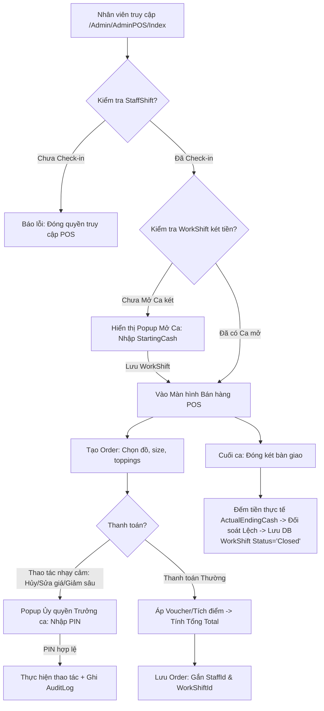

# 🛒 CẨM NANG NGHIỆP VỤ & PROMPT VIBE CODING HỆ THỐNG POS (CAFECHAIN)
## 🎯 Tài Liệu Thiết Kế Kỹ Thuật Dành Riêng Cho Các Model AI (LLM-Ready)

Tài liệu này hệ thống hóa toàn bộ nghiệp vụ (business logic) của hệ thống **Point of Sale (POS - Điểm bán hàng tại quầy)** trong chuỗi F&B CafeChain. Tài liệu được cấu trúc dưới dạng **Prompt mẫu và Bản tả nghiệp vụ sâu** để các model AI (Gemini, Claude, GPT) có thể đọc hiểu cấu trúc DB hiện tại và sinh mã nguồn chuẩn xác 100%, tránh các lỗi logic két tiền và lỗ hổng bảo mật.

---

## 1. 🏗️ BẢN ĐỒ NGHIỆP VỤ CỐT LÕI CỦA POS (POS WORKFLOWS)



---

## 2. 📚 CHI TIẾT NGHIỆP VỤ KỸ THUẬT & QUY TẮC CỦA POS

### A. Quản lý Phiên Két Tiền (`WorkShift` - Cash Session)
1. **Khởi tạo (Mở Ca):**
   - Đọc thông tin `UserId` (StaffId) và `StoreId` từ Claims của User đăng nhập.
   - Nhập số tiền lẻ đầu ca (`StartingCash`) để phục vụ thối tiền.
   - Trạng thái `WorkShift` khi lưu xuống DB mặc định là `"Open"`, `StartTime = DateTime.UtcNow`.
2. **Ràng buộc bán hàng (Active Guard):**
   - Tất cả các API tạo hóa đơn (`CommitOrder`) trên POS bắt buộc phải kiểm tra xem két tiền `WorkShift` của Thu ngân đó tại cửa hàng đó có đang `"Open"` hay không. 
   - Nếu ca đã `"Closed"`, từ chối tạo hóa đơn và trả về mã lỗi: `400 Bad Request ("Phiên két tiền đã đóng, vui lòng mở ca mới để tiếp tục bán hàng")`.
3. **Kết thúc (Đóng Ca & Đối Soát):**
   - **Tiền mặt lý thuyết (`ExpectedEndingCash`):**
     $$\text{Expected} = \text{Starting Cash} + \sum \text{Tiền mặt thu về từ đơn hàng} - \sum \text{Tiền thối ra}$$
   - **Tiền mặt thực tế (`ActualEndingCash`):** Thu ngân đếm trực tiếp trong ngăn kéo và nhập thủ công.
   - **Xử lý chênh lệch (Discrepancy):** 
     - Lệch = `ActualEndingCash` - `ExpectedEndingCash`.
     - Nếu Lệch $\neq 0$, hệ thống bắt buộc Client hiển thị trường nhập **Lý do chênh lệch** (`DiscrepancyReason`) và lưu vết kiểm toán.
     - Ghi nhận `EndTime = DateTime.UtcNow`, `Status = "Closed"`.

---

### B. Nghiệp vụ Order & Thanh toán tại Quầy
1. **Tính toán giá trị giỏ hàng (Dynamic Price Calculations):**
   - Công thức tính đơn giá của 1 dòng Item:
     $$\text{ItemPrice} = (\text{BasePrice} + \text{SizePrice} + \sum \text{ToppingPrice}) \times \text{Quantity}$$
2. **Khấu trừ Điểm thành viên (Loyalty Points Discount):**
   - Khách hàng đọc số điện thoại $\rightarrow$ Hệ thống truy vấn thông tin Loyalty.
   - Quy đổi điểm: 1 điểm = 1.000đ (hoặc theo cấu hình hệ thống). Khách hàng có thể chọn số điểm muốn tiêu thụ (`PointsUsed`), kiểm tra số dư điểm thực tế.
3. **Áp dụng Voucher Khuyến mãi (Voucher Validation API):**
   - Gửi yêu cầu qua API `POST /api/Pos/validate-voucher` với các tham số: `{ Code, CustomerId, SubTotal }`.
   - Tính toán mức giảm dựa trên snapshot voucher:
     - Nếu giảm số tiền cố định (`DiscountAmount`): Giảm trực tiếp giá trị đó.
     - Nếu giảm phần trăm (`DiscountPercent`): Tính $\text{Discount} = (\text{SubTotal} \times \text{Percent}) / 100$, chặn mức tối đa (`MaxDiscount`).
4. **Cam kết Giao dịch (Transactional Commit DTO):**
   - Khi nhấn thanh toán, Client gửi DTO lên Backend.
   - Backend chạy một **Database Transaction** chuẩn để đảm bảo tính toàn vẹn:
     - Tạo bản ghi `Order` (gắn chặt `StoreId`, `StaffId`, và `WorkShiftId`).
     - Tạo danh sách `OrderDetail` và các topping liên quan (`OrderTopping`).
     - Trừ điểm khách hàng và tạo bản ghi lịch sử tích điểm (`PointTransaction`).
     - Áp dụng voucher và ghi nhận lượt dùng (`VoucherUsage`).
     - **Dành riêng cho Inventory:** Kích hoạt ngầm cơ chế trừ kho tự động (Blackbox Inventory Deduction) - *Tuyệt đối cấm can thiệp trực tiếp vào DB Kho nguyên liệu, chỉ phát tín hiệu/gọi Service trung gian.*
5. **Đồng bộ Đơn ngoại tuyến (Offline Order Syncing):**
   - Khi mất mạng, Client lưu tạm các hóa đơn đã bán vào LocalStorage của trình duyệt.
   - Khi mạng phục hồi, gửi danh sách DTO ngoại tuyến qua endpoint `POST /Admin/AdminPOS/SyncOfflineOrders`.
   - Backend sử dụng `BeginTransactionAsync()` để ghi nhận toàn bộ đơn hàng vào DB, gán nhãn ghi chú `[OFFLINE-SYNC]`, đảm bảo không trùng lặp và kích hoạt trừ kho tự động.

---

### C. Ủy Quyền Trưởng Ca & Bảo Mật POS (Shift Leader Bypass)
1. **Các thao tác cần kiểm soát:**
   - **Hủy hóa đơn:** Hủy đơn hàng đã in/đã thanh toán để thối tiền lại cho khách (nguy cơ thu ngân đút túi riêng).
   - **Giảm giá tay (Manual Discount):** Giảm giá trực tiếp trên tổng hóa đơn > 15% mà không có voucher hợp lệ.
   - **Sửa giá gốc:** Thay đổi đơn giá của món đồ uống trực tiếp tại quầy bán hàng.
2. **OTP phê duyệt (one-time, #139–#143):**
   - Không còn PIN cố định / `Staff.PinHash` / `AuthorizeBypass` PIN.
   - Thao tác nhạy cảm trong scope (CASH_DIFFERENCE, CLOSE_SHIFT_EXCEPTION, OPEN_SHIFT_LATE) dùng OTP challenge 6 ký tự alphanumeric gửi email Ca trưởng.
3. **OTP lifecycle:**
   - Request → Verify → Consume; payload fingerprint; anti-self-approval; max attempts/TTL/resend.
   - **Ghi log kiểm toán:** actor/approver/action/target/reason/challenge PublicId — không lưu OTP plaintext/hash trên Staff.

---

## 3. 💾 CẤU TRÚC DATABASE LIÊN QUAN ĐẾN POS (DATABASE MAP)

Các model chính trong DB bạn cần model AI thao tác chính xác:

### 1. Model `WorkShift` (`Models/Stores/WorkShift.cs`)
* Quản lý ca két tiền POS:
  * `ShiftId` (Key) - ID phiên két tiền.
  * `StoreId` - ID cửa hàng.
  * `UserId` - ID nhân viên thu ngân mở ca (FK $\rightarrow$ `Staff.StaffId`).
  * `StartTime` (DateTime) - Thời gian mở.
  * `EndTime` (DateTime, Nullable) - Thời gian chốt ca.
  * `StartingCash` (decimal) - Tiền lẻ đầu ca.
  * `ExpectedEndingCash` (decimal) - Tiền mặt lý thuyết.
  * `ActualEndingCash` (decimal, Nullable) - Tiền mặt đếm thực tế.
  * `Status` (string) - Trạng thái (`"Open"`, `"Closed"`).
  * `DiscrepancyReason` (string, Nullable) - Lý do chênh lệch tiền mặt.

### 2. Model `Order` (`Models/Orders/Order.cs`)
* Đại diện cho hóa đơn giao dịch tại quầy:
  * `OrderId` (Key)
  * `StoreId`, `StaffId` (Nullable - Người bán), `WorkShiftId` (Nullable - Ca két tiền).
  * `CustomerId` (Nullable - Điểm thành viên).
  * `SubTotal` (Tiền gốc), `VoucherDiscount` (Tiền giảm voucher), `PointDiscount` (Tiền giảm điểm), `Total` (Tổng tiền cuối cùng phải thu = `SubTotal` - `Discount`).
  * `OrderStatusId` (4 = Đã thanh toán / Hoàn thành).
  * `PaymentStatusId` (Đã thanh toán).
  * `OrderTypeId` (1 = DineIn, 2 = TakeAway, 3 = Delivery).

---

## 4. 📝 COPY-PASTE PROMPT CHO MODEL AI (POS VIBE CODING CHEAT SHEET)

Hãy sao chép đoạn Prompt chi tiết dưới đây và dán vào cửa sổ chat với AI khi bạn cần lập trình bất kỳ tính năng nào thuộc Module POS của CafeChain:

```text
Chúng ta đang xây dựng Module Bán Hàng Tại Quầy POS cho dự án CafeChain (ASP.NET Core MVC, N-Tier Architecture, EF Core). Hãy đóng vai trò là Chuyên gia Lập trình Cao cấp, đọc hiểu nghiệp vụ POS dưới đây và thực thi code chính xác:

1. Kiến Trúc Két Tiền POS (WorkShift - Cash Session):
   - Mọi giao dịch tại quầy bắt buộc phải gắn với một phiên két tiền đang mở (WorkShift.Status == "Open").
   - Khi mở ca, bắt buộc nhân viên nhập StartingCash (Tiền lẻ thối).
   - Khi đóng ca, bắt buộc nhân viên nhập ActualEndingCash (Tiền lẻ thực tế). Hệ thống tự tính ExpectedEndingCash = StartingCash + Tổng tiền mặt các đơn hàng trong ca.
   - Nếu có chênh lệch (Lệch != 0), bắt buộc Client hiển thị ô nhập DiscrepancyReason và lưu vào DB. Sau đó đổi Status = "Closed".

2. Bảo Mật Cổng POS (Access Guard):
   - Thu ngân (Cashier) và Ca trưởng (ShiftSupervisor) chỉ được vào màn hình POS khi và chỉ khi đã chấm công vào ca nhân sự thành công (có bản ghi StaffShift hoạt động hôm nay: ActualCheckIn != null && ActualCheckOut == null).
   - Nếu chưa check-in nhân sự, chặn truy cập ngay từ Controller và chuyển hướng về StaffHub kèm thông báo SweetAlert2.

3. Xử Lý Giao Dịch Bán Hàng (Commit Order API):
   - Nhận DTO thanh toán gồm danh sách món ăn, voucher, và điểm tiêu dùng.
   - Bắt buộc thực hiện trong Database Transaction (sử dụng _context.Database.BeginTransactionAsync()).
   - Tạo hóa đơn Order gắn StoreId, StaffId, và WorkShiftId của ca két tiền đang hoạt động.
   - Thực hiện tích lũy/khấu trừ điểm Loyalty và ghi nhận Voucher nếu có.
   - Đối với việc Trừ Kho Nguyên Liệu (Inventory Deduction): Hãy gọi qua một Service trung gian đại diện (ví dụ: IInventoryDeductionService.DeductForOrder(orderId)) để kích hoạt cơ chế ngầm của hệ thống, TUYỆT ĐỐI không viết code SQL/EF truy cập trực tiếp vào DB Nguyên liệu trong service POS để tránh vi phạm nguyên tắc Đóng gói Module.

4. Cơ Chế Ủy Quyền Trưởng Ca (OTP one-time — #139–#143):
   - Không còn PIN 4 số / Staff.PinHash / AuthorizeBypass PIN endpoint.
   - CASH_DIFFERENCE / CLOSE_SHIFT_EXCEPTION / OPEN_SHIFT_LATE bắt buộc OtpChallengePublicId đã Approved rồi consume.
   - Approver selection theo role/store/email active; anti-self-approval; payload fingerprint binding.
   - InvoiceAuditLog chỉ là historical evidence, không phải authorization authority.

5. Thiết Kế Giao Diện POS (Premium UI Rules):
   - Sử dụng gam màu Dark Mode thời thượng (Dark Navy #0f172a / #1e293b).
   - Phân chia bố cục làm 3 phần tối ưu trên màn hình ngang (Desktop):
     * Cột trái: Menu đồ uống (Grid 3-4 cột hình ảnh, phân tab phân loại rõ ràng).
     * Cột giữa: Giỏ hàng tạm tính (Sold items, tùy chọn size, toppings tăng giảm số lượng mượt mà).
     * Cột phải: Panel thanh toán (Chọn khách hàng thành viên, áp mã voucher, hiển thị các nút thanh toán nhanh tiền mặt 50k, 100k, 200k, 500k bằng bàn phím số numeric keypad lớn tối ưu cho màn hình cảm ứng).
   - Tích hợp Icon chỉ báo Trạng thái Mạng (Online/Offline indicator). Nếu mất mạng, hệ thống tự động chuyển sang cơ chế lưu LocalStorage tạm thời và báo cho nhân viên biết.

Hãy bắt đầu viết code cho mình dựa trên cấu trúc các file trong Cheat Sheet thư mục CafeChain. Hãy phản hồi dạng cấu trúc code sạch (Clean Code), viết log đầy đủ và xử lý Edge Cases kỹ lưỡng.
```

---

## 5. 🛠️ CHEAT SHEET CÁC FILE VÀ CẤU TRÚC KẾT NỐI POS TRÊN BACKEND

Dành cho Model AI định vị nhanh các file cần tác động khi lập trình POS:

```
 CafeChain
 ├── 📂 Application
 │    ├── 📂 DTOs
 │    │    └── 📂 POS
 │    │         ├── 📄 POSOrderCommitDto.cs     <-- DTO gửi từ quầy POS chứa thông tin giỏ hàng thanh toán
 │    │         └── 📄 OfflineOrderSyncDTO.cs   <-- DTO đồng bộ đơn hàng ngoại tuyến khi có mạng lại
 │    └── 📂 Interfaces
 │         └── 📂 POS
 │              └── 📄 IWorkShiftService.cs     <-- Khai báo nghiệp vụ Mở/Đóng két tiền, tính Expected Cash
 ├── 📂 Areas
 │    └── 📂 Admin
 │         ├── 📂 Controllers
 │         │    └── 📄 AdminPOSController.cs   <-- Controller chính điều phối View POS, Mở ca, Đồng bộ Offline
 │         └── 📂 Views
 │              └── 📂 AdminPOS
 │                   └── 📄 Index.cshtml       <-- Màn hình bán hàng POS quầy cao cấp (Dark Mode, Touch-friendly)
 ├── 📂 Models
 │    ├── 📂 Orders
 │    │    ├── 📄 Order.cs                     <-- Chứa WorkShiftId kết nối ca két tiền
 │    │    └── 📄 OrderDetail.cs               <-- Dòng món ăn bán ra
 │    └── 📂 Stores
 │         └── 📄 WorkShift.cs                 <-- Phiên hộc két POS (Open, Closed, StartingCash, EndingCash)
 └── 📂 Controllers
      └── 📄 PosController.cs                  <-- API bổ trợ (nhập mã giảm giá, kiểm tra chênh lệch nhanh)
```
