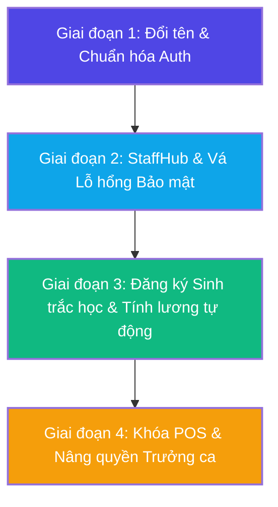

# BÁO CÁO PHÂN TÍCH VÀ LỘ TRÌNH TRIỂN KHAI (ROADMAP)
## Dự án: CafeChain - Hệ thống StaffHub & Biometric Attendance

Tài liệu này được biên soạn dựa trên phân tích cấu trúc thư mục `.agent`, mã nguồn thực tế của dự án CafeChain, và yêu cầu của bạn về việc chia các giai đoạn lập trình một cách khoa học, an toàn, có kiểm soát.

---

## 📅 Tổng quan các Giai đoạn (Roadmap)

Chúng ta sẽ chia dự án thành **4 Giai đoạn phát triển** tuần tự. Mỗi giai đoạn có mục tiêu, danh sách file ảnh hưởng, và các edge cases cần xử lý rõ ràng. 

> [!NOTE]  
> Theo yêu cầu của bạn, các phần liên quan tới **IP Geofencing sẽ tạm thời được bỏ qua hoặc làm cấu hình tùy chọn** ở giai đoạn đầu để không ảnh hưởng đến việc chấm công và trải nghiệm thực tế của nhân viên.

---

## 🎯 Chi tiết từng Giai đoạn

### 🔹 GIAI ĐOẠN 1: Chuẩn hóa Authentication & Di chuyển Đổi tên (Kiosk ➔ StaffHub)
* **Mục tiêu**: Đổi tên toàn bộ giao diện và luồng điều hướng từ "Kiosk" thành "StaffHub", đồng thời xây dựng hệ thống phân quyền điều hướng chuẩn hóa, an toàn. Tạm ẩn kiểm tra IP.
* **Các file ảnh hưởng**:
  * `Controllers/KioskController.cs` ➔ Đổi tên thành `StaffHubController.cs`
  * `Views/Kiosk/` ➔ Đổi tên thư mục thành `Views/StaffHub/`
  * `Controllers/AccountController.cs`
  * `Application/Services/Accounts/AccountService.cs`
  * `Views/Shared/_Layout.cshtml`
* **Các nhiệm vụ cụ thể**:
  1. [ ] **Di chuyển & Đổi tên**: Đổi tên `KioskController` sang `StaffHubController`. Đổi tên router `/Kiosk` thành `/StaffHub`.
  2. [ ] **Exact Role Matching**: Cập nhật `RedirectByRole` trong `AccountController.cs` dùng `RoleConstants` thay vì viết hardcode chuỗi tiếng Việt.
  3. [ ] **Inject StoreId Claim**: Đảm bảo khi đăng nhập thành công, `StoreId` của nhân viên được đưa vào Cookie Claims.
  4. [ ] **Tạm ẩn Check IP**: Trong `StaffHubController.Index` (hoặc `MyBYOD`), tạm thời comment/bỏ qua logic `ValidateStoreIPAsync` để tránh việc IP động của nhân viên bị chặn khi truy cập StaffHub.
  5. [ ] **Xử lý Edge Cases**:
     * Thêm logging khi phát hiện tài khoản có Role không hợp lệ (không thuộc Admin hay StaffHub).
     * Bổ sung AJAX global handler trong `_Layout.cshtml` sử dụng SweetAlert2 để phát hiện lỗi `401 Unauthorized` và điều hướng về trang đăng nhập một cách mượt mà.

---

### 🔹 GIAI ĐOẠN 2: StaffHub Dashboard & Vá Lỗ hổng Bảo mật (Vulnerability Fixes)
* **Mục tiêu**: Xây dựng màn hình Dashboard StaffHub cao cấp và khắc phục triệt để lỗ hổng bảo mật nghiêm trọng (IDOR) trong API chấm công hiện tại, đồng thời ngăn chặn các lỗi logic như chấm công trùng lặp.
* **Các file ảnh hưởng**:
  * `Controllers/AttendanceController.cs`
  * `Application/Services/Attendance/AttendanceActionService.cs`
  * `Views/StaffHub/Index.cshtml`
  * `wwwroot/js/staffhub.js`
* **Các nhiệm vụ cụ thể**:
  1. [ ] **Vá lỗ hổng IDOR (Critical)**:
     * Hiện tại các endpoint `SubmitTimeAction`, `RegisterFace`, `GetKioskData` trong `AttendanceController` đang nhận trực tiếp `accountId` từ client gửi lên (dễ bị giả mạo).
     * **Giải pháp**: Loại bỏ tham số `accountId` từ Request body/query. Thay vào đó, trích xuất an toàn từ `User.FindFirst(ClaimTypes.NameIdentifier).Value` ở phía Server.
  2. [ ] **Sửa lỗi N-Tier trong MyBYOD**:
     * Hiện tại phương thức `MyBYOD` trong `AttendanceController` đang gọi trực tiếp `DbContext` thông qua `HttpContext.RequestServices.GetService` ➔ vi phạm kiến trúc N-Tier.
     * **Giải pháp**: Chuyển toàn bộ logic xử lý dữ liệu qua `IAttendanceActionService` và sử dụng DI chuẩn hóa.
  3. [ ] **Chặn Chấm công Trùng lặp (Duplicate Check-In Guard)**:
     * Ngăn chặn nhân viên đã chấm công vào ca ("Vào ca") thực hiện chấm công "Vào ca" thêm một lần nữa khi ca đó chưa "Tan ca".
  4. [ ] **Hỗ trợ Ca qua đêm (Overnight Shifts)**:
     * Cập nhật thuật toán tìm kiếm ca làm việc để tự động quét cả ngày hôm trước nếu ca đó có cờ `IsOvernight = true`.
  5. [ ] **Xử lý Edge Cases**:
     * Thêm thông báo chi tiết khi trình duyệt chặn quyền truy cập Camera của nhân viên kèm hướng dẫn mở lại.
     * Thêm SweetAlert2 xác nhận khi hệ thống không tìm thấy ca làm việc đã đăng ký, hỗ trợ tạo ca tự do (`IsAdHoc = true`).

---

### 🔹 GIAI ĐOẠN 3: Đăng ký Gương mặt Sinh trắc học & Tính toán Giờ công tự động
* **Mục tiêu**: Triển khai tính năng quét gương mặt 3D tại client (3 góc độ) và lưu trữ vector đặc trưng làm cơ sở chấm công. Phát triển Background Worker tự động tính giờ công chuẩn hóa.
* **Các file ảnh hưởng**:
  * `wwwroot/js/face-registration.js`
  * `Application/Services/Attendance/AttendanceActionService.cs`
  * `BackgroundServices/PayrollCalculationWorker.cs` (File mới)
* **Các nhiệm vụ cụ thể**:
  1. [ ] **Client-side 3D Face Scan**: Hướng dẫn người dùng quét 3 góc: Nhìn thẳng ➔ Quay trái ➔ Quay phải bằng thư viện `face-api.js`.
  2. [ ] **Average Vector & DB Storage**: Tính toán vector trung bình 128 chiều từ 3 ảnh quét, gửi lên Server để lưu vào trường `Staff.FaceDescriptor`.
  3. [ ] **Background Payroll Engine**:
     * Tạo một background worker (chạy định kỳ hàng giờ hoặc cuối ngày) quét các `StaffShifts` đã hoàn thành (có đủ check-in và check-out).
     * Thực hiện tính toán tổng thời gian làm việc thực tế và làm tròn về mốc **15 phút gần nhất** (ví dụ: làm 3.1h làm tròn thành 3.0h, làm 3.2h làm tròn thành 3.25h).
  4. [ ] **Xử lý Edge Cases**:
     * Lỗi mạng chậm không tải được file mô hình AI (`face-api.js` models) ➔ Show popup nhắc nhở tải lại.
     * Xử lý trường hợp độ lệch đặc trưng gương mặt theo thời gian (drift).

---

### 🔹 GIAI ĐOẠN 4: Khóa POS Đảm bảo Ca & Phân quyền Xác thực Trưởng ca
* **Mục tiêu**: Bảo vệ hệ thống POS bán hàng. Cashier chỉ được vào POS khi đang trong ca làm việc tích cực. Các thao tác nhạy cảm yêu cầu Trưởng ca duyệt ngay tại chỗ.
* **Các file ảnh hưởng**:
  * `Controllers/PosController.cs`
  * `Application/Services/Invoices/InvoiceService.cs`
  * `Views/Pos/Index.cshtml`
* **Các nhiệm vụ cụ thể**:
  1. [ ] **POS Access Guard**: Thêm Action Filter hoặc kiểm tra trong `PosController.Index` để kiểm tra nhân viên đăng nhập có ca hoạt động (`ActualCheckIn != null && ActualCheckOut == null`) hay không. Nếu không, chuyển hướng tới trang thông báo khóa.
  2. [ ] **Sale Session Binding**: Đảm bảo tất cả các hóa đơn (`Invoice`) khi lưu trữ đều được gắn chặt với ID ca làm việc hiện tại (`StaffShiftId`) để dễ dàng đối soát quỹ tiền mặt.
  3. [x] **Supervisor OTP Approval** (#139–#143):
     * Thao tác nhạy cảm (chênh lệch két, đóng ca ngoại lệ, mở ca trễ) yêu cầu OTP one-time 6 ký tự alphanumeric gửi email Ca trưởng.
     * Không còn PIN 4 số cố định / `Staff.PinHash`.
  4. [ ] **Xử lý Edge Cases**:
     * OTP: TTL, max attempts, resend cooldown, anti-self-approval, payload fingerprint.
     * Xử lý trường hợp ca làm việc hết hạn giữa chừng khi nhân viên đang thực hiện giao dịch dở dang trên POS.

---

## 📊 Trạng thái Triển khai (Checklist Báo cáo)

*Bạn có thể trực tiếp cập nhật dấu `[x]` vào các mục bên dưới khi cùng tôi phát triển qua từng giai đoạn:*

- [ ] **GIAI ĐOẠN 1: Chuẩn hóa Auth & Di chuyển StaffHub**
  - [ ] Đổi tên KioskController ➔ StaffHubController & Views
  - [ ] Chuẩn hóa `RedirectByRole` dùng `RoleConstants`
  - [ ] Inject `StoreId` claim khi Sign-in
  - [ ] Ẩn Geofencing check (Tạm thời)
  - [ ] AJAX global 401 handler
- [ ] **GIAI ĐOẠN 2: StaffHub & Vá Bảo mật**
  - [ ] Loại bỏ lỗ hổng IDOR trong các API Attendance
  - [ ] Refactor `MyBYOD` tuân thủ N-Tier (Inject Service)
  - [ ] Thêm Duplicate Check-In Guard
  - [ ] Hỗ trợ ca qua đêm (Overnight shift lookup)
  - [ ] Camera Permission & Ad-hoc shift confirmation
- [ ] **GIAI ĐOẠN 3: Sinh trắc học & Tính lương**
  - [ ] Client 3-angle face scan
  - [ ] Tính trung bình và lưu FaceDescriptor
  - [ ] Background worker tính PayrollHours (Làm tròn 15m)
- [ ] **GIAI ĐOẠN 4: Khóa POS & Cấp quyền Trưởng ca**
  - [ ] POS Entrance Action Guard
  - [ ] Gắn `StaffShiftId` vào Invoice
  - [ ] Shift Leader Bypass API & PIN validation
  - [ ] Brute-force protection cho PIN Trưởng ca

---

## 🛠️ Hướng dẫn Kiểm tra và Chạy thử (Verification Plan)

### 1. Kiểm tra Tự động (Automated Testing)
Sau mỗi giai đoạn, chúng ta có thể thực hiện chạy thử ứng dụng cục bộ:
* Chạy dự án: `dotnet run` hoặc qua Visual Studio
* Truy cập kiểm tra giao diện đăng nhập và điều hướng.

### 2. Kiểm tra Thủ công (Manual Check)
* Đăng nhập với tài khoản **Thu ngân / General Staff** ➔ Hệ thống phải chuyển hướng chính xác đến `/StaffHub/Index`.
* Đăng nhập với tài khoản **Cửa hàng trưởng / Admin** ➔ Hệ thống phải chuyển hướng chính xác đến `/Admin/AdminStaff/Index`.
* Thử gọi API `/api/Attendance/GetKioskData?accountId=XXX` bằng tài khoản khác ➔ Hệ thống bắt buộc phải trả về lỗi `401 Unauthorized` hoặc tự nhận diện theo Claim của chính user đang đăng nhập (Vá lỗ hổng IDOR).
