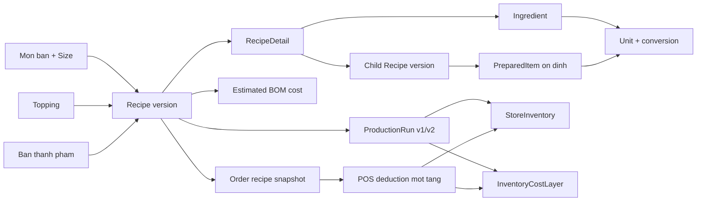

# BOM AS-IS Domain Map

## 1. Pham vi va phuong phap

Tai lieu nay mo ta BOM dang ton tai trong checkout `feature/POS`, dua tren duong di thuc:

`route/UI -> controller -> application service -> model/configuration -> database -> downstream runtime`.

Moi ket luan quan trong duoc gan mot trong cac nhan:

- `CODE_CONFIRMED`: co implementation hien tai lam evidence.
- `DOCUMENTED_DECISION`: co ADR duoc chap nhan, nhung code hien tai van la authority cho trang thai AS-IS.
- `NOT_RUNTIME_VERIFIED`: chua xac minh bang phien dang nhap/runtime trong task discovery nay.

Hai file duoc prompt yeu cau nhung khong ton tai trong checkout luc audit:
`AGENT_TASK_RULES.md` va `.agents/skills/SkillTest/SKILL.md`. Task khong chay test va khong thay doi production code.

## 2. So do end-to-end hien tai

## 3. Trace route den authority

| Use case | Route/UI | Controller/API | Service authority | Model/DB | Ket qua |
|---|---|---|---|---|---|
| Danh sach va loc cong thuc | `Areas/Admin/Views/AdminRecipe/Index.cshtml` | `AdminRecipeController.Index` | `AdminRecipeQueryService.GetIndexPageAsync` | `Recipe`, `RecipeDetail` | Tach mon ban, topping, BTP; co trang thai va gia von uoc tinh |
| Chi tiet cau truc | `AdminRecipe/Visualize.cshtml` | `AdminRecipeController.Visualize` | `GetVisualizePageAsync`, `RecipeBomTreeQueryService` | Recipe tree theo `ChildRecipeId` | Tong quan, suc khoe du lieu, dinh muc, lien ket van hanh |
| Tao cong thuc | `AdminRecipe/Create.cshtml`, `bom-builder.js` | `AdminRecipeController.Create` | `AdminRecipeService.CreateRecipeAsync` | Transaction + validation + Recipe/Details | Luu mot version moi cho POS/Topping/BTP |
| Tao phien ban moi | `AdminRecipe/Edit.cshtml` | `AdminRecipeController.Edit` | `AdminRecipeService.UpdateRecipeAsync` | Archive row cu, insert row moi, `ParentVersionId` | Version chain mot chieu |
| Chuan hoa san luong BTP | Form/preview endpoint | `PreviewNormalizedOutput` | `RecipeOutputNormalizer` | `PreparedItem.BaseUnitId` | `OutputQuantity` duoc doi ve don vi ton |
| Gia von thiet ke | List/detail/form preview | `EstimateBomCost` | `EstimatedBomCostService` | Goi NCC + UOM + nested recipe | Complete/incomplete, khong gia zero gia |
| San xuat | Production pages/services | Production controllers | `ProductionRunOperationsService`, `ProductionRunAcceptanceService` | Run, actual input/output, FIFO, ledger | Input actual bi tru, output accepted duoc cong ton |
| POS catalog | React catalog API | POS catalog controller | `POSCatalogSnapshotService` | Active/effective Recipe | Chon exact mon + size/topping theo thoi diem |
| POS khau tru | Checkout/sync | POS order/inventory path | `InventoryDeductionService` | Order snapshot, StoreInventory, ledger | Tru Ingredient/BTP mot tang, idempotent theo Order |

## 4. Entity va business meaning

| Entity | Business meaning | Identity | Lifecycle / mutability | Relationships va scope | UOM / cost authority | Production / POS / audit |
|---|---|---|---|---|---|---|
| `Drink` + `DrinkSize` | Dinh danh mon va kich co ban | `DrinkId`, `SizeId` | Master data | Global; Recipe tro den cap mon-size | Gia ban nam ngoai Recipe | POS target; Recipe phan giai exact size |
| `Topping` | Hang them khi ban | `ToppingId` | Master data | Global; co Recipe rieng va policy theo mon | Policy snapshot qty/unit va cach tinh gia/cost | POS snapshot topping |
| `Recipe` | **Mot phien ban cong thuc**, khong phai SKU ton | `RecipeId`; business target la mon+size, topping hoac PreparedItem | Row cu duoc archive, row moi duoc tao; component cua row da publish duoc xem nhu immutable | Global; `ParentVersionId`; mot target co mot Active theo index | `OutputQuantity/OutputUnitId` chi cho BTP; estimated cost duoc tinh | Pin boi ProductionRun va Order snapshot |
| `RecipeDetail` | Dong dinh muc dau vao | `RecipeDetailId` | Thuoc mot Recipe version | XOR `IngredientId` / `ChildRecipeId`; child pin exact version | `Quantity + UnitId`; duplicate va cycle bi chan | POS tru mot tang; costing recurse |
| `Ingredient` | Nguyen lieu ton co so | `IngredientId` | Master data co Active | Global, ton theo Store | `BaseUnitId` la authority; gia actual tu FIFO | Dau vao production/POS |
| `PreparedItem` | Ban thanh pham/SKU ton on dinh | `PreparedItemId` | Master data; khong doi identity khi recipe version doi | Global, ton theo Store | `BaseUnitId` la authority | Output san xuat, input nested BOM/POS |
| `Unit` | Don vi do | `UnitId`, `UnitCode` | Master data | Global | Dimension va physical conversion | Dung tren ingredient, BTP, output va BOM line |
| `UnitConversion` | Quy doi co context ingredient | Cap unit + ingredient | Active/inactive | Ingredient-specific; physical registry xu ly kg-g, l-ml | Fail-closed neu khong doi duoc | Bao ve quantity va costing |
| `ProductionRun` | Lan thuc thi cong thuc san xuat | `ProductionRunId` | State machine; co `RowVersion`, request key | Pin `RecipeId`; store-scoped | v2 co integer batch + expected base output | Noi recipe den inventory/FIFO |
| `ProductionRunInputActual` | Input planned va actual | Line ID | Xac nhan truoc complete | Thuoc run | `PlannedBaseQuantity`, `ActualBaseQuantity` | Actual la costing authority |
| `ProductionRunOutput` | Expected/actual/accepted/rejected output | Output ID | Chot trong acceptance | Thuoc run | Accepted base quantity | Accepted moi cong ton; variance co approval |
| `StoreInventory` | Ton tai mot chi nhanh | `StoreInventoryId`; `(Store, Ingredient)` hoac `(Store, PreparedItem)` | Mutable, co `RowVersion`; co legacy `RecipeId` dual-read | Store-scoped | Quantity trong base unit | POS va production cung ghi ledger |
| `InventoryCostLayer` | Bang chung FIFO cho gia actual | `InventoryCostLayerId` | Append/consume remaining qty | Ingredient XOR PreparedItem, store-scoped | `UnitCost` tren base unit | Production output tao layer; POS consume |
| `InventoryTransaction` | But toan thay doi ton | `InventoryTransactionId` | Append-only theo nghiep vu | Link order/run/document | Quantity va cost snapshot | Co `SourceRecipeId` de trace, khong lam stock identity |
| `OrderDetail` | Dong ban da commit | `OrderDetailId` | Snapshot giao dich | `RecipeIdSnapshot` | Gia va BOM version tai luc ban | Bao ve lich su khi recipe thay doi |
| `OrderTopping` | Topping tren dong ban | ID quan he | Snapshot giao dich | Recipe/qty/unit/price treatment snapshot | Cost treatment duoc dong bang | POS deduction dung snapshot |

## 5. Cac authority hien tai

### 5.1 Identity

- `CODE_CONFIRMED`: Recipe row la version; `PreparedItem` moi la danh tinh ton BTP on dinh.
- `CODE_CONFIRMED`: Recipe cho mon duoc dinh danh nghiep vu boi `DrinkId + SizeId`; topping boi `ToppingId`; BTP boi `PreparedItemId`.
- `CODE_CONFIRMED`: Nested BOM van pin exact `ChildRecipeId`, sau do resolve `PreparedItemId` cho stock.

### 5.2 UOM

- Ingredient va PreparedItem luon co `BaseUnitId`.
- BOM line giu quantity va source unit; backend normalize truoc stock/cost.
- Physical conversion khong coi goi/chai/thung la universal UOM.
- Missing/incompatible conversion fail-closed; khong dung raw quantity nhu fallback.

### 5.3 Cost

Co ba authority rieng:

1. **Gia von uoc tinh/thiet ke**: supplier package va nested BOM hien tai.
2. **Gia van hanh tai chi nhanh**: FIFO layers thuc te.
3. **Gia lich su don hang**: snapshot/allocations tai luc ban.

Khong duoc hien thi ba gia tri nay nhu mot chi so duy nhat.

### 5.4 Production

- V2: `PlannedBatchCount` la integer; expected output chi phuc vu planning.
- Actual inputs la FIFO costing authority.
- Actual accepted output la inventory authority.
- Under-yield giu remaining demand; overage vao ton nhung khong tu fulfil Restock khac.
- Legacy decimal run van duoc doc, tao ra mot domain hai the he can trinh bay ro.

### 5.5 POS

- Catalog chon recipe active/effective tai thoi diem tao snapshot.
- Don da commit giu `RecipeIdSnapshot`; topping giu them quantity/unit/treatment snapshot.
- Deduction tru **mot tang**: ingredient hoac PreparedItem; khong explode nested BOM khi ban.
- Recursive nested BOM chi dung cho cost/read model, khong phai stock mutation POS.

## 6. Version va effective-date AS-IS

`AdminRecipeService.UpdateRecipeAsync` hien archive version cu va tao version moi `Active=true` ngay trong mot transaction. Trong khi do `POSCatalogSnapshotService` chi chon version co `EffectiveDate <= asOfUtc`.

He qua code-confirmed:

- Neu version moi co ngay hieu luc trong tuong lai, version cu da bi archive.
- Version moi lai chua duoc catalog xem la effective.
- Co the xuat hien khoang thoi gian khong co cong thuc hop le cho target.
- Filtered unique index chi mo ta "mot Active", chua mo ta "mot Effective tai moi thoi diem".

Day la mismatch domain, khong the sua chi bang label/UI.

## 7. Audit va version history

- Co `ParentVersionId` va cac row version cu duoc giu lai.
- ProductionRun va Order pin `RecipeId`, nen co traceability version.
- UI chi hien lien ket version truoc, chua co timeline day du hoac compare.
- Khong tim thay read model where-used; service delete chi kiem tra child dependency de chan xoa.
- Khong co mot aggregate audit timeline BOM nghiep vu trong cac page da inspect.

## 8. Evidence index

| Chu de | Evidence |
|---|---|
| Recipe/version/output | `Models/Drinks/Recipe.cs`, `RecipeDetail.cs` |
| DB invariants/index | `Data/Configurations/Drinks/Recipes/RecipeConfiguration.cs`, `RecipeDetailConfiguration.cs` |
| Create/version lifecycle | `Application/Services/Admin/Recipes/AdminRecipeService.cs` |
| Read model/tree/health | `AdminRecipeQueryService.cs`, `RecipeBomTreeQueryService.cs`, `BomDataHealthEvaluator.cs` |
| BTP/UOM | `PreparedItem.cs`, `Ingredient.cs`, `Unit.cs`, `UnitConversionService.cs`, `RecipeOutputNormalizer.cs` |
| Cost design/FIFO | `EstimatedBomCostService.cs`, `InventoryCostLayerConsumptionService.cs`, `DrinkSizeProfitabilityQueryService.cs` |
| Production | `ProductionRunOperationsService.cs`, `ProductionRunAcceptanceService.cs`, `ProductionBatchYieldTests.cs` |
| POS snapshot/deduction | `POSCatalogSnapshotService.cs`, `InventoryDeductionService.cs`, `OrderDetail.cs`, `OrderTopping.cs` |
| Admin UI | `Areas/Admin/Views/AdminRecipe/*`, `Areas/Admin/Views/AdminPreparedItem/Index.cshtml`, `wwwroot/js/Admin/Recipe/bom-builder.js` |

## 9. Runtime status

`NOT_RUNTIME_VERIFIED`: Task nay khong khoi dong server, khong sua demo data va khong chay authenticated runtime. Ket luan AS-IS dua tren code, EF configuration, tests hien huu va ADR; nhung test file bi comment toan bo khong duoc xem la automated coverage dang hoat dong.
