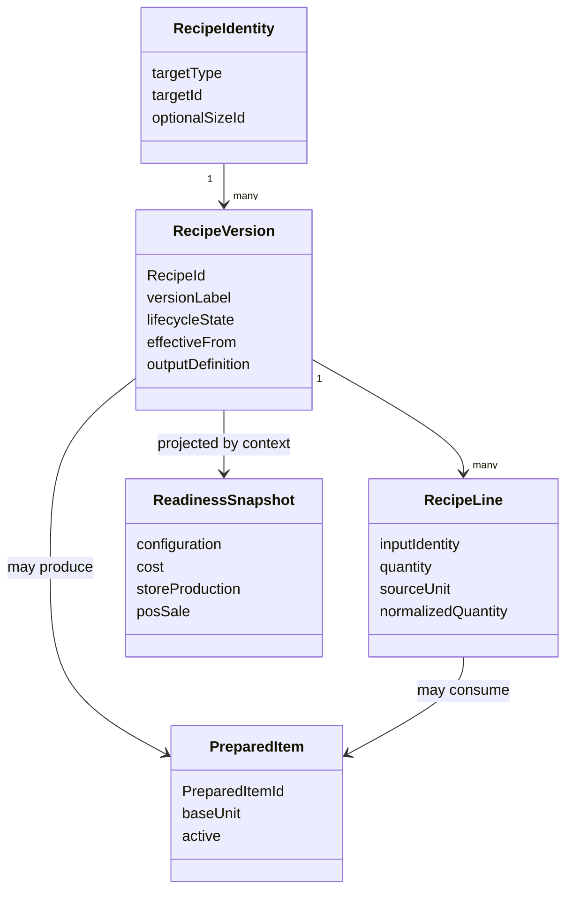
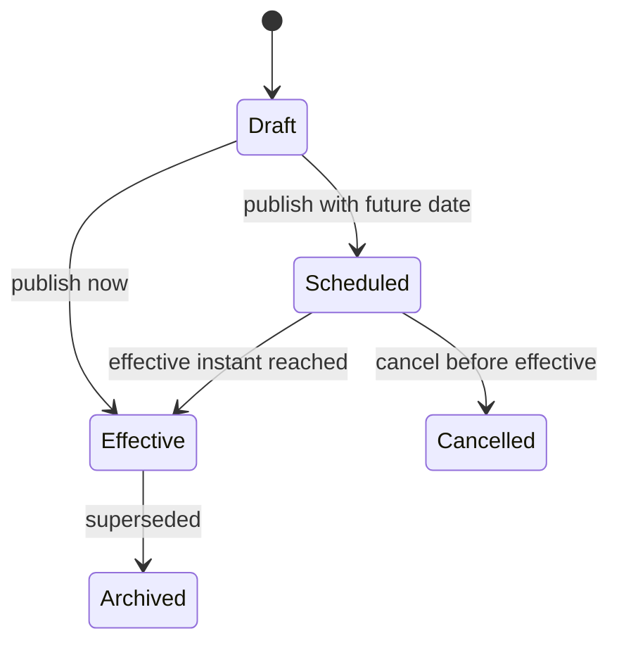

# BOM Target Domain Model

## 1. Nguyen tac

Target model khong doi ten class/database trong task nay. Muc tieu la tao ngon ngu nghiep vu nhat quan va chi ra cho nao chi can presentation/read model, cho nao can domain change sau khi Owner chot.

## 2. Ubiquitous language

| Code term | UI hien tai | De xuat UI/nghiep vu | Mismatch | Recommendation |
|---|---|---|---|---|
| `Recipe` | Cong thuc/BOM | **Phien ban cong thuc** khi noi ve mot row; **Cong thuc** khi noi ve target/family | Mot row hien tai la version, khong phai stable identity | UI tach identity header va version selector |
| Target tuple | Ten mon/topping/BTP | **Doi tuong dau ra** | Chua co ten chung ro | Dung target lam stable business identity truoc khi them entity moi |
| `RecipeDetail` | Thanh phan/dinh muc | **Dong dinh muc** | "Thanh phan" co the chi identity, bo qua qty/UOM | List dung "Dinh muc dau vao" |
| `Ingredient` | Nguyen lieu | **Nguyen lieu** | Khong mismatch | Giu |
| `PreparedItem` | BTP/Ban thanh pham | **Ban thanh pham** | Raw English con lo o mot so warning | UI khong render `PreparedItem` |
| `ChildRecipeId` | Cong thuc nguon/BTP lien ket | **Ban thanh pham dau vao** + phien ban cong thuc tham chieu | ID pin version, stock identity lai la PreparedItem | Hien business name truoc, version evidence sau |
| `OutputQuantity` | San luong/san luong du kien | **San luong chuan mot me** | Chi co nghia voi BTP | Khong hien field nay cho POS/topping |
| Normalized output | San luong quy doi | **Tuong duong don vi ton** | De bi nham la output khac | Hien duoi cung dong, read-only |
| `Expected Yield` | San luong du kien | **San luong du kien** | Co the nham voi `YieldPercentage` legacy | Cong thuc dung output chuan; run dung expected total |
| `Actual Yield` | San luong thuc te | **San luong thuc te / chap nhan** | Produced va accepted la hai so khac | Hien produced, accepted, rejected rieng |
| `YieldPercentage` | Ty le hao hut/hieu suat | **Thong tin legacy** neu xuat hien | Khong con la costing authority | Khong cho user sua trong flow moi |
| `PlannedBatchCount` | So me | **So me ke hoach** | Dung v2 | Giu integer |
| `RequestedRunCount` v1 | So me/he so | **He so cong thuc (quy trinh cu)** neu code dung scale | Decimal khong phai physical batch | Khong goi la so me |
| Estimated BOM cost | Gia von | **Gia von uoc tinh theo thiet ke** | De nham voi FIFO | Bat buoc label authority |
| FIFO unit cost | Gia von thuc te | **Gia von FIFO thuc te tai chi nhanh** | Can Store va timestamp | Hien context Store + cap nhat |
| Active | Hoat dong | **Duoc phep su dung** | Khong dong nghia dang effective | Tach state va effectivity |
| Effective Date | Ngay hieu luc | **Ap dung tu** | Hien tai lifecycle khong bao dam nghia | Can policy domain neu schedule |

## 3. Target conceptual model



`RecipeIdentity` o day la conceptual boundary. Hien tai co the derive tu tuple target ma chua can table moi. Chi tao stable entity/database neu Owner can workflow Draft/Scheduled, friendly version number hoac lifecycle phuc tap ma tuple target khong du.

## 4. Invariants de giu

1. Mot Recipe version co dung mot target: mon+size, topping hoac PreparedItem.
2. Mot Recipe line co dung mot input: Ingredient hoac child Recipe version.
3. Quantity > 0 va UOM phai compatible; missing conversion fail-closed.
4. PreparedItem la stock identity; RecipeId la formula/version evidence.
5. POS tru stock mot tang; nested explode chi cho cost/readiness.
6. ProductionRun pin exact Recipe version.
7. Expected output khong cong ton; accepted output moi cong ton.
8. Actual input moi la FIFO cost authority.
9. Historical order khong resolve lai live recipe.
10. Khong co cycle; max depth phai duoc enforce backend.

## 5. Target lifecycle

### 5.1 Neu Owner khong can lap lich phien ban

Giu MVP don gian:

`ACTIVE -> ARCHIVED`

- Version moi co hieu luc ngay khi publish.
- Khong cho chon ngay tuong lai, hoac label ro rang chi la ngay ghi nhan.
- Mot shared resolver chon duy nhat Active version.

Day la thay doi nho nhat va it migration nhat.

### 5.2 Neu Owner can lap lich phien ban

Can target state ro:



Required behavior:

- Version dang Effective tiep tuc duoc dung cho den khi version Scheduled bat dau.
- Resolver chon version theo target + business instant.
- Khoang hieu luc khong overlap va khong co gap neu target dang duoc ban/san xuat.
- POS catalog, deduction fallback, production va admin detail dung cung resolver.

Day la `NEEDS_OWNER_DECISION` va co the can additive schema/index migration. Khong implement trong discovery.

## 6. Output, portion va batch

| Recipe category | Output semantic |
|---|---|
| Mon ban + size | Mot phan ban theo identity mon-size; khong can physical output field |
| Topping | Mot don vi ap dung theo topping policy/snapshot |
| BTP | `OutputQuantity x OutputUnit`, normalized ve PreparedItem base UOM, tren mot me chuan |

Batch khong phai UOM. `2 me x 5 kg/me = 10 kg expected output`; ton van luu `g/kg/ml/...`, khong luu "me" nhu don vi vat ly.

## 7. Cost model de xuat

```text
DesignEstimatedCost
  = current normalized supplier-package inputs + nested estimated cost

StoreActualFifoCost
  = actual FIFO layers at one Store and one instant

HistoricalOrderCogs
  = sale-time snapshot/allocation evidence
```

UI khong dung mot label "Gia von" cho ca ba. Cost completeness la mot facet rieng, khong duoc suy ra tu configuration completeness.

## 8. Readiness model de xuat

Readiness khong nen la mot boolean. Dung projection co facet:

| Facet | Cau hoi |
|---|---|
| Configuration | Identity, output, lines, UOM co hop le? |
| Cost | Moi dong co cost authority day du? |
| Production at Store | Store co capability va du input/FIFO evidence? |
| POS sale | Catalog co effective recipe va stock policy cho phep ban? |
| Governance | Version co effective dung va co warning dependency? |

UI co the hien tong ket "San sang" chi khi noi ro cho muc dich nao.

## 9. Where-used va version comparison

Hai capability nay nen la read model:

### Where-used

- Input: RecipeId hoac PreparedItemId.
- Output: mon-size, topping, parent recipes, active/effective version, trang thai, impact type.
- Khong mutate domain.

### Version comparison

- Compare identity/output, lines added/removed/changed, UOM normalized delta, estimated cost delta.
- Dung immutable version rows da co.
- Khong can luu JSON diff neu query-time diff du nhanh.

## 10. Scope

- Recipe/PreparedItem master la global theo code hien tai.
- Inventory, FIFO, production readiness la store-scoped.
- UI target phai cho user chon Store khi xem operational facet, nhung khong lam cong thuc global trong nhu store-specific.

## 11. Audit expectations cho future spec

Moi publish/archive/schedule can luu du:

- actor/time;
- old/new RecipeId;
- target identity;
- effective instant;
- reason neu cancel/rollback;
- overlap confirmation neu co;
- khong hien GUID/raw payload cho user.

## 12. Quy mo thay doi

| De xuat | Loai thay doi |
|---|---|
| UI language, workspace, readiness facets | UI/read-model |
| Where-used, version chain/diff | Read-model/API projection |
| Shared effective resolver | Backend application/domain service |
| True future scheduling | Domain + co the migration/index |
| Stable RecipeIdentity entity | Chi can neu Owner chot governance mo rong |

Khong co migration nao duoc tao trong task nay.
