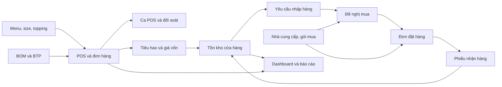
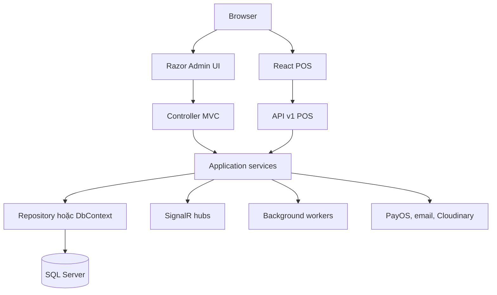

# Tổng quan dự án CafeChain

## Cách đọc tài liệu

| Nhãn | Ý nghĩa |
|---|---|
| `CODE_CONFIRMED` | Kết luận được xác nhận trực tiếp từ code, cấu hình hoặc schema trong repository. |
| `RUNTIME_CONFIRMED` | Kết luận đã được kiểm tra trên môi trường local/demo ngày 08/08/2026. |
| `OWNER_DECISION` | Quyết định nghiệp vụ do Owner cung cấp trong `FIX.md`. |
| `INFERENCE` | Suy luận hợp lý từ nhiều bằng chứng, chưa có một authority duy nhất. |
| `UNKNOWN_NEEDS_CONFIRMATION` | Chưa đủ bằng chứng; không được trình bày như chức năng đã hoàn thiện. |

## CafeChain giải quyết bài toán gì?

`CODE_CONFIRMED` CafeChain là hệ thống quản trị chuỗi cửa hàng đồ uống, kết nối các mảng thường bị tách rời: bán hàng tại POS, ca làm việc, menu và công thức, tồn kho cửa hàng, mua hàng, nhà cung cấp, nhận hàng, giá vốn và báo cáo quản trị.

Điểm trung tâm của hệ thống là khả năng truy vết dữ liệu xuyên module:

Evidence chính: `CafeChain/Data/AppDbContext.cs`, `CafeChain/Models/Orders/Order.cs`, `CafeChain/Models/Inventories/Stock/RestockRequest.cs`, `CafeChain/Models/Inventories/Procurement/PurchaseAdvice.cs`, `CafeChain/Models/Inventories/Procurement/PurchaseOrder.cs`, `CafeChain/Models/Inventories/Stock/BranchReceipt.cs`.

## Đối tượng sử dụng

`CODE_CONFIRMED` Code có tám role, trong đó bảy role nội bộ và một role khách hàng:

| Tên code | Tên nghiệp vụ trên UI | Vai trò chính |
|---|---|---|
| `BusinessOwner` | Chủ doanh nghiệp | Quản trị toàn chuỗi, phê duyệt mua hàng và chính sách giá. |
| `AreaManager` | Quản lý vùng | Theo dõi các cửa hàng trong phạm vi vùng. |
| `StoreManager` | Quản lý chi nhánh | Điều hành một cửa hàng, tồn kho, Restock và ca vận hành. |
| `ShiftSupervisor` | Ca trưởng | Điều phối ca, hỗ trợ POS, nhận hàng và vận hành đá theo ca. |
| `SalesStaff` | Nhân viên bán hàng | Bán hàng tại POS trong ca được phép. |
| `AccountantWarehouse` | Kế toán/kho | Supplier, nguồn cung, PA, PO, PDF/gửi nhà cung cấp. |
| `SystemAdmin` | Quản trị hệ thống | Tài khoản, quyền, cấu hình và công cụ hệ thống. |
| `Customer` | Khách hàng | Đặt hàng và theo dõi phần trải nghiệm khách hàng nếu route tương ứng được dùng. |

Authority: `CafeChain/Application/Constants/RoleConstants.cs`, `CafeChain/Scripts/SeedAll.sql`.

> Lưu ý bảo vệ: tên “RegionManager” trong đề bài tương ứng với `AreaManager` trong code. Không nên nói hệ thống có enum `RegionManager`.

## Các module chính

| Module | Trách nhiệm | Authority tiêu biểu |
|---|---|---|
| Authentication và authorization | Cookie cho web admin, JWT cho POS, permission động, scope cửa hàng | `Extensions/Services/AuthenticationServiceExtensions.cs`, `AuthorizationServiceExtensions.cs` |
| POS | Catalog, chọn món/size/topping, thanh toán, offline sync, in lại hóa đơn | `Controllers/Api/v1/POSOrderController.cs`, `Application/Services/POS/POSOrderService.cs` |
| Ca POS | Mở/đóng ca, tiền đầu ca, chênh lệch, OTP, đối soát | `Controllers/Api/v1/POSShiftController.cs`, `Application/Services/POS/WorkShiftService.cs` |
| Menu/BOM | Đồ uống, size, công thức phiên bản, BTP và topping | `Models/Drinks`, `Areas/Admin/Controllers/AdminRecipeController.cs` |
| Costing/Pricing | FIFO, tính đầy đủ giá vốn, Margin/Markup, mô phỏng giá | `DrinkSizeProfitabilityQueryService.cs`, `PriceSuggestionService.cs` |
| Inventory | Tồn khả dụng/giữ chỗ, ledger, lớp giá, cảnh báo và điều chuyển | `Models/Inventories`, `InventoryDeductionService.cs` |
| Procurement | Restock, phân bổ nguồn, PA, PO thường/PO gộp, receipt | Các controller `AdminRestockRequests`, `AdminPurchaseAdvices`, `AdminPurchaseOrders`, `AdminBranchReceipts` |
| Supplier/UOM | NCC, cửa hàng phục vụ, gói mua, mua lẻ, giá và quy đổi | `AdminSupplierController.cs`, `Models/Inventories/Suppliers` |
| Operational Ice | Phân bổ đá theo ca, liên kết POS, bổ sung, bàn giao, chốt và variance | `AdminOperationalIceController.cs`, `OperationalIceService.cs` |
| Analytics | Dashboard doanh thu, giá vốn, hiệu quả sản phẩm/cửa hàng | `Areas/Admin/Controllers/DashboardController.cs`, `Application/Services/Admin/Dashboard` |
| Audit/notification | Nhật ký thay đổi, cảnh báo, SignalR cập nhật thời gian gần thực | `AuditLog.cs`, `Hubs`, các service audit theo module |

## Kiến trúc kỹ thuật

`CODE_CONFIRMED` Backend là ASP.NET Core MVC/API trên .NET 8. Dữ liệu dùng Entity Framework Core 8 với SQL Server và lazy-loading proxies. UI quản trị dùng Razor MVC; POS là React 19 + TypeScript + Vite. SignalR phục vụ cập nhật đơn, thanh toán, in, tồn kho và ca. Dexie/IndexedDB giữ hàng đợi offline POS.

Authority: `CafeChain/Program.cs`, `CafeChain/CafeChain.csproj`, `CafeChain.Frontend/package.json`, `CafeChain/Extensions/Pipeline/EndpointRouteExtensions.cs`.

## Authentication, authorization và scope

- `CODE_CONFIRMED` Web admin dùng cookie; POS API dùng JWT bearer.
- `CODE_CONFIRMED` Quyền không chỉ dựa trên role. `PermissionRequirement` kiểm tra permission code được seed và phân cho role/account.
- `CODE_CONFIRMED` Các nghiệp vụ cửa hàng còn kiểm tra `StoreScope`; có nút trên UI không phải bằng chứng đủ để kết luận backend cho phép.
- `CODE_CONFIRMED` `RowVersion`, transaction, request key và unique index được dùng ở các workflow có nguy cơ cạnh tranh.
- `CODE_CONFIRMED` Maker-checker được áp dụng rõ tại PO/PO gộp: người tạo không được tự duyệt.

## Ranh giới nghiệp vụ quan trọng

1. `CODE_CONFIRMED` **Restock không phải nhập kho.** Restock ghi nhu cầu; chỉ `BranchReceipt` đã `CONFIRMED` mới ghi tăng tồn.
2. `CODE_CONFIRMED` **PA không phải PO.** PA gom và xem xét nhu cầu mua; PO là cam kết đặt hàng với nhà cung cấp.
3. `CODE_CONFIRMED` **Đơn vị nhu cầu khác đơn vị mua và đơn vị tồn.** Backend quy đổi về base UOM trước khi ghi kho.
4. `CODE_CONFIRMED` **Giá bán khác giá vốn.** Giá bán được snapshot tại dòng đơn; giá vốn được tính từ BOM/lớp FIFO và có trạng thái đầy đủ.
5. `CODE_CONFIRMED` **WorkShift khác OperationalShift.** WorkShift quản lý POS/két; OperationalShift quản lý đá theo ca và có thể liên kết nhiều WorkShift phù hợp.
6. `CODE_CONFIRMED` **Đơn đã thanh toán không bị rollback chỉ vì side effect trừ kho lỗi.** Lần gọi lại có thể sửa phần trừ kho thiếu nhờ idempotency theo Order; worker/outbox khôi phục tự động chưa được code hiện tại chứng minh.

## Điểm nổi bật khi bảo vệ

- Permission + scope + maker-checker tạo kiểm soát nhiều lớp thay vì chỉ ẩn nút.
- `ClientOrderId` giúp POS retry/offline sync không tạo trùng đơn; inventory posting cũng chống trừ lặp theo Order.
- `OrderDetail` giữ snapshot giá, size, BOM và topping để lịch sử không đổi theo cấu hình mới.
- Receipt ghi đồng thời trace về Restock/PO line, chi phí snapshot và inventory transaction.
- Base UOM, conversion và package snapshot giúp mua 1 gói/L/kg nhưng tồn vẫn nhất quán.
- FIFO cost phân biệt “chi phí biết được” với “giá vốn đầy đủ”; phần thiếu không bị coi là 0.
- Operational Ice có state, row version, idempotency posting và maker-checker riêng.

## Evidence runtime local

`RUNTIME_CONFIRMED` ngày 08/08/2026:

- Ứng dụng khởi động tại `http://localhost:5111`.
- `/Account/Login` trả HTTP 200.
- `/Admin/Dashboard` khi chưa đăng nhập chuyển tới login; API POS bảo vệ trả HTTP 401.
- Database local/demo có đủ các role nội bộ: Owner, Area Manager, Store Manager, Shift Supervisor, Accountant/Warehouse, System Admin và Sales Staff.
- Dữ liệu demo có 3 cửa hàng, 55 nhà cung cấp, Restock, PA, PO, Receipt, 136 đơn, 65 WorkShift và 2 OperationalShift.

`UNKNOWN_NEEDS_CONFIRMATION`: Không có phiên browser đăng nhập khả dụng trong lần kiểm chứng này, nên menu và thao tác tương tác theo từng account chưa được xác nhận runtime; các phần đó dựa trên controller, permission matrix và test, đồng thời được đánh dấu trong `10_EVIDENCE_INDEX.md`.
