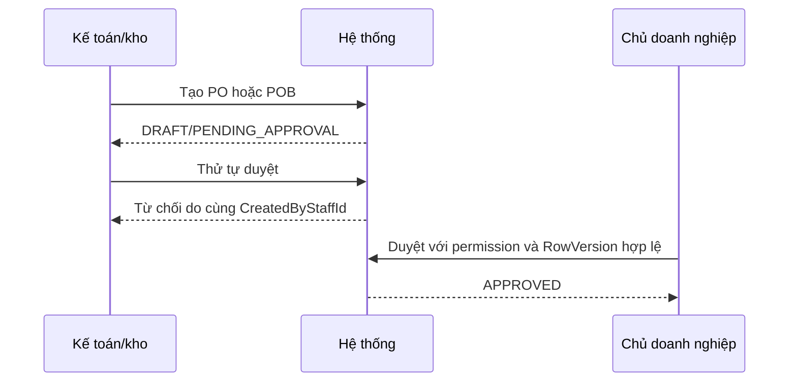

# Ma trận role và quyền

## Authority và cách hiểu

`CODE_CONFIRMED` Permission matrix dưới đây lấy từ `CafeChain/Scripts/SeedAll.sql`, policy ở `AuthorizationServiceExtensions.cs`, attribute trên controller và guard trong application service. Dấu “Có” chỉ dùng khi backend có authority; menu chỉ là bằng chứng bổ sung.

## Tổng quan theo role

| Role | Mục tiêu công việc | Module xem | Module thao tác | Thao tác bị cấm/giới hạn | Scope |
|---|---|---|---|---|---|
| Chủ doanh nghiệp | Điều hành và phê duyệt toàn chuỗi | Dashboard, kho, mua hàng, supplier, costing, ice | Duyệt/hủy PO, giá bán, topping policy, ngoại lệ | Không tự duyệt chứng từ do chính mình tạo | Toàn chuỗi, vẫn chịu state/maker-checker |
| Quản lý vùng | Theo dõi các cửa hàng trong vùng | Dashboard, tồn, Restock, PO, receipt, báo cáo ice | Quản lý một số dữ liệu nhân sự/cửa hàng theo permission | Không mặc định source, tạo PA/PO, nhận hàng hay duyệt PO | Region/store scope được cấp |
| Quản lý chi nhánh | Điều hành cửa hàng | Dashboard cửa hàng, tồn, Restock, PO, receipt, ice | Tạo/gửi Restock, quản lý ca/ice, một số xác nhận nhận hàng | Không tạo PA/PO, chọn NCC, duyệt PO | Store scope |
| Ca trưởng | Vận hành ca | StaffHub, POS, Restock/PO/receipt cần thiết, báo cáo ice | POS, đóng/đối soát theo quyền, nhận hàng, ice bổ sung/bàn giao/chốt | Không quản lý supplier/giá, không source hoặc tạo PA/PO | Store/ca được giao |
| Kế toán/kho | Điều phối cung ứng | Dashboard, tồn, Restock, PA, PO, supplier, receipt, costing | Tiếp nhận/source Restock, PA, PO, supplier, PDF/gửi NCC | Không tự duyệt PO do mình tạo; không mặc định thao tác POS/ice | Organization và store scope nghiệp vụ |
| Quản trị hệ thống | Quản trị nền tảng | Nhân sự, quyền, cấu hình, diagnostics | Quyền, tài khoản, cấu hình hệ thống | Không mặc định là người thực hiện nghiệp vụ mua/bán hằng ngày | Toàn hệ thống theo permission |
| Nhân viên bán hàng | Bán hàng | StaffHub, POS, ca của mình | Tạo đơn, thanh toán, in lại theo permission, báo thiếu | Không xem giá vốn, quản lý kho, supplier hoặc procurement | Store + WorkShift/operator |
| Khách hàng | Mua hàng | Menu/trạng thái đơn theo surface khách hàng | Đặt hàng và thông tin cá nhân nếu route hỗ trợ | Không vào admin/POS staff | Dữ liệu tài khoản khách |

## Permission matrix rút gọn

Ký hiệu: `V` xem, `M` thao tác, `A` duyệt, `-` không được seed mặc định, `S` phụ thuộc scope, `MC` maker-checker.

| Permission/nhóm | Owner | Area | Store | Shift | Accountant | SysAdmin | Sales |
|---|---:|---:|---:|---:|---:|---:|---:|
| `App.AdminDashboard` | V | V | V | - | V | - | - |
| `App.StaffHub` | V | V | V | V | V | V | V |
| `App.POS` | - | - | M | M | - | - | M |
| Inventory.View | V | V,S | V,S | - | V | - | - |
| Restock.View | V | V,S | V,S | V,S | V | - | - |
| Restock.Create | M | - | M,S | - | M | - | - |
| Restock.Submit | - | - | M,S | - | M | - | - |
| Restock tiếp nhận/từ chối | - | - | - | - | M | - | - |
| PA View | V | V,S | V,S | - | V | - | - |
| PA Create/Review/Supplier/PO | - | - | - | - | M | - | - |
| PO View | V | V,S | V,S | V,S | V | - | - |
| PO Create/Send/PDF | - | - | - | - | M | - | - |
| PO Approve/Reject | A,MC | - | - | - | - | - | - |
| PO Cancel | M | - | - | - | M | - | - |
| PO Receive | - | - | M,S | M,S | - | - | - |
| Receipt View | V | V,S | V,S | V,S | V | - | - |
| Receipt Create/Confirm | - | - | M,S | M,S | - | - | - |
| Supplier View | V | V,S | V | - | V | - | - |
| Supplier Create/Update | M | - | - | - | M | - | - |
| Costing View | V | V,S | V,S | - | V | - | - |
| Global Price/Topping Policy | M | - | - | - | - | - | - |
| Operational Ice View | V | V,S | V,S | V,S | V | - | - |
| Ice Configure/Create/Open/Link | M | - | M,S | - | - | - | - |
| Ice Supplement/Handoff/Close | M | - | M,S | M,S | - | - | - |
| Ice Approve variance | A | - | A,S | - | - | - | - |
| Staff View | V | V,S | V,S | - | - | V | - |
| Permission Manage | M | - | - | - | - | M | - |

## UI, backend và scope

| Lớp kiểm soát | Cách triển khai | Evidence |
|---|---|---|
| UI visibility | `_AdminLayout.cshtml` dựng menu từ effective permission codes | `Areas/Admin/Views/Shared/_AdminLayout.cshtml` |
| Controller | `[RequirePermission]`, policy và `[Authorize]` | Các controller trong `Areas/Admin/Controllers`, `Controllers/Api/v1` |
| Application service | Revalidate role, store, state, row version, ownership | `PurchaseOrderService`, `BranchReceiptService`, `OperationalIceService`, `WorkShiftService` |
| Scope | `IScopeAuthorizationService`, `AdminStoreScopeResolver` | `Application/Services/Security` và `Application/Authorization` |
| Concurrency | `RowVersion`, SQL lock, serializable transaction | Entity procurement/shift và service tương ứng |
| Maker-checker | So sánh `CreatedByStaffId` với actor duyệt | `PurchaseOrderService.cs`, `PurchaseOrderBatchService.cs` |

## Maker-checker được xác nhận

- PO thường: `PurchaseOrderService.TransitionAsync` chặn người tạo tự duyệt.
- PO gộp: `PurchaseOrderBatchService.ApproveAsync` chặn người tạo tự duyệt.
- `UNKNOWN_NEEDS_CONFIRMATION`: Chưa thấy authority chung bắt buộc hai người khác nhau cho mọi loại phê duyệt khác ngoài PO/POB; không mở rộng kết luận.

## Những khác biệt dễ nhầm khi trình bày

1. `AreaManager` là tên code của Quản lý vùng.
2. `AccountantWarehouse` là một role kết hợp kế toán và kho trong thiết kế hiện tại.
3. SystemAdmin không tự động có mọi permission nghiệp vụ.
4. Owner có quyền rộng nhưng state machine, scope dữ liệu và maker-checker vẫn được kiểm tra.
5. Ca trưởng có quyền vận hành, không đồng nghĩa được cấu hình chính sách hoặc mua hàng.

## Runtime status

`RUNTIME_CONFIRMED` database local có account active cho toàn bộ bảy role nội bộ; Sales Staff và Store Manager có nhiều hơn một account để phục vụ demo nhiều cửa hàng. `NOT_RUNTIME_VERIFIED`: chưa đăng nhập UI lần lượt từng role trong phiên kiểm chứng tài liệu này.
