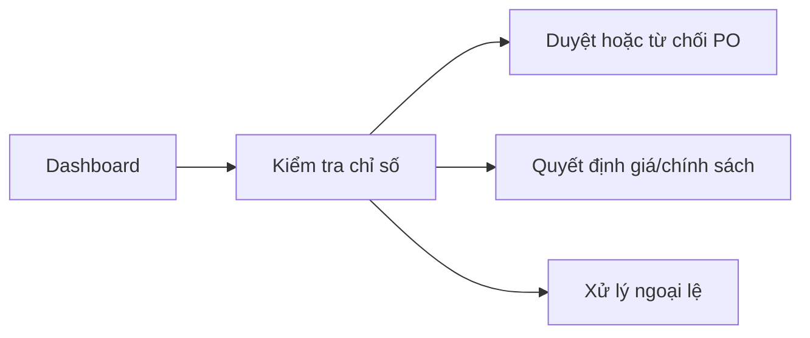
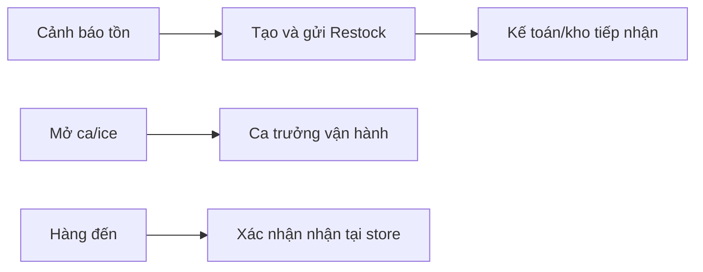
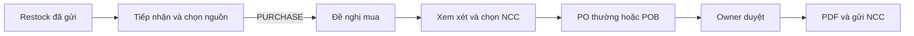
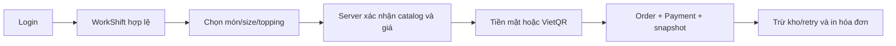

# Workflow theo từng role

## 1. Chủ doanh nghiệp (`BusinessOwner`)

**Mục tiêu:** giám sát toàn chuỗi, quyết định chính sách và thực hiện bước phê duyệt độc lập.

| Thời điểm | Công việc | Bàn giao/nhận từ |
|---|---|---|
| Đầu ngày | Xem dashboard doanh thu, tồn, hiệu quả cửa hàng và cảnh báo | Nhận dữ liệu tổng hợp từ POS, inventory và procurement |
| Trong ngày | Xem PO/POB chờ duyệt; xem costing; điều chỉnh giá/topping policy khi có căn cứ | Nhận PO từ Kế toán/kho; chính sách đi tới POS |
| Cuối ngày | Xem báo cáo, ngoại lệ ca, chênh lệch ice và xu hướng | Nhận báo cáo từ Store/Area/Kế toán |

**Phê duyệt:** PO thường, PO gộp, giá bán/topping policy và một số variance ice theo permission.
**Không làm mặc định:** tạo PA/PO thay Kế toán; vận hành POS thường ngày.
**Lỗi thường gặp:** tự duyệt chứng từ do chính mình tạo; RowVersion cũ; chứng từ sai state.
**Code evidence:** `PermissionConstants.cs`, `PurchaseOrderService.TransitionAsync`, `PurchaseOrderBatchService.ApproveAsync`, `AdminDrinkProfitabilityController`.
**Runtime:** `RUNTIME_CONFIRMED` role/account tồn tại; `NOT_RUNTIME_VERIFIED` thao tác UI theo role.

## 2. Quản lý vùng (`AreaManager`)

**Mục tiêu:** theo dõi hiệu quả và rủi ro của nhiều cửa hàng trong vùng được cấp.

| Thời điểm | Công việc | Bàn giao/nhận từ |
|---|---|---|
| Đầu ngày | Xem dashboard vùng, cảnh báo tồn và hoạt động cửa hàng | Nhận từ các Store Manager |
| Trong ngày | Lọc theo store, theo dõi Restock/PO/receipt và báo cáo ca | Điều phối, không mặc định mutate procurement |
| Cuối ngày | So sánh cửa hàng, ghi nhận ngoại lệ và báo cáo Owner | Bàn giao tổng hợp cho Owner |

**Scope:** chỉ store/region được cấp qua scope service.
**Không làm mặc định:** tạo PA/PO, nhận hàng thay cửa hàng, duyệt PO.
**Lỗi thường gặp:** chọn store ngoài scope; hiểu quyền xem là quyền sửa.
**Evidence:** `RoleConstants.AreaManager`, `AdminStoreScopeResolver`, permission seed.
**Runtime:** `RUNTIME_CONFIRMED` account role tồn tại; `NOT_RUNTIME_VERIFIED` menu vùng.

## 3. Quản lý chi nhánh (`StoreManager`)

**Mục tiêu:** bảo đảm cửa hàng có người, hàng, ca và dữ liệu vận hành đúng.

| Thời điểm | Công việc | Bàn giao/nhận từ |
|---|---|---|
| Đầu ngày | Xem tồn/cảnh báo; kiểm tra lịch; tạo/mở ca hoặc phân bổ đá | Giao ca cho Ca trưởng/Nhân viên bán hàng |
| Trong ngày | Tạo/gửi Restock, bổ sung nhu cầu, theo dõi PO; xử lý operational ice | Bàn giao Restock cho Kế toán/kho |
| Cuối ngày | Kiểm tra receipt, chênh lệch ca/đá, báo cáo cửa hàng | Nhận đóng ca từ Ca trưởng; báo Area/Owner |

**Được làm:** Restock thủ công trong store, vận hành ca/ice, xem supplier được phép, xác nhận receipt nếu permission/state hợp lệ.
**Không được làm:** source tập trung, tạo PA/PO, chọn NCC, duyệt PO.
**Lỗi thường gặp:** store ngoài scope; Restock duplicate; receipt vượt số lượng còn lại; ca đã thay đổi.
**Evidence:** `AdminRestockRequestsController`, `AdminBranchReceiptsController`, `AdminOperationalIceController`, permission seed.
**Runtime:** `RUNTIME_CONFIRMED` hai account Store Manager tồn tại; `NOT_RUNTIME_VERIFIED` thao tác UI.

## 4. Ca trưởng (`ShiftSupervisor`)

**Mục tiêu:** điều phối một ca bán hàng và chịu trách nhiệm ngoại lệ vận hành trong phạm vi được giao.

| Thời điểm | Công việc | Bàn giao/nhận từ |
|---|---|---|
| Đầu ca | Xem StaffHub, nhận lịch, mở/chọn phiên POS nếu có quyền | Nhận phân công từ Store Manager |
| Trong ca | Hỗ trợ operator, theo dõi bán hàng, nhận hàng, yêu cầu bổ sung/bàn giao đá | Phối hợp Sales Staff và Store Manager |
| Cuối ca | Kiểm tiền, nhập lý do chênh lệch, gửi đóng/đối soát; bàn giao | Bàn giao cho ca sau/Store Manager |

**Được làm:** POS, WorkShift close/reconcile theo permission, receipt tại store, operational ice supplement/handoff/submit close.
**Không được làm:** cấu hình policy ice, supplier, PA/PO, giá bán global.
**Lỗi thường gặp:** còn payment đang xử lý; còn order offline; tiền chênh lệch cần OTP; không phải shift lead được giao.
**Evidence:** `POSShiftController`, `WorkShiftService`, `OperationalIcePermissions`, permission seed.
**Runtime:** `RUNTIME_CONFIRMED` một account role tồn tại; `NOT_RUNTIME_VERIFIED` OTP và handoff trong phiên này.

## 5. Kế toán/kho (`AccountantWarehouse`)

**Mục tiêu:** chuyển nhu cầu đã gửi thành phương án cung ứng có trace, giá và chứng từ.

| Thời điểm | Công việc | Bàn giao/nhận từ |
|---|---|---|
| Đầu ngày | Xem Restock mới, tồn/cảnh báo, supplier và các PO đang về | Nhận Restock từ Store Manager |
| Trong ngày | Tiếp nhận, source PURCHASE/TRANSFER/PRODUCTION/REJECT; tạo/review PA; chọn supplier; tạo PO/POB | Bàn giao PO cho Owner duyệt |
| Sau duyệt | Tạo PDF, đánh dấu gửi NCC, theo dõi receipt và vấn đề nhà cung cấp | Bàn giao nhận hàng cho Store/Ca trưởng |
| Cuối ngày | Đối chiếu receipt, phần còn lại, giá mua và báo cáo | Cập nhật Owner/Store |

**Được làm:** quản lý Supplier/package/UOM, PA, PO, source allocation, PDF/gửi NCC.
**Không được làm:** tự duyệt PO do mình tạo; mặc định đóng ca POS hoặc link WorkShift ice.
**Lỗi thường gặp:** MOQ/UOM không hợp lệ; PA đã được đặt; supplier không phục vụ store; state/row version cũ.
**Evidence:** các controller procurement, `PurchaseAdviceService`, `PurchaseOrderService`, `AdminSupplierService`.
**Runtime:** `RUNTIME_CONFIRMED` account, PA/PO/receipt demo tồn tại; `NOT_RUNTIME_VERIFIED` full handoff tương tác.

## 6. Quản trị hệ thống (`SystemAdmin`)

**Mục tiêu:** duy trì tài khoản, quyền, cấu hình và khả năng vận hành của nền tảng.

| Thời điểm | Công việc | Bàn giao/nhận từ |
|---|---|---|
| Đầu ngày | Kiểm tra account/permission, job và diagnostics | Nhận sự cố từ các role |
| Trong ngày | Cấp quyền, quản trị dữ liệu nền/cấu hình theo permission | Bàn giao quyền đã sửa cho người dùng |
| Cuối ngày | Kiểm tra audit và tình trạng hệ thống | Báo Owner về sự cố/hardening |

**Không nên làm:** nghiệp vụ mua/bán thường ngày chỉ vì có vai trò kỹ thuật. Permission seed không biến SystemAdmin thành superuser nghiệp vụ.
**Evidence:** `AuthorizationServiceExtensions`, permission seed, các controller system/admin.
**Runtime:** `RUNTIME_CONFIRMED` account tồn tại; `NOT_RUNTIME_VERIFIED` thao tác UI.

## 7. Nhân viên bán hàng (`SalesStaff`)

**Mục tiêu:** thực hiện giao dịch POS chính xác trong ca và terminal hợp lệ.

| Thời điểm | Công việc | Bàn giao/nhận từ |
|---|---|---|
| Đầu ca | Đăng nhập StaffHub/POS, mở hoặc nhận operator trong WorkShift | Nhận ca từ Store Manager/Ca trưởng |
| Trong ca | Chọn món, size, topping; nhận thanh toán; in lại; báo thiếu | Giao đồ uống cho khách; sự cố cho Ca trưởng |
| Cuối ca | Đồng bộ đơn offline, kiểm đếm tiền, gửi đóng ca | Bàn giao két cho Ca trưởng/Manager |

**Backend guards:** POS permission, store, staff active, terminal, WorkShift active/current operator, catalog version và server-side pricing.
**Snapshot:** drink/size name, accepted price, recipe, topping policy, ice level, payment và client order key.
**Không được làm:** xem costing, supplier, PA/PO hoặc cấu hình hệ thống.
**Lỗi thường gặp:** không có ca active; terminal đang có ca; catalog cũ; payment chưa hoàn tất; offline queue chưa sync.
**Evidence:** `POSOrderController`, `POSOrderService`, `POSStoreMenuSaleValidator`, `WorkShiftService`, React `src/pages/OrderPage.tsx`.
**Runtime:** `RUNTIME_CONFIRMED` hai account Sales Staff và dữ liệu order/workshift tồn tại; `NOT_RUNTIME_VERIFIED` giao dịch tương tác trong phiên này.

## 8. Khách hàng (`Customer` claim)

**Mục tiêu:** sử dụng các surface đặt hàng/tài khoản khách nếu được triển khai trong deployment.

`CODE_CONFIRMED` Entity và claim khách hàng tồn tại cùng các controller/order surface phía khách. Database không seed role/account khách hàng; account có quan hệ `Customer` nhận claim khách hàng khi đăng nhập. `UNKNOWN_NEEDS_CONFIRMATION` phạm vi demo bảo vệ nên ưu tiên POS nhân viên; luồng khách hàng online chưa được runtime verify trong task này và không nên tuyên bố ngang mức với POS.

## Các điểm bàn giao giữa role

| Người giao | Đối tượng | Người nhận | Điều kiện bàn giao |
|---|---|---|---|
| Store Manager | Restock | Kế toán/kho | Đã submit, store/scope hợp lệ |
| Kế toán/kho | PO/POB | Owner | Chứng từ đúng state, supplier/UOM hợp lệ |
| Owner | PO đã duyệt | Kế toán/kho | Maker-checker và RowVersion đạt |
| Kế toán/kho | PO gửi NCC | Store/Ca trưởng | Hàng đến, PO line còn số lượng nhận |
| Sales Staff | WorkShift/két | Ca trưởng/Store Manager | Offline queue/payment đã xử lý hoặc đi luồng ngoại lệ |
| Ca trưởng | Variance/Operational Ice close | Store Manager/Owner | Đúng policy, state và scope |

## Bảng kiểm đầy đủ cho từng role

Bảng này bổ sung các trường bắt buộc không nên bị bỏ qua khi học theo “một ngày làm việc”. Các công việc đầu/trong/cuối ngày và handoff chi tiết nằm ở từng mục phía trên.

| Role | Màn hình bắt đầu | Điều kiện trước/phạm vi | Cảnh báo nhận được | Báo cáo xem | Thao tác cấm/lỗi điển hình | Evidence |
|---|---|---|---|---|---|---|
| BusinessOwner | Dashboard Admin | Account active, permission toàn chuỗi | PO chờ duyệt, tồn/COGS/variance | Doanh thu, lợi nhuận, store, procurement | Tự duyệt chứng từ mình tạo; stale state | PO/POB services; runtime role exists |
| AreaManager | Dashboard theo vùng | Region/StoreScope được cấp | Cảnh báo store/tồn trong vùng | So sánh store, receipt, ice report | Mutate ngoài scope; nhầm view thành manage | Scope resolver; runtime role exists |
| StoreManager | Dashboard cửa hàng/StaffHub | StoreScope và store active | Tồn thấp, ca, receipt, ice | Tồn, Restock, tiến độ PO, ca | Source/PA/PO/approve; store ngoài scope | Restock/Ice controllers; runtime role exists |
| ShiftSupervisor | StaffHub/ca POS | Lịch/ca/store/permission phù hợp | Payment/offline/chênh lệch, supplement | WorkShift và ice report trong scope | Cấu hình policy, PA/PO, giá global | POSShift/Ice services; runtime role exists |
| AccountantWarehouse | Restock/Procurement | Account active, permission supply chain | Restock mới, MOQ/UOM, PO/receipt | Tồn, supplier, PA/PO/receipt/costing | Tự duyệt PO, thao tác store ngoài scope | Procurement services; runtime records exist |
| SystemAdmin | Quản trị hệ thống | Permission staff/system | Account lock, config/diagnostics | Audit và trạng thái nền tảng | Tự nhận là business superuser | Permission seed; runtime role exists |
| SalesStaff | StaffHub/POS | App.POS, store, terminal, WorkShift/operator | Catalog stale, payment, offline queue, stock warning | Order history/ca của mình | Costing, supplier, procurement/admin | POS services; runtime orders/role exist |
| Customer | Customer surface | Account/order ownership | Trạng thái đơn/thanh toán nếu surface bật | Lịch sử đơn cá nhân | Admin/POS staff | Customer controllers/models; NOT_RUNTIME_VERIFIED |
