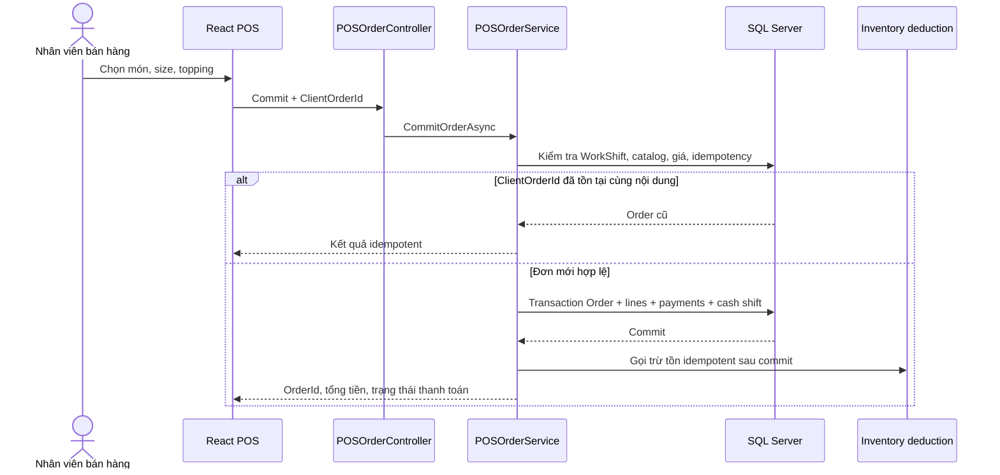
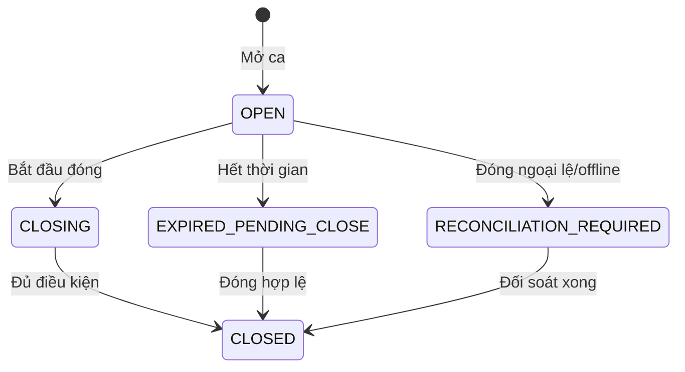
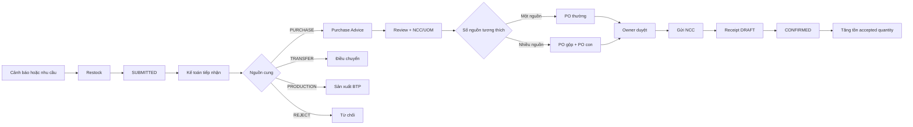
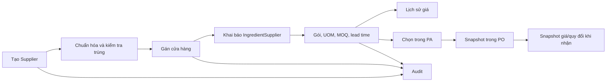
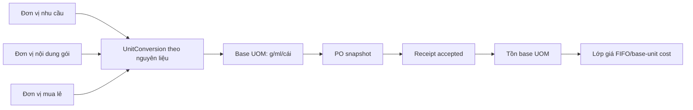
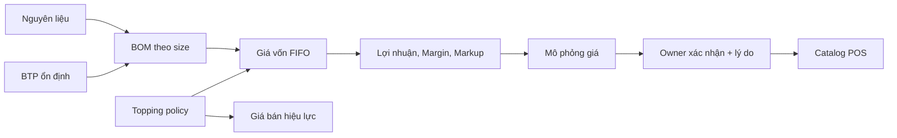
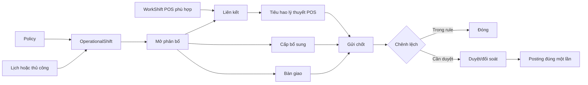
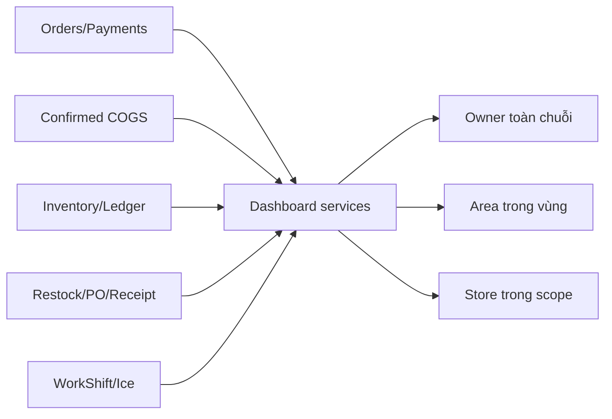

# Các quy trình nghiệp vụ end-to-end

## 1. Bán hàng tại POS

**Mục tiêu:** tạo một giao dịch bán hàng có giá do server xác nhận, thanh toán truy vết được và không tạo trùng khi retry/offline sync.

| Thành phần | Nội dung |
|---|---|
| Actor khởi tạo | Nhân viên bán hàng, Ca trưởng hoặc Quản lý chi nhánh có permission POS |
| Điều kiện trước | Account/staff/store active; terminal hợp lệ; WorkShift active; operator được phép; catalog còn hiệu lực |
| Dữ liệu vào | Món, size, topping, số lượng, payment lines, `ClientOrderId`, catalog/recipe snapshot |
| Kết quả | `Order`, `OrderDetail`, `OrderTopping`, `Payment`; cập nhật tiền kỳ vọng của ca; side effect tồn kho có trace |
| Bàn giao | Hóa đơn cho khách; dữ liệu ca cho Ca trưởng; tiêu hao/COGS cho Inventory và Dashboard |

### Các bước và validation

1. POS tải catalog theo store; server vẫn là authority giá và khả năng bán.
2. Người dùng chọn size/topping; default topping lấy từ policy active của `DrinkSize`.
3. API kiểm tra JWT, `CurrentStoreId`, `CurrentStaffId`, terminal và WorkShift.
4. `POSStoreMenuSaleValidator` đối chiếu menu item, recipe snapshot, topping và catalog version.
5. `POSOrderService` tính subtotal từ giá server, kiểm tra tổng payment lines bằng total.
6. Tiền mặt kiểm tra mệnh giá; VietQR tạo trạng thái chờ thanh toán.
7. `ClientOrderId` tồn tại với cùng payload trả lại đơn cũ; payload khác bị từ chối.
8. Transaction ghi Order, snapshot dòng, Payment và tiền kỳ vọng trong WorkShift.
9. Sau commit, controller/webhook gọi `InventoryDeductionService`; service dùng Order reference/BOM snapshot và chống trừ lặp. Nếu side effect lỗi, request retry có thể gọi lại; không có bằng chứng về worker recovery riêng.
10. In/reprint dùng order đã lưu; SignalR thông báo khi cần.

### Snapshot và ảnh hưởng tồn

- `OrderDetail`: tên món/size, giá chấp nhận, catalog version, `RecipeIdSnapshot`, ice level và COGS.
- `OrderTopping`: topping, recipe/policy và xử lý giá/giá vốn tại thời điểm bán.
- `Order`: store, staff, WorkShift, terminal, payment status, `ClientOrderId`.
- `CODE_CONFIRMED`: hệ thống chấp nhận blind selling/âm tồn theo ADR-0001; đây là quyết định hỗ trợ offline, không phải bỏ kiểm soát.
- `CODE_CONFIRMED`: thiếu side effect tồn sau khi thanh toán không rollback Order; retry cùng request có thể repair nhờ idempotency. `UNKNOWN_NEEDS_CONFIRMATION`: durable outbox/worker của ADR-0009 chưa hiện diện trong code đang inspect.

### Ngoại lệ

| Tình huống | Xử lý |
|---|---|
| Không có ca active | Chặn commit, yêu cầu mở/nhận ca |
| Catalog/recipe stale | Chặn và yêu cầu tải catalog mới |
| Retry cùng ClientOrderId | Trả order cũ nếu payload tương thích |
| ClientOrderId tái dùng khác nội dung | Business conflict |
| Offline queue còn khi đóng ca | Chặn đóng thường hoặc đi luồng ngoại lệ có phê duyệt |
| Thiếu conversion/BOM | Fail-closed cho phép tính; ghi warning/retry tồn theo contract |

**Evidence:** `Controllers/Api/v1/POSOrderController.cs`, `Application/Services/POS/POSOrderService.cs`, `POSStoreMenuSaleValidator.cs`, `InventoryDeductionService.cs`, ADR-0001/0002/0004/0009.
**Runtime:** `RUNTIME_CONFIRMED` local có Order với `ClientOrderId`, dữ liệu payment/cost và 136 order; giao dịch tương tác `NOT_RUNTIME_VERIFIED`.

## 2. Quản lý ca POS

**Mục tiêu:** ràng buộc bán hàng vào người, cửa hàng, terminal, lịch và két tiền; xử lý chênh lệch có kiểm soát.

| Actor | Hành động |
|---|---|
| Sales Staff | Mở ca đúng quyền/lịch, bán hàng, gửi đóng ca |
| Shift Supervisor | Hỗ trợ operator, OTP/ngoại lệ và đối soát theo permission |
| Store Manager | Quản lý ca, lịch và ngoại lệ trong StoreScope |

### Contract

- Mỗi staff/terminal không có hai active shift xung đột.
- Mở ngoài lịch cần permission, lý do và có thể cần OTP.
- Tiền kỳ vọng = tiền đầu ca + tổng tiền mặt trong ca.
- Chênh lệch = tiền thực đếm - tiền kỳ vọng; vượt ngưỡng cần lý do/OTP.
- Payment đang xử lý hoặc offline order chưa sync chặn đóng thường.
- Đóng ngoại lệ giữ manifest offline và chuyển `RECONCILIATION_REQUIRED`.
- Reconcile dùng request key, transaction, row version và audit.

**Ví dụ:** ca có 500.000 đ đầu ca và 2.000.000 đ tiền mặt bán hàng thì expected = 2.500.000 đ. Đếm 2.480.000 đ tạo chênh lệch -20.000 đ và phải xử lý theo ngưỡng cấu hình.
**Evidence:** `Models/Stores/WorkShift.cs`, `WorkShiftService.cs`, `POSShiftController.cs`.
**Runtime:** 64 WorkShift `CLOSED`, 1 `RECONCILIATION_REQUIRED` trong local/demo.

## 3. Restock đến PA, PO và Receipt

**Mục tiêu:** biến nhu cầu cửa hàng thành nguồn cung và chỉ tăng tồn khi hàng thực nhận được xác nhận.

### Đối tượng không đồng nghĩa

| Đối tượng | Ý nghĩa | Có tăng tồn? |
|---|---|---:|
| Restock | Ý định/nhu cầu của cửa hàng | Không |
| Sourcing allocation | Quyết định phần nào mua, chuyển, sản xuất hoặc từ chối | Không |
| PA | Đề nghị mua, giữ coverage theo số lượng | Không |
| PO/POB | Cam kết đặt với supplier | Không |
| Receipt DRAFT | Ghi nhận dự kiến/kiểm đếm | Không |
| Receipt CONFIRMED | Hàng được chấp nhận và post ledger | Có |

### State authority

- Restock hiện hành: `DRAFT → SUBMITTED → PROCESSING → PARTIALLY_RECEIVED → COMPLETED`, cùng `REJECTED/CANCELLED`.
- PA hiện hành trong service: `DRAFT → SUBMITTED → UNDER_REVIEW`; allocation/fulfillment cập nhật các trạng thái tiếp theo. Cancel chỉ trước khi review.
- PO thường: `DRAFT → APPROVED → MARKED_AS_SENT → PARTIALLY_RECEIVED → COMPLETED`, hoặc `CANCELLED`.
- POB: `DRAFT → PENDING_APPROVAL → APPROVED → PDF_GENERATED → SENT_TO_SUPPLIER → PARTIALLY_RECEIVED → COMPLETED`.
- Receipt: `DRAFT → CONFIRMED`; receipt confirmed là immutable.

### Validation và maker-checker

1. Store Manager tạo/gửi Restock trong scope; Kế toán tiếp nhận và chọn nguồn.
2. PA coverage tính theo số lượng còn hiệu lực, không chỉ theo boolean “đã có PA”.
3. Một PA/nguồn có thể tạo PO thường; POB chỉ cho nhiều nguồn tương thích.
4. Supplier phải active, phục vụ store và offer/UOM/MOQ hợp lệ.
5. Người tạo PO/POB không được tự duyệt.
6. Receipt khóa document/request/inventory rows, kiểm tra row version và số lượng còn lại.
7. Chỉ accepted quantity tạo `InventoryTransaction`; rejected quantity giữ lý do và trace.
8. Confirm receipt replay trả success cũ, không post lần hai.

**Ví dụ dữ liệu:** cửa hàng cần 10 kg cacao; 2 kg chuyển nội bộ, 8 kg mua. PA bao phủ 8 kg, PO đặt 8 kg. NCC giao 7,5 kg đạt và 0,5 kg loại; tồn tăng 7,5 kg, phần Restock còn lại phản ánh đúng.
**Evidence:** `RestockRequestService`, `PurchaseAdviceService`, `PurchaseOrderService`, `PurchaseOrderBatchService`, `BranchReceiptService`, ADR-0008.
**Runtime:** local/demo có Restock, PA, 8 PO và 6 Receipt; trạng thái legacy `OPEN/APPROVED` còn xuất hiện và được ghi là data drift trong tài liệu hạn chế.

## 4. Nhà cung cấp

**Mục tiêu:** quản lý danh tính NCC, phạm vi cửa hàng, gói mua/mua lẻ, giá và liên kết chứng từ.

### Actor và dữ liệu

| Actor | Hành động |
|---|---|
| Kế toán/kho | Tạo/sửa supplier, contact, offer, giá, store assignment |
| Owner | Xem/quản lý toàn chuỗi theo permission |
| Store Manager | Xem supplier được phép, không mặc định sửa giá global |

- Supplier identity: `SupplierId`, code, name, tax code, active state.
- `SupplierStore`: store, active, lead-time override, lịch giao.
- `IngredientSupplier`: ingredient, content UOM, package quantity/price, package MOQ, lead time, primary source, loose mode/UOM/price/MOQ/step.
- PO line giữ snapshot package/procurement unit, price và conversion để lịch sử không phụ thuộc giá mới.

### Ngoại lệ

- Duplicate supplier/offer/store assignment bị từ chối có thông điệp nghiệp vụ.
- UOM khác dimension mà không có conversion bị chặn.
- Supplier/store inactive không được dùng cho đơn mới nhưng lịch sử giữ nguyên.
- Independent loose price không bị ghi đè khi package price đổi.

**Evidence:** `AdminSupplierController.cs`, `AdminSupplierService.cs`, `Supplier.cs`, `SupplierStore.cs`, `IngredientSupplier.cs`.

**Ví dụ:** NCC A phục vụ Store 1, bán một gói 200 ml giá 168.000 đ và cho mua lẻ theo L. PA chỉ chọn offer khi assignment/offer active; PO giữ snapshot giá và quy đổi lúc đặt.
**Ngoại lệ tiêu biểu:** mã số thuế trùng, store assignment trùng, UOM không tương thích, offer inactive hoặc supplier không phục vụ store.

## 5. Inventory và UOM

**Mục tiêu:** cho phép nhập liệu bằng đơn vị quen thuộc nhưng tồn và ledger luôn dùng đơn vị chuẩn.

| Khái niệm | Ví dụ | Authority |
|---|---|---|
| Base UOM | g, ml, cái | `Ingredient.BaseUnitId` |
| Đơn vị nhu cầu | kg, L, cái | Restock original/procurement fields |
| Nội dung gói | 200 ml/gói | `IngredientSupplier.PackageQuantity + UnitId` |
| Mua theo gói | 3 gói | `PurchaseMode.Packaged`, package MOQ |
| Mua lẻ | 1,5 L | `PurchaseMode.Loose`, loose UOM/MOQ/step |
| Inventory posting | 1.500 ml | Receipt conversion snapshot |

| Actor | Hành động |
|---|---|
| Store Manager | Chọn UOM nhu cầu compatible khi tạo Restock |
| Kế toán/kho | Cấu hình conversion/gói/mua lẻ và chọn purchase mode |
| Store/Ca trưởng | Nhập quantity thực nhận; backend materialize base quantity |

**Công thức gói:** `ceil(BaseDemand / PackageBaseQuantity)`, sau đó áp package MOQ.
**Công thức mua lẻ:** đổi demand sang loose UOM, áp loose MOQ và bước số lượng.
**Validation:** không tự đổi mass ↔ volume nếu thiếu conversion/density theo nguyên liệu.
**Ngoại lệ tiêu biểu:** conversion thiếu/âm, quantity không theo loose step, package MOQ chưa đạt hoặc input UOM khác identity.
**Evidence:** `UnitConversion.cs`, `IngredientSupplier.cs`, `PurchaseOrderLine`, `BranchReceiptLine`, ADR-0005/0006/0008.

## 6. Menu, BOM, BTP, costing và pricing

**Mục tiêu:** duy trì công thức theo size, tính giá vốn từ FIFO và mô phỏng giá bán mà không âm thầm thay giá.

### Contract

- `PreparedItem` là identity tồn kho BTP ổn định; `Recipe` là phiên bản công thức sản xuất/tiêu hao.
- POS dùng recipe snapshot; thay recipe không viết lại đơn cũ.
- FIFO đi qua lớp giá theo thời gian và chỉ báo complete khi đủ quantity/conversion.
- Giá vốn = tổng chi phí component hợp lệ; phần thiếu không được coi là 0.
- Lợi nhuận gộp = giá bán - giá vốn.
- Margin = lợi nhuận / giá bán; Markup = lợi nhuận / giá vốn.
- Giá gợi ý theo Margin: `Cost / (1 - TargetMargin)`; theo Markup: `Cost × (1 + TargetMarkup)`; theo tiền lời: `Cost + TargetProfit`.
- `Suggest` chỉ trả preview. `UpdatePrice` là action riêng, có permission Owner, reason, row version và audit.
- Topping policy tách `PriceTreatment`, `CostTreatment`, `IsDefaultSelected` và quantity.

| Actor | Hành động |
|---|---|
| Kế toán/kho | Xem FIFO/COGS và xử lý dữ liệu nguyên liệu/UOM khi có quyền |
| Owner/Menu manager | Quản lý BOM, topping policy và áp dụng giá bán |
| Store Manager | Xem giá áp dụng/costing trong scope, không mặc định sửa global price |
| Sales Staff | Chỉ dùng catalog/price/policy đã phát hành trên POS |

**Ví dụ:** cost FIFO 10.000 đ, giá bán 30.000 đ tạo profit 20.000 đ, Margin 66,67% và Markup 200%. Tính giá gợi ý 35.000 đ không persist cho tới action UpdatePrice riêng.
**Ngoại lệ tiêu biểu:** thiếu exact recipe, thiếu conversion/layer, topping legacy chưa map, RowVersion giá stale hoặc actor thiếu permission.

### Giới hạn được code xác nhận

`CODE_CONFIRMED` cost treatment hiện hỗ trợ “đã nằm trong BOM”, “cộng thêm recipe cost” và display-only. `UNKNOWN_NEEDS_CONFIRMATION`: chưa có treatment thay thế component tổng quát trong constants hiện tại; không demo như tính năng hoàn chỉnh.

**Evidence:** `PreparedItem.cs`, `Recipe.cs`, `DrinkSizeProfitabilityQueryService.cs`, `PriceSuggestionService.cs`, `DrinkSizeToppingPolicyService.cs`, ADR-0005/0006.

## 7. Operational Ice

**Mục tiêu:** kiểm soát đá được cấp, dùng, bổ sung, bàn giao và chênh lệch theo ca vận hành.

### Actor/action

| Actor | Hành động |
|---|---|
| Store Manager/Owner | Cấu hình, tạo/mở shift, link WorkShift, duyệt supplement/variance |
| Shift Supervisor | Yêu cầu bổ sung, bàn giao, gửi chốt trong ca được giao |
| Area/Accountant | Xem và báo cáo theo scope, không mặc định mutate |

### Contract và ngoại lệ

- Candidate WorkShift phải cùng store, giao thời gian, state hợp lệ và không link xung đột.
- Link transaction/idempotency và unique relation ngăn double-count.
- Theoretical usage lấy từ WorkShift đã link; policy và actual dùng để tính variance.
- Chênh lệch dương cần xuất tồn tạo `ICE_VARIANCE_OUT`; posting có idempotency key.
- Chênh lệch âm được đối soát, không tự động ghi tăng tồn.
- RowVersion, state, permission và StoreScope được revalidate backend.

**Evidence:** `OperationalIceConstants.cs`, `OperationalShift.cs`, `OperationalIceService.cs`, `AdminOperationalIceController.cs`.
**Runtime:** 2 OperationalShift `Open` tồn tại trong local/demo; thao tác link/close `NOT_RUNTIME_VERIFIED` trong phiên tài liệu.

**Ví dụ:** ca đá cấp 20 kg, POS lý thuyết dùng 15 kg, kiểm kê/bàn giao hợp lệ còn 3 kg thì actual usage 17 kg và variance 2 kg cần đi rule duyệt/posting.
**Ngoại lệ tiêu biểu:** WorkShift khác store/không overlap, link xung đột, stock giữ chỗ thiếu, ca đã đóng hoặc row version stale.

## 8. Dashboard và báo cáo

**Mục tiêu:** biến dữ liệu giao dịch, tồn và giá vốn thành chỉ số quản trị có scope.

- Doanh thu lấy từ order/payment phù hợp trạng thái và khoảng thời gian.
- Gross profit đáng tin chỉ trên phần COGS confirmed/complete; dashboard có data-status thay vì coi thiếu giá vốn là 0.
- Store/Area filters phải qua permission và scope.
- `UNKNOWN_NEEDS_CONFIRMATION`: định nghĩa KPI chi tiết thay đổi theo widget; khi bảo vệ một chỉ số cụ thể phải mở metadata trong `DashboardWidgetCatalog` thay vì nói chung.

| Actor | Hành động |
|---|---|
| Owner | Xem toàn chuỗi và phê duyệt dựa trên chỉ số |
| Area Manager | Lọc store trong vùng và so sánh hiệu quả |
| Store Manager | Xem store trong scope và xử lý cảnh báo |
| Accountant | Đối chiếu tồn, procurement và COGS |

**Ví dụ:** widget hiệu quả size dùng doanh thu, confirmed COGS và confirmed gross profit; row thiếu COGS phải mang data status thay vì bị tính như cost = 0.
**Ngoại lệ tiêu biểu:** actor chọn store ngoài scope, date filter không hợp lệ, dữ liệu cost chưa complete hoặc widget sample quá nhỏ.

**Evidence:** `DashboardController.cs`, `Application/Services/Admin/Dashboard/DashboardWidgetCatalog.cs`, `DashboardIntelligenceService.*`.
