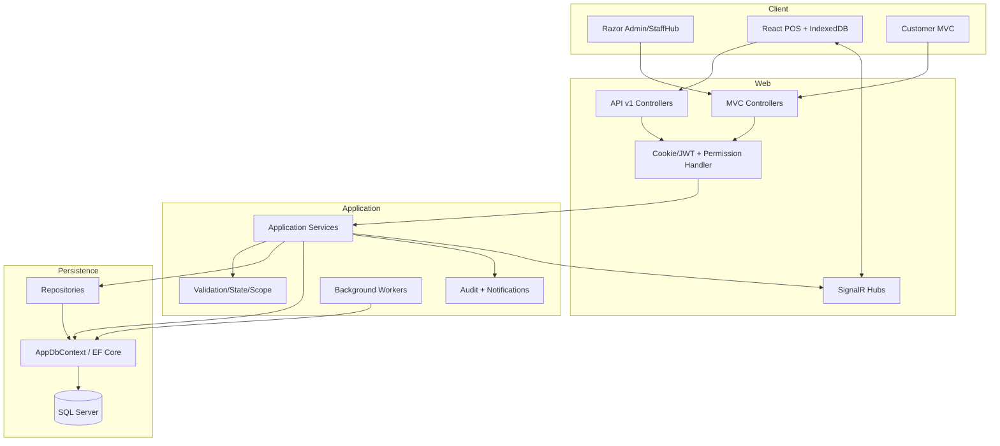
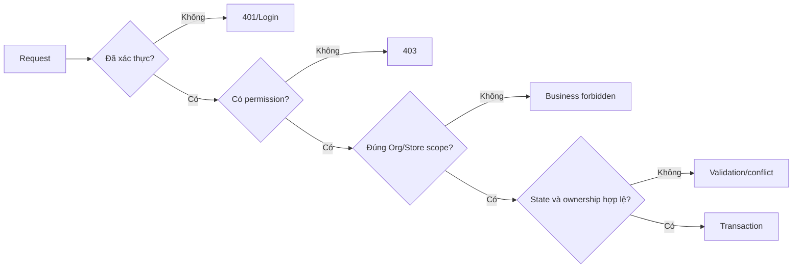

# Kiến trúc hệ thống

## Sơ đồ tổng thể

## Thành phần và trách nhiệm

| Lớp | Trách nhiệm thật trong code | Ví dụ |
|---|---|---|
| UI Razor | Admin, StaffHub, form và table server-rendered | `Areas/Admin/Views`, `Views/StaffHub` |
| UI React | POS, offline queue, customer display | `CafeChain.Frontend/src` |
| Controller | Route, model binding, anti-forgery, permission, HTTP result | `Areas/Admin/Controllers`, `Controllers/Api/v1` |
| Application service | Workflow, transaction, validation, mapping DTO | `Application/Services` |
| Repository | Truy vấn/ghi chuyên biệt, một số lock/transaction abstraction | `Infrastructure/Repositories` |
| DbContext | Unit of work, relationship/configuration, direct query | `Data/AppDbContext.cs`, `Data/Configurations` |
| Worker | Cleanup order/payment theo lịch | `Application/Workers`, đăng ký trong `AddCafeChainWorkers` |
| Hub | Event đơn, payment, print, inventory, workshift | `Hubs` |

`CODE_CONFIRMED`: Đây là kiến trúc phân lớp thực dụng, không phải Clean Architecture thuần. Application service đôi khi dùng trực tiếp `AppDbContext`, đôi khi qua repository. Khi bảo vệ nên mô tả đúng như vậy.

## Khởi động ứng dụng

`Program.cs` cấu hình theo chuỗi extension:

1. MVC/JSON, session, cache, SignalR, CORS.
2. SQL Server DbContext và lazy-loading proxies.
3. Cookie + JWT authentication.
4. Permission policies và handler.
5. Third-party: payment, email, media, PDF tùy cấu hình.
6. Application services, repositories, workers.
7. Pipeline: HTTPS/static/localization/routing/CORS/session/auth.
8. Route MVC Areas/default và SignalR hubs.

## Authentication

| Surface | Cơ chế | Authority |
|---|---|---|
| Admin/StaffHub | Cookie; login path `/Account/Login` | `AuthenticationServiceExtensions.cs` |
| POS API | JWT bearer, issuer/audience/key validation | Cùng file |
| SignalR inventory | JWT có thể truyền qua `access_token` cho hub được cấu hình | Cùng file |

- Cookie là HttpOnly, Secure, SameSite Lax, sliding expiration.
- JSON request nhận 401/403 JSON thay vì HTML redirect.
- Secret đến từ user secrets/environment; không đưa secret vào tài liệu hoặc source.

## Authorization

`PermissionRequirement` đọc effective permission; service tiếp tục kiểm tra scope/state. Đây là zero-trust nội bộ giữa UI và backend: ẩn nút không thay cho authorization.

## Validation và error handling

- Data annotations/ViewModel cho validation hình thức.
- Application service cho validation nghiệp vụ, state transition, UOM và scope.
- `ServiceResult<T>` mang success, message, errors và error code.
- Conflict/concurrency trả thông báo tiếng Việt ở các module đã harden.
- Non-development dùng `/Home/Error`; technical detail giữ trong log.
- `UNKNOWN_NEEDS_CONFIRMATION`: một số service legacy còn nối `ex.Message` vào lỗi người dùng; không tuyên bố toàn hệ thống đã có global exception taxonomy hoàn chỉnh.

## Transaction, concurrency và idempotency

| Kỹ thuật | Nơi dùng | Mục đích |
|---|---|---|
| EF transaction | POS commit, receipt, procurement, ice | Ghi aggregate nguyên tử |
| Serializable/UPDLOCK | PA/PO allocation, receipt, batch | Ngăn hai actor đặt/nhận cùng phần |
| `RowVersion` | WorkShift, Supplier, PA, PO, Receipt, Ice | Phát hiện stale edit |
| Request key/dedup table | WorkShift, receipt, POS operations | Retry an toàn |
| Unique `ClientOrderId` | Order | Offline sync không trùng |
| Posting identity | Receipt/ice/inventory | Không post ledger hai lần |
| Maker-checker | PO/POB | Người tạo không tự duyệt |

## Dữ liệu thời gian thực và offline

- React POS dùng IndexedDB/Dexie để giữ catalog/queue/snapshot local.
- Offline order mang UUID `ClientOrderId`; sync batch kiểm tra idempotency server-side.
- SignalR hubs: `/orderHub`, `/paymentHub`, `/hubs/print-bridge`, `/hubs/inventory-notifications`, `/hubs/workshifts`.
- Print bridge tách phần tạo payload khỏi thiết bị in thật theo ADR-0003.
- Blind selling có thể làm tồn âm; dashboard/đối soát phải hiển thị thay vì che đi.

## Audit

`CODE_CONFIRMED` Audit tồn tại ở nhiều mức:

- `AuditLog` dạng before/after cho inventory/admin legacy.
- Transition entity riêng cho PA và các workflow.
- Price/topping policy audit entities.
- Log/event có actor, time, reason và request key ở WorkShift/Ice/Receipt.

`INFERENCE`: Audit hiện là mô hình lai thay vì một event store thống nhất. Đây là lựa chọn thực dụng nhưng làm truy vấn audit liên module phức tạp hơn.

## External services

| Dịch vụ | Vai trò | Khi demo lỗi |
|---|---|---|
| PayOS | VietQR/payment link | Dùng tiền mặt hoặc dữ liệu payment có sẵn |
| SMTP | OTP/thông báo | Dùng local log mode nếu được cấu hình, không lộ password |
| Cloudinary | Media | Dùng ảnh seed/local fallback |
| QuestPDF/OpenXML | PDF/Excel | Dùng file đã tạo hoặc bỏ qua nếu external prerequisite lỗi |

## Deployment/runtime evidence

`RUNTIME_CONFIRMED` backend local .NET 8 khởi động ở port 5111, kết nối SQL Server và chạy cleanup workers. Login trả 200; admin unauthenticated redirect; POS API unauthenticated trả 401.
`NOT_RUNTIME_VERIFIED`: React dev server, PayOS, SMTP, Cloudinary và print bridge không được bật trong lượt kiểm chứng docs này.
