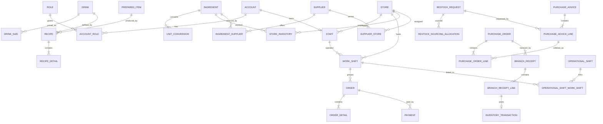

# Bản đồ dữ liệu và entity

## ER nghiệp vụ mức cao

## Identity, role và scope

| Entity | Ý nghĩa | Quan hệ chính | Ai tạo/cập nhật |
|---|---|---|---|
| `Account` | Danh tính đăng nhập, trạng thái bảo mật | Roles, Staff | SystemAdmin/role có quyền staff |
| `Role` | Nhóm chức năng nghiệp vụ | AccountRole, permissions | Seed + SystemAdmin/Owner |
| `Permission` | Quyền thao tác cụ thể | RolePermission/AccountPermission | Seed và màn hình quyền |
| `Staff` | Hồ sơ nhân viên, store gốc | Account, Store, shifts | Manager/Admin theo scope |
| `StaffScope` | Store/region được phép truy cập | Staff, ScopeType/target | Role có permission scope |
| `Store` | Chi nhánh vận hành | Staff, inventory, orders, procurement | Owner/Area tùy permission |
| `Region`/scope vùng | Nhóm store phục vụ Area Manager | Stores/scopes | Cấu hình hệ thống |

## POS và ca

| Entity | Ý nghĩa/field bảo vệ | Quan hệ | Actor |
|---|---|---|---|
| `WorkShift` | Ca POS/két; status, business date, terminal, starting/expected/actual cash, RowVersion | Store, staff, orders | POS actor/manager |
| `PosTerminal` | Thiết bị POS và store authority | WorkShift | Manager/Admin |
| `Order` | Header giao dịch; store, shift, total, status, `ClientOrderId`, COGS | Details, payments | Sales Staff/POS |
| `OrderDetail` | Snapshot món/size/giá/recipe/ice/COGS | Drink, DrinkSize, toppings | POS service |
| `OrderTopping` | Snapshot topping và policy tại thời điểm bán | OrderDetail, Topping | POS service |
| `Payment` | Dòng thanh toán, method/status, staff, shift, terminal | Order | POS/payment webhook |
| `CashSession` | Dữ liệu két liên quan payment legacy | Payment | POS services |
| `RequestDeduplication` | Request key và kết quả replay | Workflow action | Infrastructure/service |

## Menu, BOM và costing

| Entity | Ý nghĩa/field quan trọng | Quan hệ | Actor |
|---|---|---|---|
| `Drink` | Món bán | Category, sizes, recipe | Menu manager/Owner |
| `DrinkSize` | Giá global theo size, RowVersion | Drink, Size, topping policies | Owner |
| `Recipe` | Phiên bản BOM; effective date, parent version, output | Details, Drink/Size/Topping/PreparedItem | Menu/BOM manager |
| `RecipeDetail` | Ingredient hoặc child recipe + quantity/UOM | Recipe, Ingredient | Menu/BOM manager |
| `PreparedItem` | Identity tồn kho BTP ổn định | Recipe versions, inventory | BOM/production |
| `DrinkSizeToppingPolicy` | Default/required, price treatment, cost treatment, quantity | DrinkSize, Topping | Owner |
| `DrinkSizePriceAudit` | Giá cũ/mới, actor, reason, time | DrinkSize | Price service |
| `InventoryCostLayer` | Lượng còn lại và unit cost theo FIFO | Store + inventory identity | Receipt/production/transfer |

## Inventory và đơn vị

| Entity | Ý nghĩa/field quan trọng | Quan hệ | Actor |
|---|---|---|---|
| `Ingredient` | Nguyên liệu và `BaseUnitId` | conversions, BOM, supplier offers | Kế toán/kho/Admin |
| `Unit` | Đơn vị vật lý/đếm | Ingredient, conversions | Master data |
| `UnitConversion` | Quy đổi theo ingredient: from qty/unit → to qty/unit | Ingredient, Unit | Master data |
| `StoreInventory` | Available/reserved và identity Ingredient/PreparedItem | Store, ledger | Services |
| `InventoryTransaction` | Ledger before/after, quantity, cost, source reference | StoreInventory, order/receipt/etc. | System only |
| `InventoryCostLayer` | FIFO layer và remaining quantity | Store/item | Receipt/production |
| `StockAlert` | Cảnh báo thiếu/threshold | Store/item | Detection + manager |

## Supplier và procurement

| Entity | Ý nghĩa/field quan trọng | Quan hệ | Actor |
|---|---|---|---|
| `Supplier` | NCC, code, name, tax, active, RowVersion | contacts, offers, stores | Accountant/Owner |
| `SupplierContact`/`SupplierPhone` | Đầu mối liên hệ | Supplier | Accountant/Owner |
| `SupplierStore` | NCC phục vụ store; lead time override/schedule | Supplier, Store | Accountant/Owner |
| `IngredientSupplier` | Gói mua/mua lẻ, UOM, giá, MOQ, lead time, primary | Supplier, Ingredient | Accountant/Owner |
| `IngredientSupplierPriceHistory` | Lịch sử thay đổi giá/gói | Offer | Service audit |
| `RestockRequest` | Nhu cầu, store, item, quantity, priority, status, reference | alert, allocations, PA, fulfillment | Store Manager/Accountant |
| `RestockSourcingAllocation` | Phần quantity theo source | Restock, PA line | Accountant |
| `PurchaseAdvice` | Header đề nghị mua, requester/reviewer/state | Lines/transitions | Accountant |
| `PurchaseAdviceLine` | Coverage Restock theo base/procurement qty | Restock/allocation/PO line | Accountant/system |
| `PurchaseOrder` | Đơn mua theo store/supplier, approval/send state | Lines, batch, receipts | Accountant; Owner approve |
| `PurchaseOrderLine` | Item, package/loose mode, quantity, price/conversion snapshot | PA line, restock, receipt postings | Procurement service |
| `PurchaseOrderBatch` | Đơn gộp nhiều nguồn tương thích | Child PO, allocation, document revisions | Accountant; Owner approve |
| `BranchReceipt` | Phiếu nhận DRAFT/CONFIRMED, request key | PO/store/lines | Store/Shift |
| `BranchReceiptLine` | Accepted/rejected, UOM/cost snapshots, ledger link | Restock/PO line/inventory tx | Store/Shift/system |
| `RestockFulfillmentPosting` | Authority số lượng Restock đã thực hiện | Restock + source document line | System |

## Operational Ice

| Entity | Ý nghĩa | Quan hệ | Actor |
|---|---|---|---|
| `OperationalShift` | Ca vận hành đá, thời gian, lead, source, state | Store, WorkShift links, allocations | Store Manager/Owner |
| `OperationalShiftWorkShift` | Liên kết ca POS vào ca đá | OperationalShift, WorkShift | Store Manager/Owner |
| `IceAllocation` | Lượng cấp, theoretical/actual, variance, revision | Shift, inventory, issues/carryovers | System + shift actors |
| `IceSupplementalIssue` | Yêu cầu cấp bổ sung và quyết định | Allocation | Shift lead/approver |
| `IceCarryOver` | Bàn giao giữa ca | Source/target allocation | Shift actors |
| `IceInventoryPosting` | Posting variance idempotent | Allocation, transaction | Approval service |

## Audit và báo cáo

| Entity/service | Vai trò |
|---|---|
| `AuditLog` | Before/after dữ liệu inventory/admin legacy |
| `PurchaseAdviceTransition` | Lịch sử state PA với actor/reason/time |
| Price/topping audit | Lịch sử chính sách giá/menu |
| Inventory ledger | Audit tài chính-số lượng của mọi movement |
| Dashboard read models | Projection phục vụ KPI, không phải source of truth |

## Quy tắc dữ liệu cần nhớ

1. Identity lịch sử không được thay bằng label hiện tại: Order/PO/Receipt giữ snapshot.
2. Mọi quantity nhập/mua phải quy về base UOM trước khi ghi StoreInventory.
3. `AvailableQty` có thể âm theo ADR-0001; ledger before/after vẫn phải truy vết.
4. Receipt confirmed và transaction ledger không chỉnh sửa ngược; sửa sai cần adjustment/reversal mới.
5. RowVersion chống lost update, không thay thế unique constraint/idempotency.
6. PA/PO allocation dùng quantity; một relation tồn tại không đồng nghĩa coverage đã đủ.

## Data evidence local

`RUNTIME_CONFIRMED` truy vấn read-only ngày 08/08/2026 cho thấy database demo có đủ entity xuyên chuỗi: Store, Supplier, Order, WorkShift, OperationalShift, Restock, PA, PO và Receipt. Không có dữ liệu production được sửa.
`UNKNOWN_NEEDS_CONFIRMATION`: các bảng đang chứa một số status legacy ngoài constants hiện hành (`Restock OPEN`, `PA APPROVED`); cần data normalization riêng trước khi dùng làm kịch bản state-machine chuẩn.
