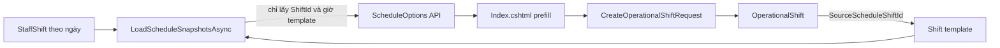
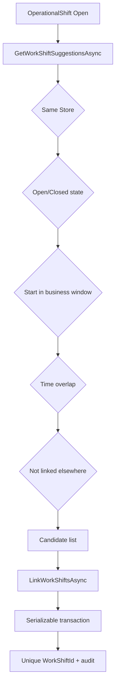

# Operational Ice / WorkShift / POS Shift Linking Fix Plan

## 1. Executive summary

Task state: `INSPECT_AND_PLAN_ONLY`.

Epic: [#417 Operational Ice shift scheduling and POS linkage hardening](https://github.com/TheSkibidi1712/CafeChain/issues/417)

Analysis issue: [#418 Inspect schedule-time source, POS WorkShift linking, and Ice Policy configuration](https://github.com/TheSkibidi1712/CafeChain/issues/418)

Hai lỗi kiến trúc chính đã được xác định:

1. `CODE_CONFIRMED`: Operational Ice tạo lựa chọn lịch từ `Shift.StartTime/EndTime` và bỏ qua `StaffShift.CustomStartTime/CustomEndTime`. Vì vậy ca mẫu 12:00-18:00 vẫn được dùng dù lịch thực tế đã đổi thành 11:50-17:50.
2. `CODE_CONFIRMED`: POS dùng timezone cấu hình `WorkShift:TimeZoneId` và giữ `SourceStaffShiftId`, trong khi Operational Ice dùng timezone của máy chủ qua `ToLocalTime()/ToUniversalTime()` và chỉ giữ `ShiftId` của ca mẫu. Sự lệch authority này có thể làm một POS WorkShift hợp lệ bị loại khỏi candidate query trên máy chủ chạy UTC.

Candidate query hiện tại đã dùng time overlap, không dùng exact equality. Do đó riêng chênh lệch 10 phút vẫn phải match nếu cùng Store, đúng business window, trạng thái hợp lệ và chưa liên kết nơi khác. Snapshot database hiện tại không còn `OperationalShift`, `IceAllocation` hoặc `IcePolicy`, nên không thể chứng minh điều kiện cụ thể nào đã loại record trong screenshot cũ. Plan phải bổ sung reason diagnostics thay vì tiếp tục trả danh sách rỗng không giải thích.

Không có implementation, migration hoặc data repair trong task này.

## 2. Screenshot/runtime evidence

### Owner evidence

- Ca mẫu: `Ca chiều`, 12:00-18:00.
- Lịch thực tế: 11:50-17:50.
- Form tạo ca vận hành vẫn hiển thị 12:00-18:00.
- Chi tiết ca hiển thị chưa liên kết/đã liên kết 0 POS WorkShift.
- Tiêu hao lý thuyết POS bằng 0.

Classification: `RUNTIME_CONFIRMED_BY_OWNER`.

### Local read-only database evidence

Query được chạy bằng `sqlcmd`, chỉ đọc:

- `OperationalShifts`: 0 record.
- `IceAllocations`: 0 record.
- `IcePolicies`: 0 record.
- POS WorkShift #66: Store 1, business date 10/08/2026, trạng thái `OPEN`, `SourceStaffShiftId = NULL`.
- StaffShift #5: template 12:00-18:00, custom 13:00-17:30.

Classification: `RUNTIME_DATA_INSPECTED`, nhưng scenario screenshot là `NOT_REPRODUCIBLE_FROM_CURRENT_DB_SNAPSHOT`.

Không tạo dữ liệu reproduce vì task cấm sửa demo/production data và database hiện không có policy/ca đá để chạy flow an toàn mà không mutation.

## 3. Entity and identity map

| Khái niệm            | Entity                      | Identity                            | Time authority                                                         | Ghi chú                                                                  |
| -------------------- | --------------------------- | ----------------------------------- | ---------------------------------------------------------------------- | ------------------------------------------------------------------------ |
| Ca mẫu               | `Shift`                     | `ShiftId`                           | `StartTime`, `EndTime`, `IsOvernight`                                  | Lưu giờ mặc định 12:00-18:00.                                            |
| Lịch nhân sự thực tế | `StaffShift`                | `StaffShiftId`                      | `CustomStartTime ?? Shift.StartTime`, `CustomEndTime ?? Shift.EndTime` | Lưu override 11:50-17:50.                                                |
| Ca bán hàng POS      | `WorkShift`                 | `ShiftId`                           | `StartTimeUtc`, `EndTimeUtc`, `BusinessDate`                           | Có `SourceStaffShiftId`; giờ thực tế là instant UTC.                     |
| Ca vận hành đá       | `OperationalShift`          | `OperationalShiftId`                | `StartAtUtc`, `EndAtUtc`, `BusinessDate`                               | Chỉ giữ `SourceScheduleShiftId` trỏ tới `Shift`, không trỏ `StaffShift`. |
| Liên kết POS         | `OperationalShiftWorkShift` | `(OperationalShiftId, WorkShiftId)` | `LinkedAtUtc`                                                          | Một ca đá có nhiều POS WorkShift; một POS WorkShift tối đa một ca đá.    |
| Chính sách đá        | `IcePolicy`                 | `IcePolicyId`, unique Store         | Base quantity trong g                                                  | Một mutable active row cho mỗi Store.                                    |
| Cấp đá               | `IceAllocation`             | `IceAllocationId`                   | UTC audit timestamps                                                   | Giữ cấp đầu ca, bổ sung, reservation, usage và variance.                 |

### Authority conclusion

- Template 12:00-18:00: `Shift`.
- Actual schedule 11:50-17:50: `StaffShift`.
- Form tạo Operational Ice hiện chọn một nhóm theo `ShiftId`, không chọn một `StaffShiftId` cụ thể.
- POS mở ca theo `StaffShiftId` cụ thể và dùng effective interval đúng.

## 4. Current schedule to OperationalShift flow



1. `AdminOperationalIceController.ScheduleOptions` gọi `OperationalIceService.GetScheduleOptionsAsync`.
2. `LoadScheduleSnapshotsAsync` query `StaffShifts` nhưng projection chỉ lấy field của `Shift`.
3. Kết quả được group theo `ShiftId + template time`.
4. UI nhận tên/giờ đã sai từ API và submit lại qua hidden fields.
5. Controller chuyển local input sang UTC bằng host-local timezone.
6. `OperationalShift` persist template identity và snapshot time.

Existing draft behavior:

- `SyncDraftWithScheduleAsync` tồn tại và chỉ cho Draft.
- Nhưng sync dùng lại `LoadScheduleSnapshotsAsync`, nên hiện cũng sync về template time.
- Khi ca đã Open, hệ thống không silent-update time; đây là nền tảng phù hợp để giữ lịch sử.

## 5. Root cause of template-time fallback

`CODE_CONFIRMED` tại `OperationalIceService.LoadScheduleSnapshotsAsync`:

- Không select `StaffShiftId`.
- Không select `CustomStartTime`/`CustomEndTime`.
- Tạo `startLocal` bằng `date.Add(group.Key.StartTime)` từ template.
- `ScheduleShiftId` thực chất là `ShiftId`.

POS đã có implementation đúng tại `ScheduleIntervalResolver.Resolve(StaffShift)`:

```text
start = CustomStartTime ?? Shift.StartTime
end   = CustomEndTime   ?? Shift.EndTime
```

Plan phải reuse cùng interval authority thay vì triển khai phép resolve thứ hai.

## 6. Current POS WorkShift candidate/link flow



Candidate filters:

- OperationalShift phải `Open`.
- Same `StoreId`.
- WorkShift `OPEN/CLOSED` hoặc legacy `Open/Closed`.
- WorkShift start nằm trong business window.
- `WorkShift.StartTimeUtc < OperationalShift.EndAtUtc`.
- `WorkShift.EndTimeUtc == null || EndTimeUtc > OperationalShift.StartAtUtc`.
- Chưa có link trong `OperationalShiftWorkShifts`.
- Tối đa 30 candidate.

Link mutation:

- Revalidate tất cả điều kiện backend.
- Serializable transaction.
- Distinct request IDs.
- Replay link vào cùng ca trả success.
- Unique conflict với ca khác trả lỗi tiếng Việt.
- Ghi audit `LINK_WORKSHIFT`.

## 7. Root cause of failed linking

### Confirmed defects

1. `CODE_CONFIRMED`: Operational Ice dùng host timezone:
   - `StartAtUtc.ToLocalTime()`.
   - local `ToUniversalTime()`.
   - `DateTime.Now` cho open WorkShift end.
2. `CODE_CONFIRMED`: POS dùng `WorkShiftOptions.ResolveTimeZone()` với `Asia/Ho_Chi_Minh`.
3. `CODE_CONFIRMED`: Operational Ice không có `SourceStaffShiftId`, nên không thể ưu tiên stable schedule identity giống POS.
4. `CODE_CONFIRMED`: UI không hiển thị lý do zero candidate; form link chỉ xuất hiện khi `AvailableWorkShifts.Count > 0`.

### Important qualification

Time overlap đã được hỗ trợ. Operational 12:00-18:00 và POS 11:50-17:50 vẫn overlap. Vì vậy template fallback một mình không giải thích được zero candidates trên máy chủ UTC+7.

`UNKNOWN_NEEDS_RUNTIME_EVIDENCE`: screenshot record có thể đồng thời bị loại vì:

- OperationalShift chưa `Open`.
- POS WorkShift sai Store/business date.
- POS WorkShift state không hợp lệ.
- POS WorkShift đã link ca khác.
- Host timezone không phải Vietnam.
- POS WorkShift mở ngoài lịch nên `SourceStaffShiftId = NULL` và actual time không overlap.

Implementation phải trả diagnostics theo stable reason code cho từng điều kiện, để không còn suy đoán từ danh sách rỗng.

## 8. Current theoretical POS consumption flow

### Live update at committed sale

`InventoryDeductionService` gọi `ConsumeForCommittedOrderAsync` trước khi thêm ledger row:

1. Order phải có `WorkShiftId`.
2. WorkShift phải link với OperationalShift có allocation `Open`.
3. BOM requirements phải chứa đúng `IceAllocation.IngredientId`.
4. Giảm reservation tối đa bằng nhu cầu.
5. Cộng `TheoreticalUsageQuantity` bằng toàn bộ nhu cầu.
6. Cùng transaction với inventory deduction.

Order replay đã có guard `SALES_DEDUCTION`, nên không double-count khi transaction trước đã commit.

### Recompute at close/report

`CalculateTheoreticalUsageAsync` và report service join:

```text
InventoryTransaction
-> Order by ReferenceOrderId
-> OperationalShiftWorkShift by Order.WorkShiftId
```

Theoretical usage = SALES_DEDUCTION - SALES_RETURN cho đúng StoreInventory.

Kết luận: nếu WorkShift không link, live accumulation và close recomputation đều bằng 0. Link là authority bắt buộc; không được suy đoán từ giờ hoặc Store tại thời điểm tính report.

## 9. OperationalShift to WorkShift cardinality

| Invariant                                              | Current state                          | Assessment          |
| ------------------------------------------------------ | -------------------------------------- | ------------------- |
| Một OperationalShift có nhiều POS WorkShift            | Navigation collection + bridge PK      | `ALREADY_SUPPORTED` |
| Một POS WorkShift chỉ link tối đa một OperationalShift | Unique index `WorkShiftId`             | `ALREADY_SUPPORTED` |
| Retry cùng link không duplicate                        | Application guard + unique index       | `ALREADY_SUPPORTED` |
| Conflicting concurrent links                           | Serializable + unique conflict mapping | `ALREADY_SUPPORTED` |
| Link theo actual schedule identity                     | OperationalShift thiếu `StaffShiftId`  | `MISSING`           |
| Giải thích zero candidate                              | UI chỉ render empty state              | `MISSING`           |

## 10. Time overlap and timezone rules

### Target resolver

Candidate hợp lệ khi:

```text
same Store
AND compatible business date/window
AND workShift.StartTimeUtc < operational.EndAtUtc
AND coalesce(workShift.EndTimeUtc, nowUtc/plannedEndUtc) > operational.StartAtUtc
AND eligible status
AND no conflicting link
```

Exact equality không bắt buộc.

### Timezone authority

- Persist instant UTC.
- Resolve schedule local time bằng configured Vietnam timezone.
- Không dùng server `.ToLocalTime()`, `.ToUniversalTime()` hoặc `DateTime.Now` trong resolver.
- Reuse `WorkShiftOptions.ResolveTimeZone()`, `ScheduleIntervalResolver`, `TimeProvider` hoặc `IBusinessDateService` theo responsibility.
- Overnight interval phải giữ date boundary đúng.

### Open WorkShift with null end

Current behavior coi open POS WorkShift kéo dài tới current time hoặc operational end. Plan giữ compatibility nhưng chuyển hoàn toàn sang UTC/configured timezone và test boundary rõ ràng.

## 11. Schedule change semantics

### Before execution: explicit sync recommended

Recommendation: giữ explicit **Đồng bộ từ lịch** cho Draft.

Lý do:

- Existing UI/service đã có diff và sync action.
- Tránh silent change người phụ trách/giờ đã được review.
- Có thể audit before/after.
- Cho phép chuyển ca sang Manual khi nguồn lịch bị hủy.

Expected behavior:

1. Schedule override thay đổi.
2. Draft hiển thị saved vs current effective interval.
3. Authorized actor chọn đồng bộ.
4. Audit actor/time/before/after/source identity.

### After execution started: immutable snapshot

Khi đã Open, allocation đã cấp hoặc đã link POS:

- Không silent-update `StartAtUtc/EndAtUtc`.
- Hiển thị warning rằng lịch nguồn đã thay đổi.
- Giữ snapshot lịch sử.
- Cho phép reconciliation/manual follow-up riêng nếu business cần.

Assessment: `ALREADY_SUPPORTED_IN_PRINCIPLE`, cần sửa effective source và warning.

## 12. Ice Policy current contract

### Configuration status

`IsConfigured = true` khi có một active policy cho Store.

`IsValid = true` chỉ khi:

- Có active policy.
- Có cả g và kg active, convert được.
- Ingredient selection hợp lệ.
- StoreInventory tồn tại.
- Quantity/threshold validation pass.

Sau save hợp lệ, policy được set `Active = true`; status chuyển sang hợp lệ trên lần đọc kế tiếp.

### Ingredient eligibility

- Ingredient active.
- Code chính xác `ING00007`.
- Base unit active, mass, normalized `g`.
- Có StoreInventory không superseded tại Store.

Đây là contract hard-coded theo business code, không phải chọn mọi ingredient có chữ “đá”.

### Unit semantics

- Persistence quantity dùng base unit g.
- Display unit chỉ g hoặc kg.
- Controller convert display -> base khi save/action và base -> display khi read.
- Display unit không thay đổi calculation authority.

### Quotas

- Daily quota > 0.
- Shift quota > 0.
- Shift quota <= daily quota.
- Shift quota là suggested initial allocation.
- Daily quota hiện chưa được enforce như cumulative cap qua mọi allocation trong ngày.
- Không có invariant `shift quota x number of shifts <= daily quota`.

Assessment: `PARTIALLY_SUPPORTED`; cần Owner quyết định daily quota là informational hay hard cap.

### Variance thresholds

- Mọi positive variance bắt buộc approval; policy không cho lưu `RequireVarianceApproval = false`.
- Quantity và percent threshold kết hợp bằng OR.
- Vượt một trong hai threshold thì chỉ BusinessOwner/SystemAdmin role check trong service được duyệt.
- Không vượt threshold thì StoreManager/BusinessOwner/SystemAdmin có thể duyệt nếu backend permission cho phép.

### Supplemental and handoff

- Supplemental action bị chặn nếu `AllowSupplementalIssue = false`.
- Supplemental hiện kiểm tra usable stock, nhưng không cộng dồn để enforce daily quota.
- Same-day handoff bị chặn nếu `AllowSameDayCarryOver = false`.
- Handoff chuyển reserved quantity giữa hai allocations, có hai actor và audit; không chỉ là note.

### Policy history

- Một mutable policy row per Store.
- Không có effective date/version snapshot.
- Allocation giữ FK tới policy row hiện tại, nên policy update có thể thay đổi rule đọc cho ca đang chạy.

Assessment: `NEEDS_OWNER_DECISION` cho immutable policy snapshot/version trong implementation lớn hơn.

## 13. Recommended Demo Ice Policy Configuration

Đây là cấu hình demo, không phải production policy:

| Field                                | Recommendation                                                                            | Reason                                                              |
| ------------------------------------ | ----------------------------------------------------------------------------------------- | ------------------------------------------------------------------- |
| Ice ingredient                       | Ingredient code `ING00007`, base UOM `g`                                                  | Đúng eligibility contract hiện tại.                                 |
| Display unit                         | `kg`                                                                                      | Dễ đọc trên màn vận hành; backend vẫn lưu g.                        |
| Daily quota                          | Tổng nhu cầu dự kiến của toàn bộ ca trong ngày; ví dụ 30 kg nếu demo có 3 ca xấp xỉ 10 kg | Current code chỉ validate, chưa hard-cap.                           |
| Per-shift quota                      | Suggested issue thực tế; ví dụ 10 kg                                                      | Phải > 0 và <= daily quota.                                         |
| Quantity threshold                   | 0.5 kg                                                                                    | Demo dễ quan sát escalation, cần Owner xác nhận production value.   |
| Percent threshold                    | 5%                                                                                        | OR với quantity threshold; cần Owner xác nhận production value.     |
| Supplemental                         | Bật                                                                                       | Dùng khi phát sinh bán hàng cao hơn kế hoạch; vẫn cần usable stock. |
| Same-day handoff                     | Bật nếu ca liên tiếp và có quy trình hai người giao nhận                                  | Handoff thực sự chuyển reservation.                                 |
| Mandatory positive variance approval | Bật, bắt buộc theo code                                                                   | UI không nên cho tắt khi backend từ chối false.                     |

Trước demo phải xác nhận StoreInventory của `ING00007` đủ tồn, cặp unit g/kg active và conversion hoạt động.

## 14. Role and permission map

Matrix lấy từ `SeedAll.sql`; controller permission là authority, service role check là defense-in-depth.

| Action                   | BusinessOwner | RegionManager | StoreManager | WarehouseAccountant |        SystemAdmin |     ShiftSupervisor |
| ------------------------ | ------------: | ------------: | -----------: | ------------------: | -----------------: | ------------------: |
| View                     |           Yes |           Yes |          Yes |                 Yes | No in current seed |                 Yes |
| Configure policy         |           Yes |            No |          Yes |                  No | No in current seed |                  No |
| Create/sync/cancel Draft |           Yes |            No |          Yes |                  No | No in current seed |                  No |
| Open allocation          |           Yes |            No |          Yes |                  No | No in current seed |                  No |
| Link POS WorkShift       |           Yes |            No |          Yes |                  No | No in current seed |                  No |
| Request supplemental     |           Yes |            No |          Yes |                  No | No in current seed | Yes, assigned shift |
| Approve supplemental     |           Yes |            No |          Yes |                  No | No in current seed |                  No |
| Handoff                  |           Yes |            No |          Yes |                  No | No in current seed | Yes, assigned shift |
| Submit close             |           Yes |            No |          Yes |                  No | No in current seed | Yes, assigned shift |
| Approve variance         |           Yes |            No |          Yes |                  No | No in current seed |                  No |
| View report              |           Yes |           Yes |          Yes |                 Yes | No in current seed |                 Yes |

Important findings:

- `SystemAdmin` service role được phép bởi role arrays, nhưng seed matrix không cấp granular permissions; controller sẽ chặn. Đây là current contract, không thay trong task linking.
- ShiftSupervisor chỉ thao tác ca được gán nếu không đồng thời có management role.
- High variance role check là BusinessOwner/SystemAdmin, nhưng SystemAdmin hiện thiếu controller permission trong seed.

## 15. Concurrency and idempotency

### Already supported

- `OperationalShift`, `IcePolicy`, `IceAllocation`: RowVersion.
- Link: serializable transaction, composite PK, unique `WorkShiftId`.
- Link replay to same shift: success without duplicate.
- Inventory deduction transaction encloses reservation/usage mutation.
- Sale deduction existence guard prevents replay double count.
- Variance posting has allocation/posting uniqueness and idempotent closed-state check.

### Planned hardening

- Centralize candidate validation and link validation in one resolver result.
- Resolver returns stable reason codes and user-facing Vietnamese messages.
- Query and mutation use the same UTC interval authority.
- Concurrent candidate refresh remains advisory; mutation revalidates.
- Add SQL-backed concurrency test for same WorkShift linked concurrently.
- Recompute command must be idempotent and derive usage from ledger, not increment blindly.

## 16. Data integrity audit plan

Dry-run default. No mutation in this task.

| Check                                                                                   | Classification rule                                                                              |
| --------------------------------------------------------------------------------------- | ------------------------------------------------------------------------------------------------ |
| Schedule-created OperationalShift time differs from effective StaffShift interval       | Deterministic single source: `SAFE_AUTO_REPAIR` only while Draft; otherwise `NEEDS_REVIEW`.      |
| OperationalShift only has template ID and multiple StaffShifts have different overrides | `NEEDS_REVIEW`.                                                                                  |
| Candidate overlaps but is not linked                                                    | `NEEDS_REVIEW`; user choice may be intentional.                                                  |
| Duplicate WorkShift links                                                               | `INVALID_BLOCKING`; unique index should prevent new rows.                                        |
| One WorkShift linked to conflicting shifts                                              | `INVALID_BLOCKING`.                                                                              |
| Link outside Store scope                                                                | `INVALID_BLOCKING`.                                                                              |
| Linked shift has sales but theoretical usage = 0                                        | Recompute ledger; deterministic exact match can be `SAFE_AUTO_REPAIR`, otherwise `NEEDS_REVIEW`. |
| Policy fields populated but setup invalid                                               | `NEEDS_REVIEW` with exact reason.                                                                |
| Shift quota > daily quota                                                               | `INVALID_BLOCKING` under current validation.                                                     |
| Invalid ingredient/UOM                                                                  | `INVALID_BLOCKING`.                                                                              |

Dry-run output fields:

- OperationalShiftId, StoreId, BusinessDate, status.
- Template ShiftId and actual StaffShiftId(s).
- Saved/effective start/end in UTC and Vietnam time.
- WorkShiftId, source StaffShiftId, state, overlap result and reason code.
- Link count, sales order count, ledger theoretical quantity, stored quantity.
- Policy validity details.

Repair requirements for future phase:

- Idempotent.
- Transactional per aggregate.
- Audited.
- No silent update after operational execution starts.
- No auto-link based only on time overlap.

## 17. Migration plan

No migration is created in this task.

Current schema cannot persist actual schedule-instance identity. Future implementation likely needs an additive migration after Owner resolves source granularity.

### Option A: one source StaffShift instance

- Add nullable `OperationalShifts.SourceStaffShiftId int`.
- FK to `StaffShifts.StaffShiftId`, `DeleteBehavior.Restrict`.
- Index `(StoreId, BusinessDate, SourceStaffShiftId)` filtered non-null/non-cancelled.
- Keep `SourceScheduleShiftId` for legacy/template context.
- Backfill only when exactly one deterministic StaffShift candidate exists.

### Option B: grouped schedule source (recommended if one ca đá represents many staff)

- Add `OperationalShiftScheduleSources` bridge:
  - `OperationalShiftId`.
  - `StaffShiftId`.
  - snapshotted effective start/end if necessary.
- Composite PK and unique ownership rule appropriate to domain.
- Keep template ID as compatibility metadata.
- Derive operational interval only when all selected assignments share a compatible effective window; divergent overrides require review.

### Backfill

- Expand schema first.
- Backfill deterministic Draft rows.
- Mark ambiguous legacy rows `NEEDS_REVIEW` in audit/report tooling, not by rewriting times.
- Switch v2 create/read.
- Keep legacy read path.

### Down strategy

- Drop new FK/index/table only.
- Never rewrite old template ID or historical UTC snapshots.

## 18. Exact file impact map

### `CafeChain/Application/Services/Inventories/OperationalIceService.cs`

- Class/function: `LoadScheduleSnapshotsAsync`, `GetWorkShiftSuggestionsAsync`, `ValidateWorkShiftsAsync`.
- Current responsibility: schedule options, candidate resolver, link mutation validation, theoretical usage.
- Bug/gap: template-only time, host timezone, no diagnostic reasons.
- Planned change: use effective StaffShift interval; centralize UTC eligibility resolver; return diagnostics; preserve existing transaction/link behavior.
- Risk: High, affects operational scheduling and POS usage.
- Tests: schedule override, overlap, order independence, idempotency, timezone.

### `CafeChain/Application/Services/POS/ScheduleIntervalResolver.cs`

- Class/function: `Resolve`, `ToUtc`.
- Current responsibility: canonical effective StaffShift interval.
- Bug/gap: not reused by Operational Ice.
- Planned change: reuse directly or extract a shared schedule interval abstraction without changing POS behavior.
- Risk: Medium if moved; Low if reused unchanged.
- Tests: existing resolver tests plus Operational Ice consumers.

### `CafeChain/Application/Services/POS/WorkShiftService.cs`

- Class/function: POS open assessment and WorkShift creation.
- Current responsibility: persist `SourceStaffShiftId` and configured-timezone interval.
- Bug/gap: none confirmed in scoped flow.
- Planned change: no business change; regression tests only unless shared resolver signature changes.
- Risk: High if modified; prefer no change.
- Tests: POS open schedule regression.

### `CafeChain/Application/DTOs/Inventories/OperationalIceDtos.cs`

- Class/function: schedule option/create request/work-shift suggestion DTOs.
- Current responsibility: transfer source identity and candidate data.
- Bug/gap: only `ScheduleShiftId`, no reason diagnostics/source StaffShift identity.
- Planned change: additive actual source identity and candidate eligibility reason fields.
- Risk: Medium, controller/view binding contract.
- Tests: MVC binding and JSON shape.

### `CafeChain/Models/Inventories/Ice/OperationalShift.cs`

- Class/function: OperationalShift aggregate.
- Current responsibility: persisted shift snapshot and template source.
- Bug/gap: no actual schedule-instance identity.
- Planned change: additive source field/navigation or grouped source relation after Owner decision.
- Risk: High, schema and historical reads.
- Tests: EF model/FK/index and legacy read compatibility.

### `CafeChain/Data/Configurations/Inventories/Ice/OperationalIceConfiguration.cs`

- Class/function: OperationalShift and link configurations.
- Current responsibility: FK, uniqueness, RowVersion constraints.
- Bug/gap: uniqueness only at template level; no actual source relation.
- Planned change: additive FK/index/bridge configuration; preserve unique WorkShift link.
- Risk: High.
- Tests: relational schema and concurrent link.

### `CafeChain/Areas/Admin/Controllers/AdminOperationalIceController.cs`

- Class/function: `ScheduleOptions`, `CreateShift`, `Details`, mapping helpers.
- Current responsibility: scope/permission, conversion and view model assembly.
- Bug/gap: host-local conversions and no zero-candidate diagnostics.
- Planned change: configured timezone mapping; expose resolver diagnostics.
- Risk: Medium.
- Tests: authorization, JSON endpoint, details view model.

### `CafeChain/Areas/Admin/Views/AdminOperationalIce/Index.cshtml`

- Class/function: create from schedule, policy form, schedule diff.
- Current responsibility: user selection and schedule prefill.
- Bug/gap: faithfully displays wrong API time; cannot identify source instance.
- Planned change: bind effective source identity; show saved/current effective interval and explicit sync.
- Risk: Medium.
- Tests: Razor static/UI acceptance.

### `CafeChain/Areas/Admin/Views/AdminOperationalIce/Details.cshtml`

- Class/function: linked WorkShift list and link candidate form.
- Current responsibility: link action and operational metrics.
- Bug/gap: empty candidates have no explanation.
- Planned change: Vietnamese reason summary and refresh action; no raw reason codes.
- Risk: Low.
- Tests: zero-candidate reason states and permission rendering.

### `CafeChain/Application/Services/Inventories/OperationalIceReportService.cs`

- Class/function: ledger theoretical usage aggregation.
- Current responsibility: report and saved-vs-ledger comparison.
- Bug/gap: no repair output; aggregation itself is valid.
- Planned change: likely no business change; expose reusable recompute projection to dry-run tooling.
- Risk: Medium.
- Tests: multiple linked shifts, replay, returns.

### `CafeChain/Application/Services/Inventories/InventoryDeductionService.cs`

- Class/function: committed sale inventory posting.
- Current responsibility: call ice reservation consumption atomically.
- Bug/gap: none confirmed; behavior depends on existing link.
- Planned change: regression only unless resolver contract needs observability.
- Risk: High; avoid changing transaction order.
- Tests: linked usage increments once, unlinked does not.

### `CafeChain/Scripts/SeedAll.sql`

- Class/function: Operational Ice permissions.
- Current responsibility: role-permission matrix.
- Bug/gap: SystemAdmin receives no granular Operational Ice permission despite service role allowance.
- Planned change: separate follow-up/Owner decision; not required for schedule-link fix.
- Risk: High authorization impact.
- Tests: permission matrix.

### Tests

- `CafeChain.Tests/OperationalIceScheduleSourceIssue256Tests.cs`: currently largely commented; replace/re-enable focused schedule contract coverage.
- `CafeChain.Tests/OperationalIceWorkShiftLinkHardeningTests.cs`: extend overlap/timezone/order-independent/concurrency coverage.
- `CafeChain.Tests/OperationalIceScheduleUiAcceptanceIssue256Tests.cs`: extend effective-time and diagnostics UI contract.
- `CafeChain.Tests/OperationalIceReservationIssue247Tests.cs`: extend theoretical usage and replay coverage.
- `CafeChain.Tests/POS/ScheduleIntervalResolverTests.cs`: preserve POS custom-time behavior.

## 19. Test plan

Before implementation tests, publish `TEST_SCOPE_PLAN` according to `SkillTest_SKILL.md` fallback because `.agents/skills/SkillTest/SKILL.md` is absent.

No tests were run during this plan-only task.

### Schedule source

- `CreateOperationalShift_FromSchedule_UsesActualScheduledTimes`
- `CreateOperationalShift_DoesNotFallbackToTemplateDefaultAfterOverride`
- `ScheduleSourceIdentity_IsPersisted`
- `DraftScheduleSync_UsesEffectiveCustomTimes`
- `OpenedShift_DoesNotSilentlyChangeAfterScheduleEdit`

### Linking

- `CompatibleWorkShift_SameStoreAndOverlap_IsCandidate`
- `WorkShift_ExactTimeEquality_IsNotRequiredWhenOverlapIsValid`
- `WorkShift_FromOtherStore_IsRejected`
- `WorkShift_CanLinkAfterOperationalShiftCreated`
- `OperationalShift_CanLinkAfterWorkShiftAlreadyOpen`
- `LinkWorkShift_IsIdempotent`
- `SameWorkShift_CannotLinkToConflictingOperationalShift`
- `OperationalShift_CanLinkMultipleCompatibleWorkShifts`
- `CandidateResolver_UsesConfiguredVietnamTimezoneOnUtcHost`
- `ZeroCandidate_ReturnsBusinessReadableReason`

### POS consumption

- `LinkedWorkShift_ContributesTheoreticalIceConsumption`
- `MultipleLinkedWorkShifts_AggregateWithoutDoubleCount`
- `ReplayedLink_DoesNotDoubleCountConsumption`
- `SalesReturn_ReducesTheoreticalUsage`
- `LedgerRecompute_MatchesStoredUsage`

### Policy

- `ConfiguredIcePolicy_ChangesStatusFromNotConfigured`
- `IcePolicy_DisplayUnitMustConvertFromBaseUnit`
- `ShiftQuota_UsesConfiguredDisplayUnitCorrectly`
- `ShiftQuota_CannotExceedDailyQuota`
- `VarianceThresholds_UseOrEscalationRule`
- `MandatoryPositiveVarianceApproval_CannotBeDisabled`

### Concurrency

- `ConcurrentWorkShiftLink_ProducesSingleLink`
- `ConcurrentOrderReplay_DoesNotDoubleCountIceUsage`

Test order:

1. Isolated interval/resolver tests.
2. Operational Ice schedule tests.
3. WorkShift link integration tests.
4. Inventory deduction/usage integration tests.
5. SQL concurrency tests.
6. Authenticated runtime smoke.

Không chạy full suite trừ khi SkillTest trigger được thỏa và có `FULL_SUITE_JUSTIFICATION`.

## 20. Runtime smoke plan

Environment: local/dev/demo only; no production data.

| Step | Role                                              | Route/action                                                  | Expected DB/evidence                                          |
| ---- | ------------------------------------------------- | ------------------------------------------------------------- | ------------------------------------------------------------- |
| 1    | StoreManager/BusinessOwner                        | `/Admin/AdminOperationalIce` save policy                      | One valid active `IcePolicy`; no raw unit mismatch.           |
| 2    | StoreManager                                      | Staff schedule page, create Ca chiều and override 11:50-17:50 | `StaffShift.CustomStartTime/EndTime` persisted.               |
| 3    | StoreManager                                      | Create OperationalShift from schedule                         | Correct source identity and UTC snapshot for 11:50-17:50.     |
| 4    | StoreManager                                      | Operational Ice list                                          | Displays 11:50-17:50 Vietnam time.                            |
| 5    | StoreManager                                      | Open allocation                                               | `IceAllocation` Open, reservation applied once.               |
| 6    | ShiftSupervisor/SalesEmployee with POS permission | Open POS WorkShift                                            | `WorkShift.SourceStaffShiftId` points to actual StaffShift.   |
| 7    | StoreManager                                      | Refresh Details and link candidate                            | Candidate visible regardless creation order; one bridge row.  |
| 8    | SalesEmployee                                     | Commit order whose BOM consumes ING00007                      | SALES_DEDUCTION and theoretical usage > 0.                    |
| 9    | StoreManager                                      | Details/report                                                | Stored and ledger theoretical usage match.                    |
| 10   | Another compatible POS operator                   | Open/link second WorkShift                                    | Two link rows, no double-count.                               |
| 11   | StoreManager/ShiftSupervisor                      | Close submission                                              | Actual/theoretical/variance calculated.                       |
| 12   | Authorized checker                                | Approve variance                                              | Threshold escalation and maker/checker permissions respected. |

Run order-independence twice:

- OperationalShift first, POS WorkShift second.
- POS WorkShift first, OperationalShift second.

Run viewport/UI states:

- Candidate found.
- No candidate with each diagnostic reason.
- Conflict already linked elsewhere.
- Schedule changed while Draft.
- Schedule changed after Open.

## 21. Suggested implementation phases

1. **Phase 1 - Schedule source identity/time authority**
   - Reuse effective StaffShift interval.
   - Resolve source granularity decision.
   - Add schema only if approved.
2. **Phase 2 - Central WorkShift eligibility resolver**
   - Same Store/date/state/overlap/conflict rules.
   - Configured timezone and `TimeProvider`.
   - Stable reason codes + Vietnamese messages.
3. **Phase 3 - Link mutation/idempotency/concurrency**
   - Preserve current serializable transaction and unique constraint.
   - Use same resolver for query and mutation.
4. **Phase 4 - Theoretical usage refresh**
   - Preserve atomic checkout behavior.
   - Add ledger-backed recompute and mismatch diagnostics.
5. **Phase 5 - Policy status/configuration UX**
   - Explain unit/quota/threshold semantics.
   - Do not change policy math without Owner decision.
6. **Phase 6 - Legacy dry-run/repair tooling**
   - Classify deterministic vs ambiguous records.
7. **Phase 7 - Focused tests and authenticated runtime**
   - Run required matrix and concurrency cases.

## 22. Risks

| Risk                                                                    | Severity | Mitigation                                                        |
| ----------------------------------------------------------------------- | -------- | ----------------------------------------------------------------- |
| Multiple StaffShifts under one template have different custom intervals | High     | Owner chooses source granularity; flag ambiguous data.            |
| Host timezone changes behavior across environments                      | High     | Configured timezone only; UTC tests.                              |
| Historical Open/Closed shifts silently change after schedule edit       | High     | Immutable snapshots after execution starts.                       |
| Auto-link chooses wrong POS shift                                       | High     | Never auto-link solely by overlap; candidate + explicit mutation. |
| Usage recompute double posts inventory                                  | High     | Recompute usage only; ledger remains immutable.                   |
| Policy mutable row changes rules for active allocation                  | Medium   | Owner decision on snapshot/version; avoid incidental change.      |
| Permission service/controller mismatch                                  | Medium   | Separate RBAC follow-up and backend tests.                        |

## 23. Open Owner decisions

1. **Schedule source granularity**: one OperationalShift maps to one `StaffShift`, or to a group of StaffShifts sharing one effective interval?
2. **Divergent overrides**: if two employees under one Shift template have different custom times, split ca đá, choose lead schedule, or require manual resolution?
3. **Daily quota authority**: informational planning value or hard cumulative cap across allocations/supplements?
4. **Policy changes during active shift**: snapshot policy at allocation open or continue reading mutable policy?
5. **SystemAdmin permission**: should current seed grant granular Operational Ice permissions to SystemAdmin?
6. **Link behavior**: explicit user confirmation remains required, or may same `SourceStaffShiftId` auto-link when unambiguous?

Recommended defaults:

- Use actual StaffShift identity.
- Require review for divergent schedule overrides.
- Keep explicit link confirmation.
- Keep Draft explicit sync; immutable after Open.
- Treat daily quota as planning-only until hard-cap behavior is approved.

## 24. Definition of Done for implementation

- Schedule option uses actual effective StaffShift time.
- Actual schedule identity is persisted or represented unambiguously.
- No fallback to template time after override.
- POS and Operational Ice share configured timezone authority.
- Candidate resolver uses same Store, business window, overlap, state and conflict rules.
- Exact time equality is not required.
- Operational-first and POS-first flows both pass.
- One OperationalShift can link multiple POS WorkShifts.
- One POS WorkShift cannot link conflicting OperationalShifts.
- Retry/concurrency does not duplicate links.
- Zero candidates has business-readable diagnostics.
- Linked POS sales contribute theoretical ice usage once.
- Multiple linked shifts aggregate without double-count.
- Ledger recompute matches stored usage.
- Policy status, unit conversion and threshold rule are explicit.
- Dry-run audit classifies legacy mismatches.
- Migration is additive and legacy reads remain available.
- Focused automated tests and authenticated runtime scenarios pass.
- No production data is rewritten without dry-run evidence and Owner authorization.

## Required conclusions for this plan task

- `OPERATIONAL_ICE_SCHEDULE_SOURCE_INSPECTED`
- `TEMPLATE_VS_ACTUAL_SHIFT_TIME_AUTHORITY_IDENTIFIED`
- `OPERATIONAL_SHIFT_TIME_FALLBACK_ROOT_CAUSE_IDENTIFIED`
- `POS_WORKSHIFT_CANDIDATE_QUERY_MAPPED`
- `POS_WORKSHIFT_LINK_FAILURE_ROOT_CAUSE_IDENTIFIED`
- `WORKSHIFT_OVERLAP_RULE_ASSESSED`
- `OPERATIONAL_SHIFT_WORKSHIFT_CARDINALITY_ASSESSED`
- `ORDER_INDEPENDENT_LINKING_PLAN_COMPLETED`
- `THEORETICAL_POS_ICE_CONSUMPTION_FLOW_MAPPED`
- `ICE_POLICY_CONFIGURATION_CONTRACT_ASSESSED`
- `RECOMMENDED_DEMO_ICE_POLICY_CONFIGURATION_DOCUMENTED`
- `CONCURRENCY_IDEMPOTENCY_PLAN_COMPLETED`
- `DATA_AUDIT_PLAN_COMPLETED`
- `MIGRATION_PLAN_COMPLETED_OR_NOT_REQUIRED`
- `EXACT_IMPLEMENTATION_FILE_PLAN_COMPLETED`
- `TEST_PLAN_COMPLETED`
- `RUNTIME_PLAN_COMPLETED`
- `OPEN_OWNER_DECISIONS_LISTED`
- `NO_IMPLEMENTATION_PERFORMED`
- `NO_PR_PERFORMED`
- `NO_MERGE_PERFORMED`
