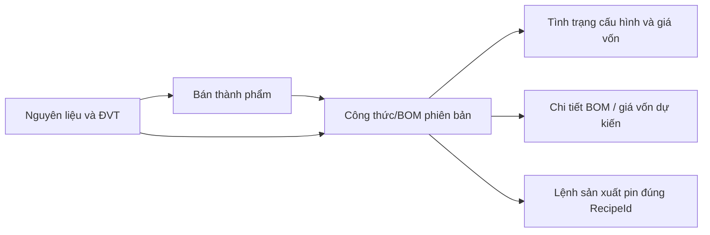
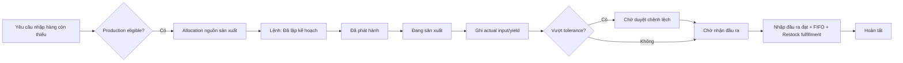

# Kế hoạch refactor UI/UX khu vực Sản xuất / BOM

> Trạng thái: `INSPECT_AND_PLAN_ONLY`
> Ngày inspect: 09/08/2026
> Issue theo dõi: [#398 - UI plan: refactor Production and BOM using the current CafeChain visual language](https://github.com/TheSkibidi1712/CafeChain/issues/398)
> Phạm vi: Razor UI, CSS, JavaScript trình bày và read model chỉ đọc khi thật sự cần.
> Ngoài phạm vi: business logic, state machine, permission contract, database schema, migration và dữ liệu.

## 1. Executive summary

Khu vực Sản xuất / BOM hiện có đủ các mảnh nghiệp vụ chính nhưng trải nghiệm bị phân mảnh thành ba ngôn ngữ giao diện:

- nhóm Công thức/Bán thành phẩm dùng `recipe-builder.css` và họ `rb-*`;
- nhóm Lệnh sản xuất dùng `production-order.css` và họ `po-*`;
- Vốn và lợi nhuận dùng `drink-profitability.css` và họ `pf-*` dù liên kết chặt với BOM.

Trong khi đó, visual baseline mới của CafeChain đã hình thành rõ ở trang Ngưỡng tồn kho qua `cc-warehouse-header`, `ops-*` và token toàn cục trong `admin-unified-depth.css`. Header của Recipe và Production đã mô phỏng cùng ý tưởng nhưng tự khai báo lại token, kích thước, shadow, breakpoint và decoration. Kết quả là giao diện gần giống nhau nhưng không thật sự thống nhất, khó bảo trì và dễ drift.

Đề xuất không rewrite module. Hướng refactor là:

1. trích một lát cắt UI dùng chung nhỏ cho admin, bắt đầu bằng `PageHero`;
2. giữ nguyên route, POST field, controller action, permission và state machine;
3. tổ chức lại IA theo hai nhóm rõ: dữ liệu nền và vận hành sản xuất;
4. làm cho các trang workflow thể hiện planned/actual/immutable và “việc tiếp theo”;
5. bỏ raw technical term/ID khỏi nội dung nghiệp vụ;
6. chỉ bổ sung read-model aggregate hoặc projection khi UI mới thật sự cần;
7. triển khai theo từng phase nhỏ, có visual regression và role/runtime review.

Kết luận kiến trúc: **NO MIGRATION**, **NO BACKEND BUSINESS CHANGE**. Một số trang cần read-model-only change để có summary đúng toàn bộ bộ lọc và pagination lịch sử.

## 2. Reference screenshot analysis

### 2.1 Nguồn baseline

Owner đã cung cấp ảnh chụp desktop của màn **Kho & Cung ứng / Ngưỡng tồn kho** trong lượt review plan này. Ảnh là authority trực tiếp cho thiết kế header của Sản xuất/BOM. Code hiện tại tiếp tục được dùng để đối chiếu feasibility:

- ảnh desktop do Owner cung cấp ngày 09/08/2026;
- mô tả visual bắt buộc trong `CafeChain/FIX.md`;
- implementation đang chạy của `/Admin/AdminInventoryThresholds`;
- markup `CafeChain/Areas/Admin/Views/AdminInventoryThresholds/Index.cshtml`;
- CSS `CafeChain/wwwroot/css/Admin/InventoryOperations/inventory-operations.css`;
- CSS `CafeChain/wwwroot/css/unit-conversion.css` cho `cc-warehouse-header`;
- token toàn cục `CafeChain/wwwroot/css/Admin/admin-unified-depth.css`.

Quyết định Owner đã khóa: **header của toàn bộ Sản xuất/BOM phải bám theo bố cục và visual language trong ảnh này; các phần còn lại giữ theo plan hiện tại.**

### 2.2 Ngôn ngữ thị giác rút ra

| Thành phần | Đặc điểm baseline | Cách áp dụng cho Sản xuất/BOM |
|---|---|---|
| Canvas | Nền cream rất sáng; nội dung rộng và thoáng nhưng vẫn có mật độ nghiệp vụ | Dùng token `--cc-canvas`; không bọc toàn page trong một card |
| Hero | Khối ngang gần full content width, cao khoảng 150-160px trên desktop; surface trắng ấm chuyển tint peach rất nhẹ về bên phải | Một `PageHero` chung; giữ tỷ lệ, khoảng thở và chiều sâu giống ảnh |
| Accent | Thanh nâu đậm 5-6px ở cạnh trái, bo theo hero | Dùng pseudo-element riêng; không dùng gradient accent nhiều màu |
| Decoration | Hai vòng tròn viền/khối màu cực nhạt, bị crop ở góc phải | Chỉ nằm trong hero, sau content/action, không tạo orb rải rác |
| Eyebrow | Uppercase nhỏ, đậm, màu nâu caramel, nằm trên title | `SẢN XUẤT / BOM` hoặc breadcrumb nghiệp vụ tương ứng |
| Tiêu đề | Icon nghiệp vụ nhỏ bên trái title; title lớn, đậm, sentence case | Không ép uppercase toàn dòng; letter-spacing bằng `0` |
| Mô tả | 1-2 dòng, chiều rộng khoảng 600-720px | Chỉ nêu mục tiêu và công thức/ảnh hưởng chính cần biết |
| Action | Nhóm nút nằm bên phải, căn giữa theo chiều dọc; secondary trắng trước, primary nâu sau | Tối đa 2 action visible trong hero; action thứ ba đưa vào menu/section sau |
| Summary | Bốn thẻ thấp, chỉ có border-top nâu và border mảnh; value lớn, label nhỏ | Chỉ dùng metric thật sự giúp quyết định; không bắt buộc đủ bốn card |
| Context tab | Tên Store/context nằm trên một underline nâu mảnh | Reuse cho store/version context khi page thật sự có switcher |
| Filter | Một band trắng mảnh; search + submit bên trái, context text bên phải | Chuẩn hóa search/status/store/version; giữ query server-side |
| Table | Header beige nhạt, chữ đậm, row trắng, action nâu ở cột cuối | Desktop table; mobile dùng row summary hoặc stacked cells |
| Status | Badge pastel nhỏ, không lấn át nội dung | Không dùng một badge xanh cho mọi trạng thái |

### 2.3 Những điều không nên kế thừa nguyên xi

- Baseline Ngưỡng tồn kho vẫn hiển thị `#StoreId` trong dòng phụ; Sản xuất/BOM không được kế thừa cách lộ ID kỹ thuật này.
- `inventory-operations.css` có nhiều `!important`; không copy stylesheet đó sang module mới.
- Vòng tròn trang trí hiện còn được đặt cả ở `.main-content::before`; plan đề xuất giữ decoration ở hero để tránh hai lớp hình chồng nhau.
- Không copy pixel-by-pixel toàn page. Riêng header phải giữ đúng composition của ảnh: accent trái, copy trái, action phải và vòng tròn mờ phía phải.
- Không tạo thêm gradient/orb rải rác. Tint ấm và vòng tròn chỉ phục vụ chiều sâu bên trong hero.

## 3. Current UI architecture

### 3.1 Shell và token

- Layout: `CafeChain/Areas/Admin/Views/Shared/_AdminLayout.cshtml`.
- Global stylesheet: `CafeChain/wwwroot/css/Admin/admin-unified-depth.css`.
- Token hiện có: màu nâu, canvas, surface, border, semantic status, radius, control height, shadow và focus ring.
- Shared partial hiện có:
  - `CafeChain/Areas/Admin/Views/Shared/_EmptyState.cshtml`;
  - `CafeChain/Areas/Admin/Views/Shared/_StatusBadge.cshtml`;
  - `CafeChain/Areas/Admin/Views/Shared/_QuantityWithUnit.cshtml`;
  - `CafeChain/Areas/Admin/Views/Shared/_IdentityLabel.cshtml`.

Không có shared `PageHero`, `MetricCard`, `LifecycleStepper` hoặc `NextActionPanel`. `cc-warehouse-header` là CSS convention được nhiều page dùng, chưa phải component có contract dữ liệu.

### 3.2 CSS module hiện tại

| File | Quy mô | Nhận xét |
|---|---:|---|
| `recipe-builder.css` | 1.069 dòng, 111 `!important` | Tự khai báo token, header, form, modal, table và compatibility override |
| `production-order.css` | 560 dòng | Lặp gần toàn bộ token và header của Recipe |
| `drink-profitability.css` | 759 dòng | Một visual language riêng cho analysis/drawer |
| `inventory-operations.css` | 1.394 dòng, 261 `!important` | Baseline đang dùng nhưng quá rộng để reuse nguyên file |
| `unit-conversion.css` | 318 dòng, 110 `!important` | Chứa contract `cc-warehouse-header`, đồng thời trộn CSS riêng của Unit Conversion |
| `admin-unified-depth.css` | 1.264 dòng | Authority hợp lý nhất cho token và primitive admin chung |

### 3.3 Drift và duplication

- `:root` token được khai báo lặp trong ít nhất bốn stylesheet.
- Recipe header cao 140px, Production header 120px, `cc-warehouse-header` 148px cố định.
- Radius, shadow và màu caramel khác nhau nhẹ giữa các file.
- Recipe/PreparedItem chứa JavaScript inline; Production Create cũng chứa script workflow lớn inline.
- `Create.cshtml` và `Edit.cshtml` của Recipe lặp cấu trúc form nhưng không hoàn toàn đồng bộ.
- Global `admin-unified-depth.css` dùng selector rộng và nhiều `!important`, sau đó module CSS lại override tiếp.

### 3.4 Kết luận shared architecture

`admin-unified-depth.css` nên là authority token. Tạo một stylesheet module chung nhỏ cho Production/BOM chỉ chứa composition và component chưa có; không redeclare toàn bộ `:root`. `PageHero` nên là partial typed, còn FilterBar/DataTable nên bắt đầu bằng CSS contract + markup pattern thay vì tạo generic partial quá trừu tượng.

## 4. Current navigation / IA

### 4.1 IA hiện tại

```text
Sản xuất / BOM
├── Danh mục bán thành phẩm
├── Công thức BOM
├── Tình trạng dữ liệu BOM
└── Lệnh sản xuất theo mẻ

Sản phẩm
├── Vốn & lợi nhuận dự kiến
└── Menu cửa hàng
```

Evidence: `CafeChain/Areas/Admin/Views/Shared/_AdminLayout.cshtml`.

### 4.2 Vấn đề

- Dữ liệu nền và vận hành nằm chung một danh sách phẳng.
- Data Health đứng ngang cấp với danh mục chính dù bản chất là chế độ phân tích của Công thức/BOM.
- Profitability có dependency BOM nhưng ownership đúng hơn vẫn thuộc Sản phẩm/Pricing.
- Không có entry “Kế hoạch sản xuất”; plan v2 được sinh từ Restock rồi xuất hiện trong danh sách Production Run.
- Route legacy “Lệnh sơ chế độc lập” nằm trong Lệnh sản xuất v2 và dùng contract khác, nhưng IA không báo rõ.

### 4.3 IA đề xuất

Giữ route để tương thích ngược, thay đổi label và grouping trong sidebar:

```text
Sản xuất / BOM
├── Dữ liệu sản xuất
│   ├── Bán thành phẩm
│   └── Công thức & BOM
├── Vận hành sản xuất
│   └── Lệnh sản xuất
└── Kiểm tra dữ liệu BOM  (secondary link hoặc tab trong Công thức & BOM)
```

“Vốn & lợi nhuận dự kiến” tiếp tục ở Sản phẩm. Trong Recipe Detail chỉ đặt deep-link “Xem phân tích giá vốn” khi có ngữ cảnh phù hợp. Không tạo menu trùng.

Route impact: **NONE** trong phase đầu. Chỉ đổi label, order và active-state mapping. Việc hợp nhất Data Health thành tab là thay đổi IA/markup; endpoint `/Admin/AdminRecipe/DataHealth` vẫn giữ để bookmark cũ hoạt động.

## 5. Screen inventory

| Route / page | Mục tiêu | User chính theo effective permission | Hiện trạng | Vấn đề chính | Priority |
|---|---|---|---|---|---|
| `/Admin/AdminPreparedItem` | Quản lý định danh tồn kho bán thành phẩm | Owner, Kế toán/kho; Area/Store xem | List + create/edit modal | Không có detail; action dày; lộ `#RecipeId`; JS inline | P1 |
| `/Admin/AdminRecipe` | Tìm và quản lý phiên bản BOM | Owner, Kế toán/kho; Area/Store xem | Tabs + filter + wide table | Quá nhiều cột; ID/code kỹ thuật; action lặp | P1 |
| `/Admin/AdminRecipe/Create` | Tạo công thức/BOM | Owner, Kế toán/kho | Form nhiều section + sticky cost panel | Planned/output terminology chưa đủ rõ; form dài; state động phức tạp | P1 |
| `/Admin/AdminRecipe/Edit/{id}` | Tạo phiên bản mới từ công thức | Owner, Kế toán/kho | Form gần giống Create | Route/action “Edit” dễ tạo mental model sửa tại chỗ; lộ source `#id` | P1 |
| `/Admin/AdminRecipe/Visualize/{id}` | Xem detail, BOM tree, cost, readiness, stock, recent runs | Người có Recipe.View | Nhiều card và cross-module link | Card fragmentation; technical fallback; hierarchy detail chưa rõ | P1 |
| `/Admin/AdminRecipe/DataHealth` | Tìm BOM thiếu cấu hình/giá/quy đổi | Người có Recipe.View | 5 metrics + full table | Load toàn bộ graph; raw reason code; chưa paginate | P1 |
| `/Admin/AdminProductionOrder` | Theo dõi lệnh sản xuất theo store/state | Các role có ProductionOrder.View | Filter + list table | Mọi status cùng badge; lộ Contract v; thiếu summary quyết định | P1 |
| `/Admin/AdminProductionOrder/Details/{id}` | Thực hiện state transition và actual yield | Store Manager, Shift Supervisor, Owner theo permission | Summary + actual + actions + history | Thiếu lifecycle stepper; form actual nằm sau action panel; read-only guidance chung chung | P0/P1 |
| `/Admin/AdminProductionOrder/Create` | Legacy/direct independent production | Role có legacy Create/Confirm | Form + readiness + execution + recent history | Decimal “mẻ”; hai contract bị trộn; technical writer mode; cognitive load cao | P0 |
| `/Admin/AdminDrinkProfitability` | Phân tích cost/profit và price/topping simulation | Owner, Area/Store/Accountant xem; Owner cập nhật | Hero + filter + table + drawers | Visual khác module; cross-module but valid ownership | P2 |

Không phát hiện page riêng cho Production Request, Production Plan hoặc PreparedItem Detail. Kế hoạch v2 được tạo từ Restock allocation; ProductionRun là entity vận hành chính.

## 6. Workflow map

### 6.1 Dữ liệu nền và versioning



- `PreparedItem` là định danh tồn kho bền vững, có `BaseUnitId`.
- `Recipe` là phiên bản công thức; BTP output được xác định bởi `PreparedItemId`, `OutputQuantity`, `OutputUnitId`.
- `RecipeDetail` là nguyên liệu hoặc công thức con, có quantity + unit.
- `Edit` không sửa đè phiên bản hiện tại; service tạo phiên bản mới từ source.

### 6.2 Production v2 từ Restock



State authority: `ProductionRunStatus` và `ProductionRunOperationsService`.

### 6.3 Actor/handoff theo seed permission hiện tại

| Bước | Permission | Actor mặc định |
|---|---|---|
| Xem | `ProductionOrder.View` | Owner, Area Manager, Store Manager, Kế toán/kho, Shift Supervisor |
| Lập kế hoạch | `ProductionOrder.Plan` | Store Manager, System Admin; run thường được tạo transactionally từ Restock source |
| Phát hành | `ProductionOrder.Release` | Store Manager, System Admin |
| Bắt đầu | `ProductionOrder.Start` | Shift Supervisor, System Admin |
| Ghi actual | `ProductionOrder.RecordActual` | Shift Supervisor, System Admin |
| Duyệt chênh lệch | `ProductionOrder.ApproveVariance` | Business Owner, System Admin; backend cấm cùng actor đã RecordActual |
| Nhận đầu ra | `ProductionOrder.AcceptOutput` | Store Manager, System Admin |
| Hủy | `ProductionOrder.Cancel` | Store Manager, System Admin, chỉ Planned/Released |

UI phải dựa trên các cờ `Can*` từ `ProductionRunDetailDto`, không tái dựng permission bằng role trong Razor.

### 6.4 Entry, decision, handoff, next action

- Entry master data: Bán thành phẩm → tạo công thức đầu ra.
- Entry vận hành chuẩn: Restock Detail → chọn nguồn Production → run Planned → Production list/detail.
- Decision: readiness, actual variance, permission/state.
- Handoff: Store Manager release → Shift Supervisor start/record → Owner approve variance nếu cần → Store Manager accept output.
- Immutable boundary: sau acceptance/completion, actual input/output và valuation chỉ đọc.

## 7. UX problems by severity

### P0 - Có thể làm người dùng hiểu sai nghiệp vụ/dữ liệu

1. `/Admin/AdminProductionOrder/Create` gọi số thực thập phân là “Số lượng mẻ” và hỗ trợ decimal, trong khi run v2 từ Restock dùng integer batch. Hai contract cùng nằm dưới một navigation mà không phân biệt rõ legacy/direct.
2. Actual input trong Production Detail được prefill bằng planned quantity. Nếu visual hierarchy không nhấn “giá trị gợi ý chưa xác nhận”, operator có thể submit mà không đối chiếu thực tế.
3. Production Detail chưa thể hiện rõ điểm inventory mutation: chỉ `Xác nhận nhập đầu ra` mới consume actual input và credit accepted output. Action này đang nằm ngang hàng thị giác với transition thông thường.

### P1 - Workflow/action/status gây nhầm

1. Tất cả trạng thái Production list dùng `badge-status-done`, làm Planned/InProgress/AwaitingApproval trông như đã hoàn tất.
2. Recipe “Edit” thực chất tạo version mới nhưng một số action/icon vẫn gợi ý sửa tại chỗ.
3. Production Detail thiếu stepper và next-role guidance cụ thể; read-only chỉ thấy “Không có thao tác phù hợp”.
4. Actual form xuất hiện sau action panel, làm “việc tiếp theo” không nằm ở vị trí dự đoán.
5. Recipe list table gộp quá nhiều identity/output/configuration/cost/action trong một hàng.
6. PreparedItem không có detail surface nên relationship với active recipe/version/history chỉ được nhồi vào list/modal.
7. Data Health render machine reason code trong `<code>` và tải toàn bộ recipe graph không pagination.
8. Raw `Contract v`, `#RecipeId`, `ChildRecipe #`, `WriterMode`, `LegacyRecipe`, `Lớp giá #` xuất hiện hoặc có fallback xuất hiện.

### P2 - Inconsistency, responsive và wording

1. Ba stylesheet module khai báo lại token và header.
2. Header dùng 120/140/148px khác nhau; title uppercase ở Production nhưng sentence case ở Recipe/Profitability.
3. Chỉ có hai breakpoint chính ở Recipe/Production; tablet 768-1023 chưa có layout chủ đích.
4. Table chủ yếu dựa vào horizontal scroll; chưa định nghĩa mobile fallback theo loại page.
5. Inline style/script làm state và responsive khó audit.
6. Profitability đúng ownership ở Products nhưng cần visual bridge/deep-link nhất quán từ BOM.

### P3 - Cosmetic polish

1. Shadow/radius/accent khác nhẹ giữa page.
2. Icon, casing và secondary copy chưa đồng nhất.
3. Một số section card và card lồng card tạo cảm giác phân mảnh.

## 8. Visual language extracted from reference

### 8.1 Token authority

- Reuse token trong `admin-unified-depth.css`.
- Không khai báo lại `--cc-*` trong Recipe/Production stylesheet.
- Page hero radius 18-20px theo ảnh; content card dùng radius tối đa 8px trừ component đang buộc compatibility.
- Header dùng surface trắng ấm với tint peach rất nhẹ ở nửa phải, border mảnh, accent nâu trái và shadow khuếch tán mềm giống ảnh.
- Shadow nhẹ: hero là surface nổi chính; summary/table/filter dùng border và shadow tối thiểu.
- Typography không scale trực tiếp theo viewport width và letter-spacing bằng `0`.

### 8.2 Header composition đã được Owner khóa

```text
┌─ brown accent ───────────────────────────────────────────────────┐
│  EYEBROW                                      [Nút phụ] [Nút chính]│
│  [icon] Tiêu đề                                                  │
│  Mô tả 1-2 dòng                         (vòng tròn mờ phía sau)   │
└───────────────────────────────────────────────────────────────────┘
```

- Text block chiếm khoảng 55-65% chiều rộng hero trên desktop.
- Action group căn giữa theo chiều dọc, nằm phía phải và có `z-index` cao hơn decoration.
- Secondary action dùng nền trắng, border nâu nhạt; primary action dùng nền nâu đậm, chữ trắng.
- Icon title cùng baseline với text, không đặt trong badge/card riêng.
- Vòng tròn trang trí bị crop tại cạnh trên/phải; opacity thấp, không che nút.
- Header không chứa summary metric; metric nằm ở band riêng ngay dưới như ảnh.

### 8.3 Hierarchy

```text
PageHero
Optional notices
Optional decision metrics
Tabs / FilterBar
Main content
Secondary detail/history
Contextual next action
```

Không bọc toàn bộ mỗi section trong card. Chỉ table shell, metric, modal/drawer và tool panel thật sự cần frame.

### 8.4 Action hierarchy

- Primary: một lệnh làm tiến workflow (`Tạo công thức`, `Phát hành`, `Bắt đầu`, `Xác nhận số liệu`).
- Secondary: navigation/export/history.
- Danger: `Hủy lệnh`, tách khỏi primary và cần confirm + reason theo contract hiện có.
- Icon-only chỉ dùng cho action quen thuộc như quay lại/refresh khi có tooltip và accessible name.

## 9. Proposed information architecture

### 9.1 Sidebar

- `Danh mục bán thành phẩm` → `Bán thành phẩm`.
- `Công thức BOM` → `Công thức & BOM`.
- `Tình trạng dữ liệu BOM` → `Kiểm tra dữ liệu BOM`.
- `Lệnh sản xuất theo mẻ` → `Lệnh sản xuất`.

Không đổi controller/action. Active state vẫn dùng route hiện tại.

### 9.2 Within-module navigation

- Recipe list có tabs: `Món bán`, `Topping`, `Bán thành phẩm`; thêm secondary link `Kiểm tra dữ liệu` thay vì một CTA ngang cấp với “Tạo công thức”.
- Recipe detail dùng local section navigation: `Tổng quan`, `Thành phần`, `Giá vốn`, `Vận hành`, `Lịch sử phiên bản` nếu dữ liệu có.
- Production list filter theo store/state; detail quay lại đúng store/filter qua `returnUrl` hoặc query preservation.
- Profitability giữ ở Products; Recipe detail deep-link theo drink/size/store khi đủ identity.

### 9.3 Backward compatibility

- Không xóa route cũ.
- Không đổi POST field names.
- Không đổi permission constants.
- Không đổi enum/status.
- Deep link cũ tiếp tục mở được.

## 10. Header / Hero standard

### 10.1 Visual specification theo ảnh Owner

- **Container:** full width của content column; `min-height: 152px` desktop; padding khoảng `26px 30px`; border 1px màu warm neutral; radius 18-20px.
- **Accent trái:** 5-6px màu nâu `--cc-brown-700`; chạy theo phần thân hero và bo cùng góc, không dùng multi-color gradient.
- **Background:** nền trắng ấm ở trái, tint peach cực nhẹ ở phải. Không dùng gradient tương phản hoặc màu tối.
- **Decoration:** hai vòng tròn lớn opacity thấp, crop ở top/right; decoration nằm hoàn toàn trong hero và có `aria-hidden="true"`.
- **Copy:** eyebrow → title + icon → description; căn trái; title không uppercase toàn bộ.
- **Action:** một secondary trắng và một primary nâu, đặt phía phải; cùng chiều cao 44px; icon + label; không quá hai nút visible.
- **Spacing:** hero cách summary band khoảng 18-20px; khoảng cách nội bộ theo nhịp 6/10/16px.
- **Depth:** một shadow mềm tương tự ảnh; không thêm card/shadow bên trong hero.

Các thông số trên là target visual, không phải yêu cầu copy từng pixel. Tỷ lệ và hierarchy phải giống ảnh ở desktop.

### 10.2 Component contract

`PageHero` nhận:

- `Eyebrow`;
- `Breadcrumbs`;
- `TitleIcon`;
- `Title`;
- `Description`;
- optional `Status`;
- tối đa hai action visible đã được server quyết định visibility;
- optional overflow action menu ngoài hero nếu có nhiều lệnh phụ;
- variant `Default | Compact | Detail`.

Breadcrumb có thể hiển thị phía trên hero trên detail/form nếu đưa vào hero làm mất đúng composition của ảnh. Eyebrow trong hero luôn giữ vị trí như baseline.

### 10.3 Content examples

| Page | Eyebrow | Icon | Title | Description | Actions |
|---|---|---|---|---|---|
| Recipe list | SẢN XUẤT / BOM | flask/list | Công thức & BOM | Quản lý định mức đầu vào, đầu ra và phiên bản công thức đang áp dụng. | `Kiểm tra dữ liệu` / `Tạo công thức` |
| PreparedItem | SẢN XUẤT / BOM | boxes | Bán thành phẩm | Quản lý định danh tồn kho và công thức sản xuất đang hoạt động. | optional `Công thức & BOM` / `Tạo bán thành phẩm` |
| Production list | SẢN XUẤT / BOM | industry | Lệnh sản xuất | Theo dõi kế hoạch theo mẻ, số liệu thực tế và tiến độ nhập đầu ra. | tối đa một contextual secondary; không đẩy legacy CTA thành primary |
| Production detail | LỆNH SẢN XUẤT | industry | `PR-{id}` | Store, output và recipe display name; status là badge cạnh metadata, không phải nút. | `Danh sách` / action hợp lệ hiện tại nếu phù hợp |
| Data Health | CÔNG THỨC & BOM | shield/check | Kiểm tra dữ liệu BOM | Xác định công thức thiếu đầu ra, đơn vị, quy đổi hoặc dữ liệu giá. | `Công thức & BOM`; không có mutation primary mặc định |

### 10.4 Responsive

- Desktop ≥1440: giữ composition như ảnh; copy trái 55-65%, action phải, description tối đa 720px.
- Laptop 1024-1439: vẫn giữ hai vùng; action có thể wrap nội bộ nhưng không rơi lên description.
- Tablet 768-1023: action xuống hàng bên dưới copy, căn trái; decoration dịch sang góc phải dưới.
- Mobile <768: hero vertical; primary full width, secondary full width hoặc hai cột nếu label ngắn; decoration giảm kích thước/opacity.
- Hero dùng `min-height`, tuyệt đối không dùng fixed/max height vì title và mô tả tiếng Việt có thể dài.
- Ở mọi viewport, thanh accent trái và title icon vẫn giữ để bảo toàn nhận diện từ ảnh.

### 10.5 Accessibility

- Một `h1` duy nhất.
- Breadcrumb dùng `nav` + ordered list và `aria-label`.
- Decoration `aria-hidden`, pointer-events none.
- Status có text visible, không dựa vào màu.
- Action icon có `aria-hidden`; button/link giữ accessible text.
- Thứ tự DOM là copy trước, action sau; CSS chỉ thay layout, không đảo thứ tự đọc.
- Contrast primary/secondary action phải đạt WCAG AA trên surface trong ảnh.

## 11. Shared component plan

| Component | Purpose | Data/props | States | Dùng tại | Responsive/accessibility |
|---|---|---|---|---|---|
| `PageHero` | Header thống nhất | eyebrow, breadcrumbs, title, description, status, actions, variant | default/compact/detail/read-only | 10 page-level views | wrap actions; semantic `header`; one `h1` |
| `MetricCard` | Một metric quyết định | label, value, tone, helper | neutral/success/warning/danger | Data Health, Production list/detail, Profitability | stable min height; value tabular; no color-only meaning |
| `FilterBar` | Composition filter/search | slots/markup convention | default/loading/dirty | Recipe, PreparedItem, Production, Profitability | labels visible or visually hidden đúng; submit keyboard |
| `SectionHeader` | Heading + optional meta/action | title, description, action | default/compact | forms/detail/list | `h2/h3` đúng cấp |
| `StatusBadge` | Semantic status | existing `AdminStatusDescriptor` hoặc descriptor mới cho Production | all domain states | all pages | reuse `_StatusBadge`; accessible description |
| `LifecycleStepper` | Thể hiện state progression | ordered steps + current/completed/blocked | normal/variance/cancelled/legacy | Production detail | ordered list; mobile vertical; screen-reader current step |
| `DataTable` | Table contract, không generic engine | CSS + markup rules | data/empty/loading/error | list/data health | sticky header optional; mobile fallback defined per page |
| `EmptyState` | Empty/error guidance | existing partial needs icon/variant/role extension | empty/filter-empty/error/forbidden | all list pages | role status; action only when authorized |
| `NextActionPanel` | Một action hợp lệ tiếp theo | title, owner role, primary, secondary, warning | actionable/read-only/blocked/completed | Production detail, Recipe health | not nested card; focus follows error summary |
| `DetailMetaGrid` | Identity/status/snapshot summary | label/value/link pairs | compact/default | Recipe/Production detail | definition list; 1/2/4 columns |

Không tạo generic table/form builder. Các component trên chỉ chuẩn hóa presentation contract.

## 12. Page-by-page redesign plan

### 12.1 Bán thành phẩm - List + modal

**Current route:** `/Admin/AdminPreparedItem`
**Current file/component:** `Areas/Admin/Views/AdminPreparedItem/Index.cshtml`
**Primary user:** Owner/Kế toán-kho quản lý; Area/Store xem.
**Primary goal:** tìm BTP, biết đơn vị tồn kho và trạng thái công thức, tạo/chỉnh BTP.

**Current problems**

- active recipe hiển thị `#id`;
- create/edit/status action dày trong từng row;
- modal vừa là create vừa edit, JavaScript inline dài;
- không có surface detail để giải thích relationship BTP ↔ recipe versions;
- table mobile chỉ scroll ngang.

**Proposed layout**

- Header: `Bán thành phẩm`, primary `Tạo bán thành phẩm` khi có quyền.
- Summary: không thêm KPI mặc định; filter bar hiển thị total. Có thể thêm warning count `Chưa có công thức` nếu query aggregate rẻ.
- Main: filter search + status; table 6 cột: BTP, ĐVT tồn kho, Công thức đang áp dụng, Số phiên bản, Trạng thái, Action menu.
- Secondary: row click hoặc “Xem công thức” đi tới Recipe detail; chưa tạo PreparedItem detail route trong phase đầu.
- Next actions: `Tạo công thức` khi chưa có active recipe; `Tạo phiên bản mới` khi đã có.

**Components to reuse:** `_StatusBadge`, `PageHero`, `FilterBar`, `EmptyState`.
**Components to create/refactor:** action menu, extract JS sang file riêng.
**Data required:** DTO hiện có đủ; optional total-by-config read model.
**Backend impact:** NONE hoặc read-model-only nếu bật warning count.
**Responsive:** <768 mỗi row thành stacked summary; không hiển thị mọi metadata thành cột.
**Accessibility:** modal focus trap Bootstrap; error summary focus; menu keyboard.
**Localization:** bỏ “BTP” ở label chính, có thể giữ mã `BTP-*` như business code.
**Risk:** Medium.
**Implementation files:** `Index.cshtml`, `recipe-builder.css`, JS mới `wwwroot/js/Admin/PreparedItem/prepared-item.js`, optional DTO/service.

### 12.2 Công thức & BOM - List

**Current route:** `/Admin/AdminRecipe`
**Current file/component:** `Areas/Admin/Views/AdminRecipe/Index.cshtml`
**Primary user:** Owner/Kế toán-kho quản lý; Area/Store xem.
**Primary goal:** tìm đúng công thức/version và quyết định xem, tạo version hoặc xử lý data health.

**Current problems**

- row chứa quá nhiều identity, output, health, cost và action;
- lộ technical ID/fallback;
- Data Health và Create cùng cấp action;
- tab/filter/action visual chưa thống nhất baseline.

**Proposed layout**

- Header: title + primary `Tạo công thức`; secondary link `Kiểm tra dữ liệu`.
- Summary: không thêm card; hiển thị total và filter chips trong filter bar.
- Main: tabs theo domain; table ưu tiên Tên/cấu hình, Đầu ra, Phiên bản-hiệu lực, Tình trạng, Giá vốn dự kiến, Action.
- Secondary: reason chi tiết không nằm trực tiếp mọi row; mở detail/Data Health.
- Next actions: row click tới Visualize; overflow menu cho version/delete.

**Components to reuse:** `_StatusBadge`, `_QuantityWithUnit`, `PageHero`, `FilterBar`.
**Data required:** list VM hiện đủ.
**Backend impact:** NONE.
**Responsive:** tablet ẩn cột chi phí phụ; mobile stacked row với name/status/output/action.
**Accessibility:** tabs là navigation link có `aria-current`; action menu labeled theo recipe.
**Localization:** user-facing type labels giữ `Món bán`, `Topping`, `Bán thành phẩm`; không render `POS/SUBRECIPE`.
**Risk:** Medium.
**Implementation files:** `Index.cshtml`, `recipe-builder.css`, shared hero partial/CSS.

### 12.3 Tạo công thức

**Current route:** `/Admin/AdminRecipe/Create`
**Current file/component:** `Areas/Admin/Views/AdminRecipe/Create.cshtml`, `wwwroot/js/Admin/Recipe/bom-builder.js`
**Primary user:** Owner/Kế toán-kho.
**Primary goal:** tạo một phiên bản BOM hợp lệ, hiểu rõ identity, output và cost completeness.

**Current problems**

- form dài với conditional section và sticky panel;
- output expected/planned chưa tách thị giác đủ mạnh;
- “Lưu ý kỹ thuật” là wording không phù hợp người nghiệp vụ;
- inline display state và JS config làm markup khó audit;
- create flow có thể dẫn sang BTP new tab, gây context switch.

**Proposed layout**

- Header compact: `Tạo công thức`, secondary back.
- Main work area theo 4 bước hiển thị đồng thời, không wizard bắt buộc: Phạm vi áp dụng → Đầu ra (nếu BTP) → Thành phần BOM → Hiệu lực & kiểm tra.
- Cost preview là tool panel cạnh phải desktop, xuống dưới thành phần ở tablet/mobile; không nested card.
- Footer action sticky nhẹ: `Kiểm tra và lưu`; cancel secondary.
- BTP output hiển thị rõ `Sản lượng dự kiến của 1 mẻ` và `Quy đổi về ĐVT tồn kho`.

**Components to reuse:** PageHero compact, SectionHeader, status/validation primitives.
**Components to create/refactor:** shared Recipe form partials giữa Create/Edit; cost preview panel.
**Data required:** hiện đủ.
**Backend impact:** NONE.
**Responsive:** BOM table đổi thành repeating row editor trên mobile; controls không nhỏ hơn 44px.
**Accessibility:** error summary link tới field; dynamic rows announce add/remove; labels associated.
**Localization:** `Lưu ý kỹ thuật` → `Ghi chú nội bộ`; `Expected Yield` → `Sản lượng dự kiến`; không hiện ItemCode.
**Risk:** High vì form/JS contract lớn; giữ nguyên payload field.
**Implementation files:** `Create.cshtml`, `Edit.cshtml`, partials mới dưới `AdminRecipe/Partials`, `bom-builder.js`, `recipe-builder.css`.

### 12.4 Tạo phiên bản công thức mới

**Current route:** `/Admin/AdminRecipe/Edit/{id}`
**Current file/component:** `Areas/Admin/Views/AdminRecipe/Edit.cshtml`
**Primary goal:** tạo version kế tiếp từ một snapshot cũ, không sửa đè lịch sử.

**Current problems**

- route/action tên `Edit` nhưng nghiệp vụ là new version;
- hero lộ `từ #id`;
- form duplicate Create và dễ drift.

**Proposed layout**

- Hero nói rõ `Tạo phiên bản mới`, source hiển thị bằng business code/name, không raw ID.
- Banner immutable: “Phiên bản hiện tại không bị thay đổi”.
- Reuse cùng form sections với Create; prefilled fields có marker `Sao chép từ phiên bản ...`.
- Submit `Lưu phiên bản mới`.

**Components:** shared Recipe form partials + PageHero compact.
**Data required:** cần source recipe code/name đã có thể lấy trong page VM; nếu chưa đủ thì read-model-only.
**Backend impact:** read-model-only tối đa.
**Responsive/accessibility/localization:** như Create; banner role `note`.
**Risk:** High do cần giữ classic form POST và version contract.
**Implementation files:** `Edit.cshtml`, `AdminRecipeFormPageVM.cs`, `AdminRecipeController.cs`/query projection nếu thiếu display identity.

### 12.5 Chi tiết công thức/BOM

**Current route:** `/Admin/AdminRecipe/Visualize/{id}`
**Current file/component:** `Areas/Admin/Views/AdminRecipe/Visualize.cshtml`, `_BomTree.cshtml`, `_BomTreeNode.cshtml`
**Primary goal:** hiểu recipe snapshot, thành phần, đầu ra, health, cost và liên kết vận hành.

**Current problems**

- nhiều card ngang cấp làm mất hierarchy;
- raw technical fallback còn xuất hiện;
- operational store/readiness/recent runs trộn vào phần definition;
- link Inventory/Production chưa theo next-action hierarchy.

**Proposed layout**

- Hero detail: business code/name, type/status/version actions.
- DetailMetaGrid: hiệu lực, đầu ra mỗi mẻ, normalized base output, phiên bản nguồn.
- Main tabs/anchors: Thành phần BOM; Tình trạng dữ liệu; Giá vốn; Vận hành theo cửa hàng.
- BOM tree là primary content; cost/readiness là side analysis hoặc sections dưới.
- Vận hành chỉ hiện cho BTP recipe; store selector + current stock + readiness + 5 run gần nhất.
- NextActionPanel: tạo version, mở Data Health, mở Production list theo context.

**Components to reuse:** PageHero detail, StatusBadge, DetailMetaGrid, SectionHeader.
**Data required:** VM hiện phần lớn đủ; source version display có thể cần code/name.
**Backend impact:** read-model-only.
**Responsive:** BOM tree horizontal relation chuyển thành nested vertical; meta 4→2→1 cột.
**Accessibility:** tree dùng nested list; expand button có `aria-expanded`; links có business label.
**Localization:** `Lớp giá #` → `Lô giá`; `ChildRecipe` → `Công thức bán thành phẩm`; không hiển thị WriterMode/LegacyRecipe.
**Risk:** High do nhiều cross-module projection.
**Implementation files:** `Visualize.cshtml`, two BOM partials, `AdminRecipeDetailVM.cs`, `AdminRecipeQueryService.cs`, `recipe-builder.css`.

### 12.6 Kiểm tra dữ liệu BOM

**Current route:** `/Admin/AdminRecipe/DataHealth`
**Current file/component:** `Areas/Admin/Views/AdminRecipe/DataHealth.cshtml`
**Primary goal:** ưu tiên và xử lý công thức thiếu dữ liệu.

**Current problems**

- machine reason code render ra UI;
- full graph toàn bộ recipe được load và cost hàng loạt;
- chưa có search/filter/pagination;
- 5 metric cùng trọng số dù mức ưu tiên khác nhau.

**Proposed layout**

- Hero + back to Recipe; không có primary mutation.
- Metrics: `Sẵn sàng`, `Cần xử lý`, `Thiếu giá`, `Thiếu quy đổi`; “thiếu đầu ra/mapping” gộp dưới Cần xử lý hoặc filter chips.
- FilterBar: search, type, issue group, status.
- Table: Công thức, Phạm vi, Cấu hình, Giá vốn, Vấn đề chính, Next action.
- Machine code giữ trong backend/log; UI chỉ dùng message + CTA đã localized.

**Components:** PageHero, MetricCard, FilterBar, StatusBadge, EmptyState.
**Data required:** paged result + aggregate counts theo toàn query.
**Backend impact:** read-model/API projection only; thay full-load bằng projection/paged health query mà không đổi evaluator.
**Responsive:** mobile list ưu tiên issue + CTA, ẩn cột cost phụ.
**Accessibility:** issue list là list semantic; CTA mô tả recipe.
**Risk:** Medium/High do performance query.
**Implementation files:** `DataHealth.cshtml`, `BomDataHealthVM.cs`, `AdminRecipeQueryService.cs`, interface query, tests.

### 12.7 Lệnh sản xuất - List

**Current route:** `/Admin/AdminProductionOrder`
**Current file/component:** `Areas/Admin/Views/AdminProductionOrder/Index.cshtml`
**Primary user:** các role có ProductionOrder.View.
**Primary goal:** biết lệnh nào đang chờ mình hoặc có rủi ro.

**Current problems**

- không có decision metrics;
- cùng badge xanh cho mọi status;
- lộ `Contract v`;
- Restock link dùng `RR #id` fallback;
- CTA legacy/direct nằm nổi bật cạnh workflow v2.

**Proposed layout**

- Hero: title; không có CTA mặc định. Legacy direct action chuyển thành secondary menu có label rõ `Tạo lệnh sơ chế độc lập (quy trình cũ)` nếu vẫn được Owner giữ.
- Metrics hữu ích: `Đang thực hiện`, `Chờ duyệt chênh lệch`, `Chờ nhận đầu ra`, `Quá hạn/chưa thao tác` chỉ khi read model có authority; nếu không có due date thì bỏ metric cuối.
- FilterBar: store, state group, search code/output/restock.
- Table: Lệnh; đầu ra; kế hoạch; liên kết nhu cầu; trạng thái; cập nhật gần nhất; action.
- Row badge map đúng state semantic.

**Components:** PageHero, MetricCard, FilterBar, StatusBadge, EmptyState.
**Data required:** status aggregate và optional search/updated timestamp.
**Backend impact:** read-model-only.
**Responsive:** mobile row summary; filter drawer optional nếu >3 controls.
**Accessibility:** status text; pagination links không dùng `.disabled` link có thể focus.
**Localization:** không render ContractVersion; legacy chỉ hiện user-facing warning.
**Risk:** Medium.
**Implementation files:** `Index.cshtml`, `ProductionRunManagementDtos.cs`, `ProductionRunQueryService.cs`, `production-order.css`.

### 12.8 Lệnh sản xuất - Detail/workflow

**Current route:** `/Admin/AdminProductionOrder/Details/{id}`
**Current file/component:** `Areas/Admin/Views/AdminProductionOrder/Details.cshtml`
**Primary goal:** hiểu lệnh đang ở bước nào và hoàn thành action hợp lệ theo role.

**Current problems**

- thiếu lifecycle stepper;
- planned/actual/accepted/rejected chưa có hierarchy đủ mạnh;
- generic no-action message không nói role tiếp theo;
- actual form nằm xa action context;
- history tải toàn bộ transitions;
- completed snapshot chưa được trình bày như immutable.

**Proposed layout**

- Hero detail + status + back.
- LifecycleStepper ngay dưới hero.
- Summary band: output, planned batches, expected output, Restock remaining; không trộn cost nếu role không có authority.
- Work area theo current state:
  - Planned: readiness + Release action;
  - Released: handoff cho Shift Supervisor + Start;
  - InProgress: planned-vs-actual editor là main content;
  - AwaitingVarianceApproval: variance summary + maker-checker guidance;
  - AwaitingAcceptance: accepted/rejected + inventory effect preview + Accept Output;
  - Completed: immutable actual/cost/Restock result, không mutation CTA;
  - Cancelled: reason + history.
- NextActionPanel chỉ có một primary action; cancel ở danger menu/secondary zone.
- History ở cuối, paginate/lazy nếu nhiều.

**Components:** PageHero detail, LifecycleStepper, DetailMetaGrid, NextActionPanel, StatusBadge.
**Data required:** current DTO đủ action flags; cần display next-role/status metadata và actor timestamps nếu muốn step completion chính xác.
**Backend impact:** read-model-only.
**Responsive:** stepper horizontal desktop, vertical mobile; actual input rows cardless stacked mobile.
**Accessibility:** current step `aria-current="step"`; error summary; numeric input helper; confirmation dialog focus.
**Localization:** planned = `Kế hoạch`; actual = `Thực tế đã xác nhận`; immutable = `Đã chốt`.
**Risk:** High vì workflow-critical UI.
**Implementation files:** `Details.cshtml`, DTO/query service, production CSS, optional workflow JS.

### 12.9 Lệnh sơ chế độc lập - Legacy/direct

**Current route:** `/Admin/AdminProductionOrder/Create`
**Current file/component:** `Areas/Admin/Views/AdminProductionOrder/Create.cshtml`
**Primary goal:** thực thi legacy/direct recipe run không gắn Restock.

**Current problems**

- decimal run count vẫn được gọi là “mẻ”;
- screen chứa form, readiness, writer mode, cost, execute và recent history;
- technical mode/fallback lộ ra;
- visual quá giống v2 khiến người dùng không biết đây là quy trình cũ/độc lập.

**Proposed layout**

- Không redesign như flow v2 cho tới khi Owner quyết định lifecycle của legacy path.
- Phase an toàn: đổi hero/notice để phân biệt `Sơ chế độc lập`, giải thích không gắn Yêu cầu nhập hàng; ẩn writer mode technical; giữ decimal contract nhưng gọi theo domain term được code xác nhận, không tự đổi thành integer.
- Tách recent history khỏi create form, link sang Production list.
- Readiness preview là tool panel, không phải table luôn chiếm trang.
- Không thay Execute/ExecuteStock contract trong task UI.

**Components:** PageHero compact, SectionHeader, NextActionPanel.
**Data required:** hiện đủ.
**Backend impact:** NONE.
**Responsive:** single column tablet/mobile.
**Accessibility:** live readiness `aria-live`; confirm dialog; no raw technical mode.
**Risk:** High/P0; cần Owner decision về giữ/ẩn/deprecate route trước implementation sâu.
**Implementation files:** `Create.cshtml`, production CSS; JS extraction có thể là phase riêng.

### 12.10 Vốn và lợi nhuận dự kiến - Cross-module analysis

**Current route:** `/Admin/AdminDrinkProfitability`
**Current file/component:** `Areas/Admin/Views/AdminDrinkProfitability/Index.cshtml`, JS/CSS Profitability
**Primary goal:** phân tích FIFO cost, gross profit và mô phỏng giá theo drink size/store.

**Current problems**

- visual riêng nhưng chức năng đã có hero/filter/table/drawer khá hoàn chỉnh;
- dependency BOM chưa được thể hiện rõ trong navigation/detail links;
- drawer cần cùng focus/error/action contract với module admin mới.

**Proposed layout**

- Không chuyển menu khỏi Products.
- Adopt PageHero, shared FilterBar/StatusBadge/EmptyState và token authority.
- Thêm breadcrumb/deep-link tới Công thức & BOM theo context, không tạo menu duplicate.
- Giữ drawers vì là focused tool; không biến thành nested page cards.

**Components:** PageHero, FilterBar, shared status/empty; giữ domain-specific profitability table/drawers.
**Data required:** hiện đủ cho visual refactor.
**Backend impact:** NONE.
**Responsive:** drawer full-width mobile; table có priority columns.
**Accessibility:** drawer focus, visible labels, result live region.
**Localization:** giữ `FIFO`, `Margin`, `Markup` kèm tiếng Việt.
**Risk:** Low/Medium.
**Implementation files:** Profitability Index/CSS/JS và shared hero.

## 13. Form redesign plan

### 13.1 Standard anatomy

1. Error summary ở đầu form, focus khi submit lỗi.
2. Section heading mô tả nghiệp vụ, không dùng A/B/C/D như authority duy nhất.
3. Label visible, required marker + text screen reader.
4. Helper text chỉ giải thích consequence/format.
5. Unit nằm trong label hoặc suffix ổn định, không để quantity trần.
6. Read-only snapshot dùng definition list, không dùng disabled input.
7. Save/Cancel nhất quán; danger action tách khỏi save.

### 13.2 Planned vs actual

| Concept | UI label | Treatment |
|---|---|---|
| `PlannedBatchCount` | Số mẻ kế hoạch | Integer với v2; không gọi decimal legacy là v2 batch |
| `ExpectedOutputPerBatchBase` | Sản lượng dự kiến mỗi mẻ | Read-only snapshot trong run |
| `ExpectedOutputBase` | Tổng sản lượng dự kiến | Read-only, không dùng như actual |
| `PlannedBaseQuantity` | Đầu vào kế hoạch | Dòng phụ/read-only |
| `ActualBaseQuantity` | Đầu vào thực tế đã dùng | User phải xác nhận |
| `AcceptedOutputBase` | Sản lượng đạt được nhập kho | Nêu rõ inventory effect |
| `RejectedOutputBase` | Lượng loại bỏ / hao hụt | Không nhập tồn |

### 13.3 Numeric formatting

- Quantity: tối đa precision thật, bỏ zero dư; luôn có UOM.
- Batch v2: integer stepper/input `step=1` chỉ khi backend contract v2.
- Currency: `vi-VN`, suffix `đ`, không dùng monospace để ám chỉ technical code.
- Percentage: `0,##%` theo locale; label nói rõ ngưỡng/chênh lệch.

### 13.4 Recipe form reuse

Tách partial presentation, không tách business orchestration:

- `_RecipeIdentitySection.cshtml`;
- `_RecipeOutputSection.cshtml`;
- `_RecipeBomLinesSection.cshtml`;
- `_RecipeReviewSection.cshtml`.

Create/Edit vẫn dùng action/payload hiện tại. `bom-builder.js` giữ field names `RecipeType`, `PreparedItemId`, `ExpectedYield`, `OutputUnitId`, `Details[*]`.

## 14. Table/list redesign plan

| Table | Desktop columns | Tablet | Mobile fallback | Pagination |
|---|---|---|---|---|
| PreparedItem | identity, UOM, active recipe, versions, status, action | bỏ description/meta phụ | stacked row | server current |
| Recipe | identity, output, version, health, cost, action | gộp version+health | stacked row | server current |
| Data Health | identity, config, cost, issue, action | ẩn estimated cost phụ | issue-first list | cần server pagination |
| Production list | run, output, plan, Restock, status, updated, action | gộp plan/output | workflow row summary | server current |
| Production inputs | input, planned, actual | giữ 3 cột nếu đủ | label/value stack | không cần |
| Profitability | item/size, cost, price, profit, ratios, action | priority columns | horizontal comparison hoặc row detail | current data contract |

Rules chung:

- Numeric right-aligned, tabular nums.
- Header sentence case hoặc small uppercase nhất quán; không all-caps thô trong markup.
- Row click chỉ khi không xung đột selection/action; vẫn có link semantic.
- Overflow menu cho action >2.
- Empty/filter-empty/error là ba state khác nhau.
- Không render raw IDs, enum, RowVersion, GUID.

## 15. Detail/workflow redesign plan

### 15.1 Recipe detail anatomy

```text
PageHero(detail)
Definition/version metadata
Configuration and cost health strip
BOM component tree
Cost breakdown
Store operational context
Related runs and next actions
```

### 15.2 Production detail anatomy

```text
PageHero(detail + status)
LifecycleStepper
Plan / Restock obligation summary
Current-state work area
Planned vs actual inputs
Actual output / variance / inventory effect
NextActionPanel
Business-readable history
```

### 15.3 Read-only role

Không render disabled mutation forms. Render:

- trạng thái hiện tại;
- bước đang chờ;
- role/đơn vị chịu trách nhiệm tiếp theo;
- linked document để theo dõi;
- history.

## 16. Localization / glossary plan

| Technical term | User-facing Vietnamese | Giữ tiếng Anh? | Ghi chú |
|---|---|---|---|
| Recipe | Công thức | Không | “Công thức & BOM” ở module |
| PreparedItem | Bán thành phẩm | Không | BTP chỉ giữ trong business code nếu có |
| DRINK_RECIPE | BOM đồ uống | Không | Machine value không render |
| Batch | Mẻ sản xuất | Không | Chỉ dùng khi đúng execution count |
| Expected Yield | Sản lượng dự kiến | Không | Không gọi là thực tế |
| Actual Yield | Sản lượng thực tế | Không | Tách produced/accepted/rejected |
| ProductionRun | Lệnh sản xuất | Không | Mã hiển thị `PR-*` |
| Base UOM | Đơn vị tồn kho chuẩn | Không | Có thể ghi “ĐVT tồn kho” ở compact UI |
| Planned | Đã lập kế hoạch | Không | Qua display helper |
| Released | Đã phát hành | Không | Qua display helper |
| InProgress | Đang sản xuất | Không | Qua display helper |
| AwaitingAcceptance | Chờ nhận đầu ra | Không | Qua display helper |
| AwaitingVarianceApproval | Chờ duyệt chênh lệch | Không | Qua display helper |
| Contract v2 | Quy trình theo yêu cầu nhập hàng | Không | Không hiện version kỹ thuật |
| Legacy | Quy trình cũ / dữ liệu cũ | Không | Chỉ khi user cần biết để thao tác |
| ChildRecipe | Công thức bán thành phẩm | Không | Không render raw type |
| Layer | Lô giá | Không | FIFO có thể giữ trong ngoặc |
| FIFO | Nhập trước - xuất trước (FIFO) | Có | Thuật ngữ nghiệp vụ được chấp nhận |
| Margin | Biên lợi nhuận gộp (Margin) | Có | Analysis page |
| Markup | Tỷ lệ cộng giá (Markup) | Có | Analysis page |
| Policy | Chính sách | Không | Topping policy theo size |
| Active | Đang áp dụng / Đang hoạt động | Không | Dịch theo context |

Machine reason code vẫn dùng trong backend/log/test, UI dùng localized message/CTA.

## 17. Responsive plan

### ≥1440 desktop

- Max content 1480-1540px nhưng không bọc thêm canvas card.
- Hero copy/actions một hàng.
- Forms tối đa 2-column; detail metadata 4-column.
- Tables hiển thị full priority columns.

### 1024-1439 laptop

- Page padding 24px.
- Hero action tối đa 2 nút cùng hàng.
- Recipe form cost panel 320-360px, main flexible.
- Table bỏ metadata phụ trước khi scroll.

### 768-1023 tablet

- Hero action xuống dòng.
- Summary 2 cột.
- Forms 1 cột hoặc 2 cột cho numeric fields liên quan.
- Production stepper có thể horizontal scroll có snap hoặc chuyển vertical ở 768; ưu tiên vertical để dễ đọc.
- Filter controls 2 cột, submit đặt cuối.

### <768 mobile

- Page padding 16px; hero không fixed height.
- Primary action full width; secondary icon+text, không icon-only khó hiểu.
- Summary 1-2 cột tùy label dài.
- Table quan trọng dùng stacked row; không cố nhét 7-8 cột.
- Drawer Profitability full viewport width.
- BOM row editor thành vertical group, remove button ở góc với accessible label.

### Stress cases

- tên món/BTP 80-120 ký tự;
- store name dài;
- số tiền hàng tỷ;
- output 0,0001 và số lớn;
- message validation 2-3 dòng;
- 3 action trong hero;
- 20 BOM lines.

## 18. Accessibility plan

- Keyboard: mọi action, tabs, dropdown, modal/drawer reachable theo thứ tự logic.
- Focus: dùng `--cc-focus-ring`; không xóa outline; focus quay về trigger khi đóng modal/drawer.
- Headings: một `h1`; section `h2`; sub-section `h3`.
- Forms: `label-for`, `aria-describedby`, validation gắn field; error summary `role=alert` và focus.
- Dynamic BOM: announce add/remove/duplicate/cost refresh qua live region tiết chế.
- Tables: `caption` visually hidden, `scope=col`, action name có entity name.
- Stepper: ordered list, current step `aria-current=step`, completed/blocked có text.
- Badge: visible label + accessible description; không dựa vào màu.
- Modal/drawer: focus trap, Escape, close button label `Đóng`.
- Motion: tôn trọng `prefers-reduced-motion`; không dùng hover transform làm layout shift.
- Contrast: kiểm tra brown text/surface, warning, disabled; target WCAG AA.
- Hit target: tối thiểu 44x44 cho primary controls; icon action compact tối thiểu 36x36 theo existing admin token.

## 19. Performance implications

| Area | Current evidence | Risk | Plan |
|---|---|---|---|
| Recipe list | Server pagination 15; includes details/child data cho page | Low/Medium | Giữ pagination; projection hóa dần nếu visual không cần full graph |
| Data Health | Load toàn bộ Recipes + graph + batch cost | High | Paged projection + aggregate query; evaluator/business logic giữ nguyên |
| PreparedItem list | AsNoTracking + batch recipe stats | Low | Giữ pattern, không thêm per-row lookup |
| Production list | AsNoTracking projection + paging | Low | Aggregate status trong query riêng; không Include graph |
| Production detail | Include actual inputs/output/all transitions | Medium | Giữ input/output; paginate hoặc take recent history + endpoint history |
| Recipe detail | Nhiều related data, recent runs take 5 | Medium | Lazy store operational section; không tải mọi store cùng lúc |
| Recipe form | Option lists có thể lớn | Medium | Search-backed select cho ingredient/BTP khi threshold lớn; không client-filter hàng nghìn option |
| Profitability | XHR preview/drawer | Low/Medium | Giữ on-demand; không preload mọi policy/history |

Visual-only pages không cần backend change. Read-model work phải có query-count/SQL evidence trước implementation.

## 20. Backend / read-model dependencies

### NONE

- Unified hero/header.
- Action hierarchy dùng cờ `Can*` hiện có.
- Recipe/PreparedItem list column reordering.
- Localization của static UI/raw display fallback khi label đã có.
- Responsive/accessibility/CSS extraction.
- Profitability visual alignment.

### Read-model only

- Recipe Edit source business identity thay cho `#id` nếu page VM chưa expose đủ.
- Production list aggregate count theo status/current filter.
- Production detail next-role guidance và step timestamps nếu cần stepper chính xác.
- Data Health pagination/filter/aggregate.
- Recipe detail parent/source version display identity.
- Paged/lazy transition history nếu volume thực tế đủ lớn.

### Không được thay đổi trong UI task

- Recipe version creation semantics.
- Expected/actual yield formulas.
- ProductionRun state transitions.
- Restock eligibility/allocation.
- FIFO consumption/acceptance.
- Permission/maker-checker.
- Legacy decimal-run contract.
- Schema/migration.

## 21. Exact file impact map

### 21.1 Shared files proposed

| Path | Change | Scope |
|---|---|---|
| `CafeChain/ViewModels/Admin/Shared/AdminPageHeroVM.cs` | Add typed hero/breadcrumb/action models | Presentation only |
| `CafeChain/Areas/Admin/Views/Shared/_PageHero.cshtml` | Add unified hero partial | Presentation only |
| `CafeChain/Areas/Admin/Views/Shared/_MetricCard.cshtml` | Optional small typed metric partial | Presentation only |
| `CafeChain/Areas/Admin/Views/Shared/_LifecycleStepper.cshtml` | Production workflow stepper | Presentation/read model |
| `CafeChain/Areas/Admin/Views/Shared/_NextActionPanel.cshtml` | Contextual action/read-only guidance | Presentation only |
| `CafeChain/Areas/Admin/Views/Shared/_EmptyState.cshtml` | Extend icon/variant semantics without breaking tuple callers, hoặc tạo v2 model | Presentation only |
| `CafeChain/Areas/Admin/Views/Shared/_StatusBadge.cshtml` | Reuse; only add Production descriptor mapping outside partial | Presentation only |
| `CafeChain/wwwroot/css/Admin/production-bom-ui.css` | Shared composition consuming global token | CSS only |
| `CafeChain/wwwroot/css/Admin/admin-unified-depth.css` | Token/primitive corrections only; avoid broad new selectors | CSS only |
| `CafeChain/Areas/Admin/Views/Shared/_AdminLayout.cshtml` | Navigation label/group and remove duplicate global decoration if approved | IA/CSS only |

### 21.2 Recipe/PreparedItem

- `CafeChain/Areas/Admin/Views/AdminPreparedItem/Index.cshtml`
- new `CafeChain/wwwroot/js/Admin/PreparedItem/prepared-item.js`
- `CafeChain/Areas/Admin/Views/AdminRecipe/Index.cshtml`
- `CafeChain/Areas/Admin/Views/AdminRecipe/Create.cshtml`
- `CafeChain/Areas/Admin/Views/AdminRecipe/Edit.cshtml`
- `CafeChain/Areas/Admin/Views/AdminRecipe/Visualize.cshtml`
- `CafeChain/Areas/Admin/Views/AdminRecipe/DataHealth.cshtml`
- `CafeChain/Areas/Admin/Views/AdminRecipe/Partials/_BomTree.cshtml`
- `CafeChain/Areas/Admin/Views/AdminRecipe/Partials/_BomTreeNode.cshtml`
- proposed Recipe form partials under `AdminRecipe/Partials/`
- `CafeChain/wwwroot/css/recipe-builder.css`
- `CafeChain/wwwroot/js/Admin/Recipe/bom-builder.js`
- `CafeChain/ViewModels/Admin/Recipes/AdminRecipeFormPageVM.cs`
- `CafeChain/ViewModels/Admin/Recipes/AdminRecipeListItemVM.cs`
- `CafeChain/ViewModels/Admin/Recipes/AdminRecipeDetailVM.cs`
- `CafeChain/ViewModels/Admin/Recipes/BomDataHealthVM.cs`
- `CafeChain/Application/Services/Admin/Recipes/AdminRecipeQueryService.cs` only for approved read-model changes
- `CafeChain/Application/Services/Admin/PreparedItems/AdminPreparedItemService.cs` only for optional aggregates/search projection

### 21.3 Production

- `CafeChain/Areas/Admin/Views/AdminProductionOrder/Index.cshtml`
- `CafeChain/Areas/Admin/Views/AdminProductionOrder/Create.cshtml`
- `CafeChain/Areas/Admin/Views/AdminProductionOrder/Details.cshtml`
- `CafeChain/wwwroot/css/Admin/ProductionOrder/production-order.css`
- optional `CafeChain/wwwroot/js/Admin/Production/production-workflow.js`
- `CafeChain/Application/DTOs/Admin/Production/ProductionRunManagementDtos.cs`
- `CafeChain/Application/Services/Admin/Production/ProductionRunQueryService.cs`
- Controllers chỉ đổi model wiring nếu typed hero/read model cần; không đổi action contract.

### 21.4 Cross-module Profitability

- `CafeChain/Areas/Admin/Views/AdminDrinkProfitability/Index.cshtml`
- `CafeChain/wwwroot/css/Admin/Profitability/drink-profitability.css`
- `CafeChain/wwwroot/js/Admin/Profitability/drink-profitability.js` chỉ cho accessibility/markup hook.

### 21.5 Test impact files proposed

- new `CafeChain.Tests/ProductionBomUiRefactorTests.cs` hoặc tách `ProductionBomHeaderTests.cs` và `ProductionWorkflowUiTests.cs` theo convention thực tế;
- existing affected source-contract tests: `AdminRefactorIssue129Tests.cs`, `BomDataHealthIssue146Tests.cs`, `BomListSemanticsAuthorizationIssue145Tests.cs`, `PreparedItemMasterIssue116Tests.cs`, production state/permission tests được discover trong implementation phase.

## 22. Test plan for future implementation

### TEST_SCOPE_PLAN

- **Change scope:** Razor/CSS/JS của Production/BOM, shared hero primitives và các read-model projection được liệt kê ở mục 20.
- **Isolated first:** render/source-contract tests cho từng page/component vừa đổi.
- **Affected module:** Recipe, PreparedItem, ProductionRun UI/read model, Profitability UI nếu phase đó chạm.
- **Integration:** chỉ chạy khi thay query/read-model hoặc form binding; xác minh route, permission, POST field và state-action visibility.
- **Runtime smoke:** authenticated role + viewport matrix ở mục 23.
- **Full suite:** không chạy theo mặc định. Chỉ đề xuất nếu shared partial/CSS contract tác động rộng hoặc SkillTest trigger rõ; phải ghi `FULL_SUITE_JUSTIFICATION` trước.
- **Out-of-scope failure:** phân loại và báo evidence, không tự sửa ngoài module.

### Required focused tests

- `ProductionHeader_UsesUnifiedHeroLayout`
- `ProductionPages_UseConsistentBreadcrumbAndActions`
- `ProductionUi_DoesNotRenderRawTechnicalTerms`
- `ProductionForms_ShowUomClearly`
- `ProductionWorkflow_ShowsPlannedVsActualClearly`
- `ProductionHero_ActionsWrapOnTablet`
- `ProductionTable_HasDefinedMobileFallback`
- `ProductionForm_DoesNotOverflow`
- `ReadOnlyRole_DoesNotSeeMutationActions`
- `AuthorizedRole_SeesContextualNextAction`
- `FormLabels_AreAssociated`
- `KeyboardFocus_IsVisible`
- `ValidationMessages_AreAccessible`
- `ProductionList_MapsEveryStatusToSemanticBadge`
- `RecipeVersionPage_StatesThatSourceVersionIsNotModified`
- `ProductionUi_DoesNotRenderContractVersionOrRawReasonCode`
- `ProductionDetail_UsesCanFlagsFromReadModel`
- `RecipeCreateEdit_PostContractsRemainStable`

Không chạy test trong task plan-only này.

## 23. Runtime review plan

### 23.1 Viewports

1. Desktop 1440×900.
2. Laptop 1280×800 và 1024×768.
3. Tablet 768×1024.
4. Mobile 390×844 và 360×800.

### 23.2 Data/state matrix

- Empty Recipe/PreparedItem/Production list.
- List có 20+ rows, tên dài, mã dài hợp lệ.
- Recipe đầy đủ và thiếu cost/UOM/output.
- Production Planned, Released, InProgress, AwaitingVarianceApproval, AwaitingAcceptance, Completed, Cancelled và legacy.
- Actual input 1 dòng và 20 dòng.
- Number/currency lớn, precision nhỏ.
- Validation lỗi nhiều field.
- Business conflict/stale/concurrency message.
- Forbidden/not found.

### 23.3 Role matrix

- BusinessOwner: view + variance approval, Recipe manage theo effective permission.
- AreaManager: read-only.
- StoreManager: release/accept/cancel trong scope.
- ShiftSupervisor: start/record actual trong scope.
- WarehouseAccountant: Recipe/PreparedItem manage và Production view.
- SystemAdmin: theo effective permission + scope behavior hiện có.

### 23.4 Visual checks

- PageHero so với screenshot gốc và Inventory Threshold baseline.
- Không overlap decoration/text/actions.
- Hero actions wrap, không overflow.
- Summary stable dimensions.
- Table/mobile fallback không mất primary action.
- Long Vietnamese copy không truncate.
- Focus visible và modal/drawer focus đúng.
- Không raw ID/enum/reason code.

### 23.5 Runtime evidence format

Mỗi page/state lưu screenshot + role + route + viewport + expected/actual. Nếu backend data không có state hiếm, dùng local fixture/dev seed; không đổi production data.

## 24. Suggested implementation phases

### Phase 1 - Shared PageHero + visual tokens

- Tạo typed PageHero và shared Production/BOM composition CSS.
- Chuyển Recipe list + Production list đầu tiên để chứng minh contract.
- Loại token duplication khỏi module từng phần, không big-bang.
- Visual checks desktop/tablet/mobile.

### Phase 2 - Navigation / IA cleanup

- Đổi label/group sidebar, giữ route.
- Data Health thành secondary mode/link.
- Giữ Profitability ở Products, bổ sung contextual deep-link.

### Phase 3 - Master-data pages

- PreparedItem list/modal.
- Recipe list/detail.
- Status, empty state, action menu và raw-term cleanup.

### Phase 4 - Production workflow pages

- Production list semantic status + metrics.
- Detail lifecycle stepper/current-state workspace/next action.
- Read-only guidance và completed immutable view.
- Legacy create chỉ chỉnh presentation sau Owner decision.

### Phase 5 - Costing/analysis pages

- Data Health paged/filterable.
- Recipe cost/readiness hierarchy.
- Profitability visual alignment/deep-link.

### Phase 6 - Forms and validation consistency

- Shared Recipe form sections.
- Planned vs actual visual contract.
- Error summary, UOM, numeric formatting, action footer.
- Extract inline JS.

### Phase 7 - Responsive/accessibility

- Viewport matrix.
- Mobile table fallback.
- Focus, labels, live regions, stepper and modal/drawer.

### Phase 8 - Localization cleanup

- Static + dynamic scan exact UI scope.
- Display helper/fallback audit.
- Remove raw Contract/RecipeId/WriterMode/reason codes.

### Phase 9 - Regression/runtime polish

- Focused tests theo SkillTest.
- Authenticated role/state runtime.
- Screenshot comparison.
- Performance/query evidence.

Mỗi phase là một safe batch độc lập; không cần đợi toàn bộ UI mới có giá trị.

## 25. Risks

| Risk | Severity | Mitigation |
|---|---|---|
| Shared CSS selector làm đổi page ngoài module | High | Scope dưới `.production-bom-page`; visual snapshot affected pages; không thêm selector global rộng |
| Recipe Create/Edit payload vỡ khi extract partial/JS | High | Contract tests field names + POST; không đổi model binder keys |
| Actual form redesign làm user submit planned as actual | High | Distinct visual state, confirmation summary, helper text; backend unchanged |
| Legacy/direct flow bị hiểu là v2 | High | Warning/label riêng; Owner quyết định deprecate trước thay đổi sâu |
| Data Health pagination làm aggregate sai | Medium | Aggregate toàn filter query, không theo current page; evaluator unchanged |
| Status stepper sai vì thiếu timestamp | Medium | Use state order + transitions; add read-model-only timestamps when needed |
| Over-componentization Razor | Medium | Componentize stable visual contracts only; domain tables/forms remain page-specific |
| CSS `!important` cascade conflict | Medium | Migrate page by page; remove local declarations after adoption, không pile thêm overrides |
| Profitability bị kéo sai ownership | Low/Medium | Giữ menu Products; chỉ visual/deep-link integration |
| Header implementation lệch tỷ lệ/composition ảnh Owner | Medium | Visual review PageHero ở 1440/1280/768/390 trước rollout; so đúng accent, copy/action split và decoration |

## 26. Open Owner decisions

**Owner decision đã chốt:** header Sản xuất/BOM dùng visual composition của ảnh Ngưỡng tồn kho vừa cung cấp. Đây không còn là open decision.

1. **Legacy direct production:** giữ visible, chuyển vào secondary menu, hay chỉ dành cho SystemAdmin? Đây là business/operational decision; plan không tự ẩn endpoint.
2. **Tên legacy quantity:** decimal run count hiện được gọi “mẻ”. Cần domain label chính xác nếu không phải integer batch; không tự đổi contract.
3. **PreparedItem detail:** phase đầu row→Recipe detail, hay tạo page/drawer riêng cho BTP? Khuyến nghị chưa tạo route mới cho đến khi có nhu cầu history/stock detail rõ.
4. **Data Health IA:** giữ sidebar link secondary hay chỉ tab trong Recipe? Khuyến nghị giữ route và link secondary trong Recipe; sidebar có thể ẩn sau một release deprecation.
5. **Production list metric thứ tư:** chỉ thêm “Quá hạn” nếu domain có due date authority; nếu không thì dùng `Tổng theo bộ lọc` hoặc bỏ card.
6. **Recipe detail navigation:** anchor sections hay tabs? Khuyến nghị anchor desktop và select/compact nav mobile để không giấu content.
7. **Global decoration:** bỏ `.main-content::before` để chỉ giữ vòng tròn trong PageHero có ảnh hưởng toàn admin; cần review cross-module trước khi đổi.
8. **Profitability bridge:** chỉ deep-link từ Recipe detail hay thêm shortcut trong module Sản xuất/BOM? Khuyến nghị deep-link, không duplicate menu.

Không có quyết định nào ở trên cho phép thay đổi business logic trong implementation UI.

## 27. Definition of Done for future implementation

- Mọi level-1/level-2 page trong inventory dùng PageHero thống nhất.
- Header đúng hierarchy, action theo permission/state và wrap ở tablet/mobile.
- Navigation label/active state nhất quán, route cũ giữ hoạt động.
- Recipe Create/Edit giữ nguyên POST contract và version behavior.
- Planned, expected, actual, accepted, rejected và immutable được phân biệt rõ.
- Production status có semantic badge và lifecycle stepper đúng state thật.
- Read-only role thấy summary + next-role guidance, không thấy disabled mutation form.
- Không render raw enum, ContractVersion, machine reason code, GUID, RowVersion hoặc code property.
- BTP/Recipe/Production UOM luôn hiển thị cùng quantity.
- Empty/loading/error/forbidden/not-found/stale có state riêng bằng tiếng Việt.
- Table có desktop hierarchy và mobile fallback được kiểm chứng.
- Form keyboard/focus/label/error đạt accessibility plan.
- Data Health không full-load graph không giới hạn.
- Production history có giới hạn/pagination khi cần.
- Không tạo N+1 mới.
- No migration; no business state/permission/inventory change.
- Focused automated verification và authenticated runtime matrix pass.

## 28. Reuse / refactor / replace matrix

| Component/page | Reuse | Refactor | Replace | Reason |
|---|---:|---:|---:|---|
| Global `--cc-*` tokens | Yes | Minor | No | Đã là authority tốt nhất |
| `cc-warehouse-header` visual idea | Yes | Yes | Markup riêng lẻ | Chuyển từ CSS convention thành typed PageHero |
| `_StatusBadge` | Yes | Mapping only | No | Contract accessible đã có |
| `_EmptyState` | Yes | Yes | No | Cần variant/icon/error nhưng giữ compatibility |
| `_QuantityWithUnit` | Yes | Yes | No | Bỏ monospace mặc định nếu không cần, chuẩn locale |
| Recipe list | Data/query | Layout | No | Business data đủ, hierarchy chưa tốt |
| Recipe Create/Edit | Payload/service | Markup/JS | No | Risk cao nếu rewrite |
| Recipe Visualize | Data/query | Anatomy | No | Cross-module links hữu ích |
| Data Health | Evaluator | Query/layout | Full-load query | Performance và raw reason code |
| PreparedItem list/modal | Service/query | Layout/JS | No | Batch query tốt, UX cần rõ hơn |
| Production list | Query/page | Layout/read model | No | Pagination tốt, status/metric thiếu |
| Production detail | State/Can flags | Anatomy/read model | No | Workflow-critical, backend authority đúng |
| Legacy Production Create | Business contract | Visual warning/layout | Chưa quyết định | Cần Owner authority |
| Profitability | Domain JS/query/drawers | Header/token | No | Chức năng hiện hữu phù hợp |

## 29. Inspection evidence index

| Kết luận | Evidence |
|---|---|
| Production/BOM có 4 sidebar links | `Areas/Admin/Views/Shared/_AdminLayout.cshtml` |
| Profitability thuộc Products | `_AdminLayout.cshtml`, `AdminDrinkProfitabilityController.cs` |
| Shared token tồn tại | `wwwroot/css/Admin/admin-unified-depth.css` |
| Header visual bị lặp | `recipe-builder.css`, `production-order.css`, `unit-conversion.css` |
| Baseline Ngưỡng tồn kho | `AdminInventoryThresholds/Index.cshtml`, `inventory-operations.css` |
| PreparedItem là inventory identity | `Models/Inventories/PreparedItems/PreparedItem.cs` |
| Recipe là version/output authority | `Models/Drinks/Recipe.cs`, `RecipeDetail.cs` |
| Production v2 states | `Models/Enums/Inventory/ProductionRunStatus.cs` |
| Action visibility từ backend | `ProductionRunQueryService.cs`, `ProductionRunDetailDto` |
| Maker-checker variance | `ProductionRunOperationsService.ApproveVarianceAsync` |
| Production list paged/projection | `ProductionRunQueryService.GetPageAsync` |
| Data Health full-load | `AdminRecipeQueryService.GetDataHealthPageAsync` |
| Recipe list paged | `AdminRecipeQueryService.GetIndexPageAsync` |
| PreparedItem avoids per-row query | `AdminPreparedItemService.LoadRecipeStatsAsync` |
| Legacy Create supports decimal batches | `AdminProductionOrder/Create.cshtml`, `AdminProductionOrderController.cs` |
| Raw technical terms remain | Recipe/DataHealth/Visualize, Production Index/Create and `bom-builder.js` |

## 30. Task stop condition and conclusions

Task này dừng ở tài liệu plan. Không có Razor, CSS, JavaScript, controller, service, model, migration hoặc database nào bị thay đổi.

`PRODUCTION_BOM_UI_CURRENT_STATE_INSPECTED`
`REFERENCE_VISUAL_LANGUAGE_ANALYZED`
`PRODUCTION_BOM_SCREEN_INVENTORY_COMPLETED`
`PRODUCTION_BOM_WORKFLOW_MAPPED`
`CURRENT_UI_PROBLEMS_PRIORITIZED`
`PROPOSED_INFORMATION_ARCHITECTURE_COMPLETED`
`UNIFIED_PAGE_HERO_PLAN_COMPLETED`
`SHARED_COMPONENT_REFACTOR_PLAN_COMPLETED`
`PAGE_BY_PAGE_REDESIGN_PLAN_COMPLETED`
`FORM_AND_TABLE_UX_PLAN_COMPLETED`
`VIETNAMESE_LOCALIZATION_PLAN_COMPLETED`
`RESPONSIVE_PLAN_COMPLETED`
`ACCESSIBILITY_PLAN_COMPLETED`
`PERFORMANCE_IMPACT_ASSESSED`
`EXACT_FILE_IMPACT_MAP_COMPLETED`
`IMPLEMENTATION_PHASES_DEFINED`
`OPEN_OWNER_DECISIONS_LISTED`
`NO_IMPLEMENTATION_PERFORMED`
`NO_PR_PERFORMED`
`NO_MERGE_PERFORMED`
