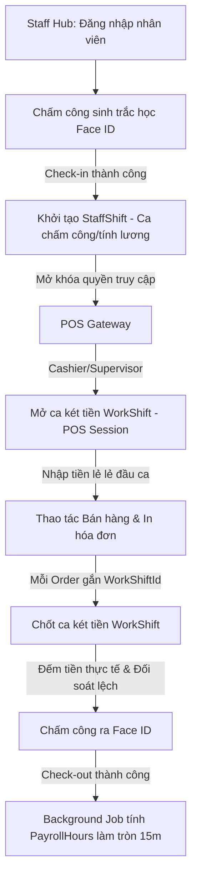
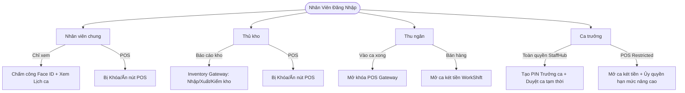
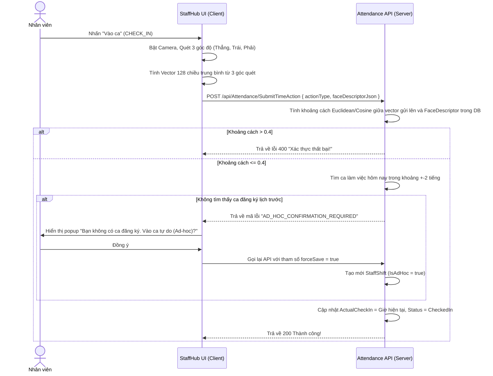
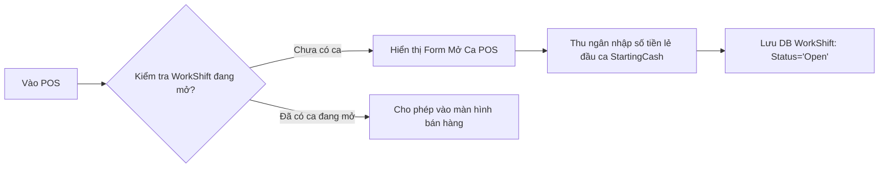
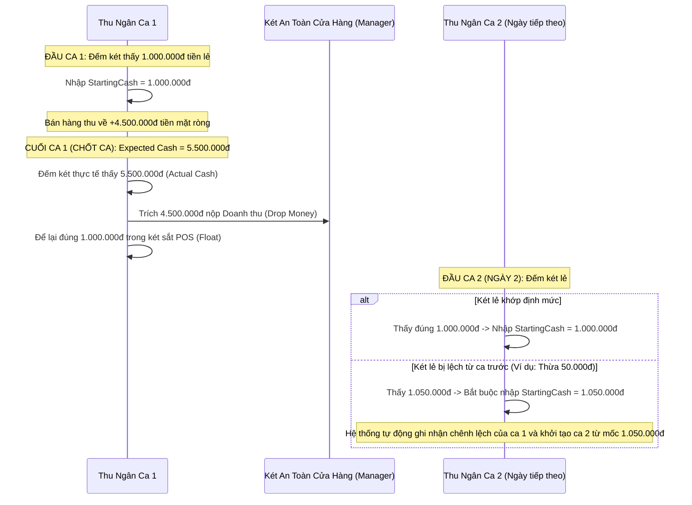
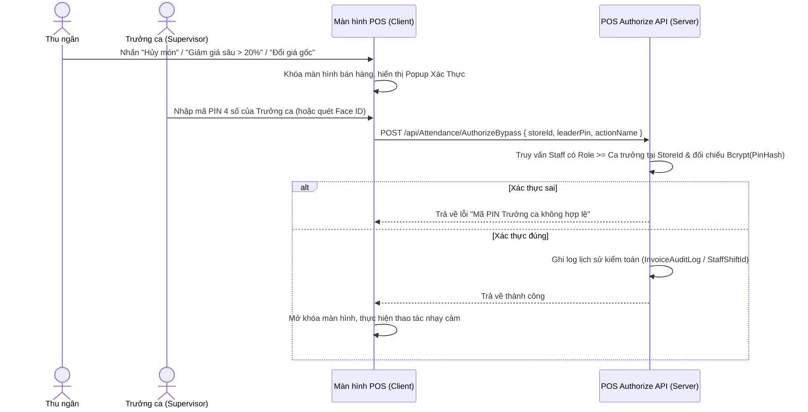

# 📑 TÀI LIỆU PHÂN TÍCH NGHIỆP VỤ HỆ THỐNG STAFF HUB & POS (CAFECHAIN)
## 🎯 Cẩm Nang Vibe Coding Dành Cho Các Model AI Hiện Đại

Tài liệu này hệ thống hóa toàn bộ nghiệp vụ (business logic) của hệ thống **Staff Hub (Cổng nhân viên)** và **POS (Điểm bán hàng tại quầy)** theo mô hình chuỗi F&B chuyên nghiệp (như Highlands Coffee, Starbucks, KiotViet, Sapo FnB). 

Tài liệu được thiết kế với cấu trúc phân cấp rõ ràng, thuật ngữ kỹ thuật chuẩn xác và các ví dụ mã nguồn thực tế để **các mô hình ngôn ngữ lớn (LLMs) đọc và thực thi code một cách chính xác nhất (Vibe Coding Friendly).**

---

## 1. 🏗️ KIẾN TRÚC HAI LOẠI CA (DUAL-SHIFT ARCHITECTURE)
Trong hệ thống quản lý chuỗi F&B chuyên nghiệp, khái niệm **"Ca làm việc"** được chia làm 2 tầng nghiệp vụ tách biệt hoàn toàn nhưng liên kết chặt chẽ với nhau:



### 📊 Bảng so sánh chi tiết giữa StaffShift và WorkShift
| Tiêu chí | 📅 Ca Chấm Công / Nhân Sự (`StaffShift`) | 💰 Ca Thu Ngân / Két Tiền (`WorkShift`) |
| :--- | :--- | :--- |
| **Đối tượng** | Áp dụng cho **tất cả** nhân viên cửa hàng (Pha chế, Thu ngân, Phục vụ, Thủ kho...). | Chỉ áp dụng cho **Thu ngân (Cashier)** và **Ca trưởng (Shift Supervisor)** giữ két tiền. |
| **Mục đích** | Ghi nhận công làm việc thực tế, tính lương (`PayrollHours`), chấm công sinh trắc học. | Quản lý dòng tiền mặt tại quầy, đối soát tiền lẻ đầu ca, tiền mặt thu được và tiền chốt ca. |
| **Mã nguồn** | `Models/Staffs/StaffShift.cs` | `Models/Stores/WorkShift.cs` |
| **Ràng buộc** | Cần lịch làm việc được lên trước (`Shift`) hoặc tạo ca tự do (`IsAdHoc = true`). | Bắt buộc phải có **`StaffShift` đang mở** (đã check-in thành công) thì mới được truy cập POS để mở két. |
| **Navigation** | Gắn với `StaffId`, `ShiftId` (giờ làm). | Gắn với `StoreId`, `UserId` (StaffId) và danh sách các đơn hàng `ICollection<Order>`. |

---

## 2. 📱 CHI TIẾT NGHIỆP VỤ STAFF HUB (EMPLOYEE PORTAL)

Staff Hub (`Views/StaffHub/Index.cshtml`) là cổng thông tin cá nhân của nhân viên hoạt động tại cửa hàng, đóng vai trò như một **Kiosk di động** hoặc máy trạm tại chỗ.

### A. Quy trình Đăng nhập & Bảo mật ban đầu
1. **Chuyển hướng theo Role (RedirectByRole):**
   - Lấy thông tin tài khoản qua Claims (`ClaimTypes.Role`).
   - **Nhóm Admin/Manager** (`SuperAdmin`, `CEO`, `CFO`, `StoreManager`...): Chuyển hướng tới Portal Quản trị (`/Admin/AdminStaff/Index`).
   - **Nhóm Cửa hàng (StaffHub Roles)** (`ShiftSupervisor`, `Cashier`, `WarehouseKeeper`, `GeneralStaff`): Chuyển hướng tới `/StaffHub/Index`.
   - **Nhóm Khách hàng**: Chuyển hướng tới storefront (`/Home/Index`).
2. **Tiêm StoreId Claim (Claims Injection):** Khi nhân viên cửa hàng đăng nhập thành công, hệ thống bắt buộc phải truy vấn thực tế `Staff.StoreId` và inject vào cookie claims để phục vụ cho các logic POS và chấm công về sau.
3. **Bắt buộc Đổi mật khẩu lần đầu (First-Login Force):**
   - Tài khoản nhân viên mới tạo có cờ `RequiresPasswordChange == true`.
   - Khi vào Staff Hub, hệ thống hiển thị popup khóa màn hình (không thể đóng) yêu cầu đổi mật khẩu thông qua API `FirstLoginChangePassword`.

---

### B. 👥 Phân Quyền Chi Tiết Cho 4 Nhóm Vai Trò Trên Staff Hub
Staff Hub là một Employee Portal dùng chung, nhưng giao diện sẽ tự động thích ứng để hiển thị các Module và giới hạn quyền hạn dựa theo từng chức vụ (Role):



#### 1. Nhân viên chung (`GeneralStaff` - Pha chế/Barista, Phục vụ, Runner, Tiếp tân):
* **Nhiệm vụ:** Trực tiếp phục vụ khách hàng, pha chế đồ uống, dọn dẹp và chuẩn bị cửa hàng.
* **Giao diện & Tính năng khả dụng trên Staff Hub:**
  * **Chấm công Face ID:** Thực hiện check-in và check-out đầu và cuối ngày.
  * **Xem lịch làm việc:** Đọc lịch phân ca cá nhân theo tuần/tháng, xem chi tiết giờ bắt đầu, kết thúc và vị trí làm việc.
  * **Yêu cầu ca tạm thời (Ad-hoc Shift):** Khi làm tăng ca đột xuất hoặc đổi ca cho đồng nghiệp, nhân viên chung bấm nút gửi yêu cầu ca ad-hoc và đợi Ca trưởng phê duyệt trên hệ thống.
  * **Khóa cổng POS:** Nút *"Đi tới máy POS"* bị ẩn hoàn toàn và thay thế bằng dòng chữ: *"Chức vụ của bạn không có quyền truy cập POS"*. Không có quyền chạm vào hệ thống bán hàng quầy.

#### 2. Thủ kho (`WarehouseKeeper`):
* **Nhiệm vụ:** Quản lý kho nguyên vật liệu (hạt cafe, sữa, syrup, ly cốc...), thực hiện nhập xuất kho và kiểm kê định kỳ.
* **Giao diện & Tính năng khả dụng trên Staff Hub:**
  * **Chấm công Face ID & Xem lịch ca:** Tương tự nhân viên chung.
  * **Cổng Inventory Gateway (Thủ kho Portal):**
    * Giao diện nhập phiếu nhận nguyên liệu (`InventoryDocument` loại *Receipt*).
    * Giao diện tạo phiếu xuất kho cho quầy bar (`InventoryDocument` loại *Issue*).
    * Màn hình kiểm kho định kỳ (`StockTakeSession`) để nhập số lượng nguyên liệu tồn thực tế đối chiếu với phần mềm.
  * **Khóa cổng POS:** Bị ẩn hoàn toàn nút truy cập POS.

#### 3. Thu ngân (`Cashier`):
* **Nhiệm vụ:** Đứng quầy order, thu tiền, in hóa đơn và bàn giao ca két tiền.
* **Giao diện & Tính năng khả dụng trên Staff Hub:**
  * **Chấm công Face ID & Xem lịch ca:** Thực hiện check-in để mở đầu ngày làm việc.
  * **POS Gateway:** Nút *"Đi tới máy POS"* hiển thị rõ ràng. Nút này sẽ **mở khóa (Active)** ngay sau khi trạng thái chấm công báo *Checked-in*. 
  * **Thao tác POS:** Mở ca két tiền `WorkShift`, bán hàng và chốt ca bàn giao két tiền.

#### 4. Ca trưởng (`ShiftSupervisor`):
* **Nhiệm vụ:** Điều phối toàn bộ nhân viên trong ca làm việc, xử lý chênh lệch tiền nong, phê duyệt các yêu cầu đặc biệt và trực tiếp đứng quầy POS nếu cần.
* **Giao diện & Tính năng khả dụng trên Staff Hub:**
  * **Toàn quyền cổng POS:** Nút *"Đi tới máy POS"* luôn sáng (khi đã check-in).
  * **Quản lý mã PIN phê duyệt:** Mục cài đặt có thêm phần *"Cập nhật mã PIN"*. Ca trưởng tự tạo mã PIN 4 chữ số (lưu Bcrypt) để phục vụ cho các thao tác mở khóa quyền hạn nhạy cảm ngay trên POS.
  * **Phê duyệt ca tự do (Ad-hoc approval):** Màn hình hiển thị danh sách yêu cầu ca tạm thời từ Pha chế/Phục vụ để Ca trưởng bấm phê duyệt trực tiếp.

---

### B. Nghiệp vụ Chấm Công Sinh Trắc Học Face ID (`SubmitTimeAction`)
Hệ thống sử dụng thư viện `face-api.js` phía Client để quét khuôn mặt và backend C# thực hiện kiểm tra so khớp vector.



#### 🛡️ Các Biên Nghiệp Vụ Cần Xử Lý (Edge Cases):
1. **Vá lỗ hổng bảo mật IDOR (Anti-IDOR Guard):** 
   - 🚫 **Cấm:** Không nhận `accountId` hay `staffId` từ body hoặc query string do Client gửi lên.
   - ✅ **Chuẩn:** Lấy trực tiếp `AccountId` từ `User.FindFirst(ClaimTypes.NameIdentifier).Value` trên Server.
2. **Chặn chấm công trùng lặp (Duplicate Check-In Guard):**
   - Trước khi xử lý `actionType == "CHECK_IN"`, hệ thống kiểm tra xem nhân viên đã có ca nào trong ngày hôm nay có `ActualCheckIn != null && ActualCheckOut == null` hay chưa.
   - Nếu đã có, trả về `409 Conflict` kèm thông báo: *"Bạn đang trong một phiên làm việc khác. Vui lòng tan ca trước khi vào lại."*
3. **Xử lý ca làm việc qua đêm (Overnight Shifts):**
   - Khi quét ca làm việc hiện tại của nhân viên để ghép check-in/check-out, hệ thống phải quét cả ngày hôm trước (`yesterday = today.AddDays(-1)`) và kiểm tra xem ca đó có thuộc tính `IsOvernight == true` hay không.
4. **Tải tài nguyên AI bị lỗi (Face-API Timeout):**
   - Client tải các file models AI nặng ~5MB. Nếu mạng chậm hoặc timeout sau 30 giây, hiển thị SweetAlert2 thông báo lỗi mạng kèm nút *"Thử lại"* thay vì đơ giao diện.

---

### C. Background Worker Tính Lương & Giờ Công (`PayrollCalculationWorker`)
Khi nhân viên chấm công ra (Check-out) thành công, hệ thống ghi nhận `ActualCheckOut`. Sau đó, một Background Worker (hoặc logic Service) sẽ tự động chạy để tính toán giờ công thực tế:
1. **Công thức tính giờ thô (Raw Hours):** `rawHours = (ActualCheckOut - ActualCheckIn).TotalHours`.
2. **Quy tắc làm tròn 15 phút (Nearest 15-minute Rounding):** 
   - Để thuận tiện cho việc tính lương chuỗi, tổng giờ công (`PayrollHours`) được làm tròn về mốc **0.25h** gần nhất bằng thuật toán:
     $$\text{roundedHours} = \frac{\text{Round}(rawHours \times 4)}{4}$$
   - *Ví dụ:* 
     - Làm 3 giờ 5 phút ($3.08h$) $\rightarrow$ Làm tròn thành **3.00h**.
     - Làm 3 giờ 12 phút ($3.20h$) $\rightarrow$ Làm tròn thành **3.25h**.
     - Làm 3 giờ 25 phút ($3.41h$) $\rightarrow$ Làm tròn thành **3.50h**.
3. **Cập nhật trạng thái:** Chuyển `StatusId` của `StaffShift` sang `Completed`.

---

## 3. 🛒 CHI TIẾT NGHIỆP VỤ POS GATEWAY & KÉT TIỀN (POINT OF SALE)

POS là giao diện thực hiện giao dịch trực tiếp với khách hàng tại cửa hàng. Chỉ các tài khoản có Role là `Cashier` (Thu ngân) hoặc `ShiftSupervisor` (Ca trưởng) mới có quyền thao tác.

### A. POS Entrance Guard (Chốt Chặn Cổng POS)
- Khi truy cập `/Admin/AdminPOS/Index`, hệ thống kiểm tra xem nhân viên đăng nhập có ca hoạt động (`StaffShift`) hay không:
  - Điều kiện: có `StaffShift` tồn tại trong ngày hôm nay hoặc hôm qua (ca qua đêm), đã có `ActualCheckIn` và chưa có `ActualCheckOut`.
  - Nếu **Không có ca hoạt động**: Chặn truy cập ngay lập tức, chuyển hướng về Staff Hub kèm thông báo: *"Bạn chưa thực hiện Chấm Công Vào Ca thành công."*
  - Nếu **Hợp lệ**: Cho phép vào màn hình POS và lưu `StaffShiftId` vào bộ nhớ Client/Session.

---

### B. Nghiệp vụ Mở Ca Két Tiền POS (`WorkShift` - Cash Session)
Khi bắt đầu phiên bán hàng tại quầy POS, thu ngân không được bán hàng ngay mà phải thực hiện **Mở ca két tiền (Open Cash Session):**



1. **Starting Cash:** Tiền lẻ đầu ca do cửa hàng trưởng giao cho thu ngân (ví dụ: 500,000đ hoặc 1,000,000đ để thối tiền).
2. **Gắn kết Hóa đơn (Order Session Binding):** 
   - Tất cả các đơn hàng (`Order`) phát sinh tại quầy trong suốt phiên làm việc bắt buộc phải lưu trường `WorkShiftId` và `StaffId` (người thực hiện).
   - Logic này giúp báo cáo doanh thu két tiền và đối soát tài chính cuối ca hoàn chỉnh.

---

### 💵 Vòng Đời Tiền Lẻ Đầu Ca & Chu Kỳ Đối Soát Tiền Mặt (Day 1 vs Day 2)
Trong F&B, việc quản lý két tiền quầy POS được chuẩn hóa theo mô hình **Standard Float (Định mức tiền lẻ cố định)** để kiểm soát dòng tiền mặt chặt chẽ:



#### 📌 Kịch bản chi tiết qua các ngày:

* **NGÀY 1 (Khởi động hệ thống):**
  * **Mở ca:** Thu ngân mở két, đếm đúng số tiền lẻ của cửa hàng bàn giao đầu ngày (định mức tiêu chuẩn là **1.000.000đ** gồm các tờ tiền lẻ 10k, 20k, 50k...). Thu ngân nhập `StartingCash = 1.000.000đ`.
  * **Bán hàng:** Trong ngày phát sinh doanh thu bán hàng thu tiền mặt ròng là **4.500.000đ** (đã trừ đi tiền thối cho khách).
  * **Chốt ca:**
    * Hệ thống tính doanh thu lý thuyết trong két: 
      $$\text{Expected Ending Cash} = \text{StartingCash (1.000.000đ)} + \text{Doanh thu ròng (4.500.000đ)} = 5.500.000đ$$
    * Thu ngân đếm két thực tế thấy đúng **5.500.000đ** $\rightarrow$ Nhập `ActualEndingCash = 5.500.000đ` (Lệch két = 0).
    * **Rút tiền mặt bàn giao (Safe Drop):** Thu ngân trích lấy đúng **4.500.000đ** tiền doanh thu ròng bỏ vào phong bì nộp cho Cửa hàng trưởng hoặc két an toàn của quán.
    * **Để lại tiền lẻ:** Thu ngân **chừa lại đúng 1.000.000đ tiền mặt lẻ** trong két bán hàng POS và khóa lại để bàn giao cho ngày hôm sau.

* **NGÀY 2 (Ngày làm việc tiếp theo):**
  * **Kịch bản A (Mọi thứ hoàn hảo):**
    * Thu ngân ngày 2 mở két, đếm lại két lẻ thấy có đúng **1.000.000đ** $\rightarrow$ Nhập `StartingCash = 1.000.000đ` để tiếp tục chu kỳ.
  * **Kịch bản B (Xảy ra lỗi đếm tiền của Ca trước):**
    * Thu ngân ca trước nộp doanh thu sai, để lại két lẻ bị thừa **1.050.000đ** (hoặc thiếu, chỉ còn **950.000đ**).
    * Thu ngân ngày 2 đếm két lẻ thực tế thấy bao nhiêu **bắt buộc phải nhập đúng con số thực tế đếm được** làm `StartingCash` (ví dụ đếm thấy 950k thì nhập `StartingCash = 950.000đ`). 
    * *Ý nghĩa:* Hệ thống ghi nhận điểm xuất phát mới của két ngày thứ 2 là 950k để không làm ảnh hưởng đến doanh số ngày 2, đồng thời báo cáo chốt ca ngày 1 của nhân viên trước đó sẽ tự động bị đánh dấu cảnh báo **Lệch két (thiếu 50.000đ)** để Quản lý tiến hành kiểm toán phạt/thu hồi.

---

### C. Cơ Chế Ủy Quyền Trưởng Ca (Shift Leader Privilege Elevation)
Trong vận hành quán cafe, thu ngân có quyền hạn giới hạn. Khi gặp các trường hợp nhạy cảm hoặc có nguy cơ thất thoát dòng tiền, hệ thống POS sẽ tự động khóa và yêu cầu **Trưởng ca hoặc Cửa hàng trưởng** duyệt trực tiếp tại chỗ.



#### 🔒 Các Thao Tác Bắt Buộc Yêu Cầu Duyệt:
1. **Hủy hóa đơn đã thanh toán / Hủy món ăn trong hóa đơn đang tạm tính.**
2. **Áp dụng mức giảm giá thủ công (Manual Discount) > 15% hoặc vượt quá giới hạn voucher.**
3. **Thay đổi đơn giá gốc của đồ uống tại quầy.**

---

### D. Nghiệp vụ Chốt Ca Két Tiền POS (Close WorkShift)
Cuối ca làm việc, thu ngân thực hiện **Chốt ca két tiền** để bàn giao cho ca tiếp theo:
1. **Expected Ending Cash (Tiền mặt lý thuyết):**
   - Hệ thống tự động tính toán: 
     $$\text{Expected Cash} = \text{Starting Cash} + \text{Tổng tiền mặt thu được từ các đơn hàng trong ca} - \text{Tổng tiền mặt thối ra}$$
2. **Actual Ending Cash (Tiền mặt thực tế):**
   - Thu ngân đếm toàn bộ số tiền mặt có trong hộc kéo và nhập số liệu thủ công vào hệ thống.
3. **Xử lý chênh lệch (Discrepancy Auditing):**
   - Hệ thống so sánh: Lệch = $\text{Actual Ending Cash} - \text{Expected Ending Cash}$.
   - Nếu có chênh lệch (âm hoặc dương), hệ thống yêu cầu thu ngân điền **Lý do chênh lệch** và ghi nhận vào bảng kiểm toán.
   - Trạng thái `WorkShift` chuyển sang `Closed`.
   - **Chốt chặn:** Sau khi đóng `WorkShift`, tài khoản thu ngân không thể tạo thêm bất kỳ `Order` nào tại POS trừ khi mở ca két tiền mới.

---

## 4. 📝 LƯU Ý VIẾT TEXT PROMPT & HƯỚNG DẪN CÁC MODEL AI (LLM CHEAT SHEET)

Khi làm việc với các model AI trong chế độ **Vibe Coding** (viết code nhanh bằng ngôn ngữ tự nhiên), bạn nên sao chép đoạn hướng dẫn chuẩn hóa dưới đây để dán vào prompt. Nó sẽ giúp model hiểu rõ cấu trúc dự án CafeChain hiện tại và không sinh code lỗi.

### 📋 COPY-PASTE PROMPT CHO MODEL AI:
> "Chúng ta đang phát triển dự án CafeChain trên nền tảng ASP.NET Core MVC (N-Tier Architecture). Hãy tuân thủ nghiêm ngặt các quy tắc sau khi viết code cho mình:
> 
> 1. **Phân biệt hai loại ca (Dual-Shift):**
>    - `StaffShift` (trong `Models/Staffs`): Ca chấm công nhân sự, dùng cho Face ID check-in/out, tính lương, ghi nhận công.
>    - `WorkShift` (trong `Models/Stores`): Ca két tiền POS, dùng để quản lý tiền mặt hộc kéo (StartingCash, ExpectedEndingCash, ActualEndingCash, Status = 'Open'/'Closed').
> 
> 2. **Chống lỗi IDOR (Bảo mật tối cao):**
>    - Tuyệt đối KHÔNG nhận `accountId` hay `staffId` từ body hoặc query do Client gửi lên trong các API chấm công/POS.
>    - Bắt buộc lấy `AccountId` trực tiếp từ JWT/Cookie claims bằng cách dùng:
>      `int.TryParse(User.FindFirst(ClaimTypes.NameIdentifier)?.Value, out int accountId)`
>    - Chỉ inject và đọc `StoreId` thông qua Claims.
> 
> 3. **Quy tắc N-Tier Architecture (Kiểu kiến trúc phân tầng):**
>    - Controller phải cực mỏng (Thin Controller). Cấm gọi trực tiếp `DbContext` hay thực hiện logic tính toán trong Controller.
>    - Mọi logic DB, tính toán khoảng cách vector gương mặt, lọc ca làm việc bắt buộc phải viết trong lớp Service thuộc `Application/Services` và gọi qua Interface.
> 
> 4. **Tránh xung đột chấm công (Concurrent Check-In):**
>    - Trước khi xử lý CHECK_IN trong `SubmitTimeActionAsync`, phải dùng `AnyAsync` kiểm tra xem nhân viên đã có ca làm việc hoạt động nào trong ngày chưa (`ActualCheckIn != null && ActualCheckOut == null`). Nếu có, trả về lỗi 409 Conflict.
> 
> 5. **Ủy quyền Trưởng ca (Shift Leader Override):**
>    - Mọi mã PIN của nhân viên được lưu dạng bcrypt hash trong trường `Staff.PinHash`. Khi so khớp PIN Trưởng ca để duyệt thao tác tại POS, phải dùng thư viện BCrypt để verify (`BCrypt.Net.BCrypt.Verify(request.Pin, staff.PinHash)`)."

---

## 5. 🛠️ CHEAT SHEET BẢN ĐỒ CƠ SỞ MÃ NGUỒN CAFECHAIN

Dành cho bạn và Model AI định vị nhanh các file khi thực hiện thay đổi:

```
 CafeChain
 ├── 📂 Application
 │    ├── 📂 Constants
 │    │    └── 📄 RoleConstants.cs            <-- Định nghĩa tên các Role chuẩn ("Thu ngân", "Ca trưởng"...)
 │    └── 📂 Interfaces
 │         └── 📂 Attendance
 │              ├── 📄 IAttendanceActionService.cs
 │              └── 📄 IAttendanceSecurityService.cs
 ├── 📂 Controllers
 │    ├── 📄 AttendanceController.cs          <-- API Endpoint cho FaceID, Đổi PIN, Đổi Pass
 │    ├── 📄 StaffHubController.cs            <-- Controller cổng thông tin nhân viên
 │    └── 📄 PosController.cs                 <-- POS API Controller (Validate Voucher)
 ├── 📂 Areas
 │    └── 📂 Admin
 │         └── 📂 Controllers
 │              └── 📄 AdminPOSController.cs  <-- POS View Controller chính (Mở ca, check ca)
 ├── 📂 Models
 │    ├── 📂 Staffs
 │    │    ├── 📄 Staff.cs                    <-- Profile nhân viên (chứa FaceDescriptor, PinHash)
 │    │    ├── 📄 StaffShift.cs               <-- Ca chấm công thực tế (ActualCheckIn, ActualCheckOut, PayrollHours)
 │    │    └── 📄 Role.cs                     <-- Định nghĩa thực thể Role liên kết tài khoản
 │    └── 📂 Stores
 │         └── 📄 WorkShift.cs                <-- Phiên két tiền POS (StartingCash, ExpectedCash, Status)
 ├── 📂 Data
 │    └── 📄 AppDbContext.cs                 <-- Lớp DbContext chính quản lý các thực thể
 └── 📂 Views
      ├── 📂 StaffHub
      │    └── 📄 Index.cshtml                <-- Giao diện cổng nhân viên (Premium dark navy)
      └── 📂 Shared
           └── 📄 _Layout.cshtml              <-- Bổ sung AJAX handler cho lỗi 401
```

---

## 6. ✨ QUY CHUẨN THIẾT KẾ GIAO DIỆN CAO CẤP (PREMIUM UI DESIGN)

Đối với các dự án F&B hiện đại, giao diện trực quan sinh động giúp nhân viên thao tác cực nhanh và giảm thiểu sai sót:

1. **Phối màu chủ đạo (Color Palette):**
   - Sử dụng tông màu tối sang trọng làm nền: **Dark Navy (`#0f172a` hoặc `#1e293b`)**.
   - Các nút chức năng nổi bật sử dụng màu gradient mượt mà:
     - Nút Chấm Công Vào Ca: `bg-gradient-to-r from-emerald-500 to-teal-600` (Xanh ngọc lục bảo).
     - Nút POS Bán Hàng: `bg-gradient-to-r from-sky-500 to-indigo-600` (Xanh đại dương).
     - Nút Tan Ca / Cảnh báo: `bg-gradient-to-r from-rose-500 to-orange-600` (Đỏ cam).
2. **Typography (Chữ viết):** Bắt buộc sử dụng font **Inter** hoặc **Outfit** từ Google Fonts. Cỡ chữ chuẩn cho quầy POS tối thiểu là **14px - 16px** để dễ đọc dưới ánh sáng mạnh tại quầy bán hàng.
3. **Hiệu ứng Micro-animations (Chuyển động tinh tế):**
   - Thêm hiệu ứng phóng to nhẹ `hover:scale-[1.03] transition-all duration-200` cho các card chức năng.
   - Thêm hiệu ứng loading spinner mượt mà trên camera quét Face ID khi AI đang tính toán vector nhằm đem lại cảm giác ứng dụng "đang sống" và chuyên nghiệp.
4. **Bố cục Responsive:**
   - Grid 2 cột trên Desktop (Bên trái: Thông tin ca làm việc & Bảng lịch; Bên phải: Widget chấm công Face ID & POS Gateway).
   - Grid 1 cột trên Mobile/Tablet (Các widget tự động xếp chồng mượt mà khi nhân viên chấm công bằng điện thoại cá nhân).
